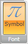

# Ribbon ToggleButton

The __RadRibbonToggleButton__ represents an extension of the __RadToggleButton__. It provides an easier interaction with the __RadRibbonView__ control. What is special about the __RadRibbonToggleButton__ is that it has two states - checked and unchecked. To switch between these states just click on it.

>tip To learn more about the __RadToggleButtonButton__ control read its documentation. __RadRibbonToggleButton__

<snippet id='radribbonview-features-ribbon-controls-ribbon-buttons-toggle-button-block_1-xaml' />

This button has its initial size set to __Large__ and its text label set to __"Symbol"__. As the __IsAutoSize__ property is set to __True__ the button will change its size depending on the __RadRibbonGroup's__ size. The button will also never collapse to its __Medium__ size and will collapse to its __Small__ size when the __RadRibbonGroup__ collapses to __Medium__.

## Handling Changes in the the Button's Checked State

Besides the __Click__ event, the __RadRibbonToggleButton__ control exposes two additional events - __Checked__ and __Unchecked.__ They are meant to notify for changes in the checked state of the toggle button.

<snippet id='radribbonview-features-ribbon-controls-ribbon-buttons-toggle-button-block_2-xaml' />

<snippet id='radribbonview-features-ribbon-controls-ribbon-buttons-toggle-button-block_3-cs' />
<snippet id='radribbonview-features-ribbon-controls-ribbon-buttons-toggle-button-block_4-vb' />

## See Also
 * [Styling the RadRibbonToggleButton]()