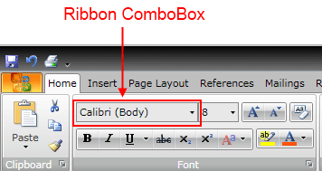
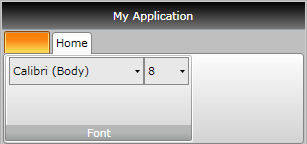

# Ribbon ComboBox

Telerik __RadRibbonView__ provides a simple and consistent way for building interfaces similar to the ribbon control used in Microsoft Office. The __RadRibbonView__ may consist of various elements, one of which is the __Ribbon ComboBox__. This topic discusses concepts fundamental to the __Ribbon ComboBox__ at first and then goes into the usage of the __RadRibbonComboBox__ class and its features.			

>tip Before proceeding with this tutorial, it is recommended to get familiar with the [Visual Structure]() of the __RadRibbonView__ control.			

## Ribbon ComboBox - Fundamentals

A __Ribbon ComboBox__ is very similar to the standard __RadComboBox__ that ships with the Telerik RadControls. However, it is designed to be hosted on a ribbon control.


>tip The class that represents the Ribbon ComboBox is __Telerik.Windows.Controls.RadRibbonComboBox__.				

__RadRibbonComboBox__ derives directly from the __RadComboBox__. It is populated with instances of __RadRibbonComboBoxItem__.				

Check out the rest of the topic, which is entirely dedicated to the __RadRibbonComboBox__ element.				

## Adding a Ribbon ComboBox to a RadRibbonGroup

Adding a __RadRibbonComboBox__ to a __RadRibbonGroup__ is an extremely simple process. The next example demonstrates how to do that.				

#### __XAML__
```XAML
	<telerik:RadRibbonView x:Name="radRibbonView">
	    <telerik:RadRibbonTab Header="Home">
	        <telerik:RadRibbonGroup Header="Font">
	            <StackPanel Orientation="Horizontal" VerticalAlignment="Top">
	                <telerik:RadRibbonComboBox Width="135" Height="28" SelectedIndex="1">
	                    <telerik:RadRibbonComboBoxItem Content="Arial" />
	                    <telerik:RadRibbonComboBoxItem Content="Calibri (Body)" />
	                    <telerik:RadRibbonComboBoxItem Content="Tahoma" />
	                    <telerik:RadRibbonComboBoxItem Content="Verdana" />
	                    <telerik:RadRibbonComboBoxItem Content="Times New Roman" />
	                    <telerik:RadRibbonComboBoxItem Content="Cambria" />
	                </telerik:RadRibbonComboBox>
	                <telerik:RadRibbonComboBox Name="comboFontSize" Height="28" Width="45" SelectedIndex="0">
	                    <telerik:RadRibbonComboBoxItem Content="8" />
	                    <telerik:RadRibbonComboBoxItem Content="9" />
	                    <telerik:RadRibbonComboBoxItem Content="10" />
	                    <telerik:RadRibbonComboBoxItem Content="11" />
	                    <telerik:RadRibbonComboBoxItem Content="12" />
	                    <telerik:RadRibbonComboBoxItem Content="14" />
	                    <telerik:RadRibbonComboBoxItem Content="16" />
	                    <telerik:RadRibbonComboBoxItem Content="18" />
	                </telerik:RadRibbonComboBox>
	            </StackPanel>
	        </telerik:RadRibbonGroup>
	    </telerik:RadRibbonTab>
	</telerik:RadRibbonView>
```



The __RadRibbonView__ is a complex control and the __Ribbon ComboBox__ is only a small part of it. The __RadRibbonView__ consists of various elements such as:
* [Application Menu]()
* [Backstage Menu]()
* [Quick Access ToolBar]()
* [Ribbon Tab]()
* [Ribbon Gallery]()
* [Ribbon Group]()
* [RibbonButtons Overview]()
* [Screen Tips]()

Additional features that you may find interesting are:
* [Selection]()
* [Resizing]()
* [Minimization]()
* [Localization]()

## See Also
 * [Styling the RadRibbonComboBox]()