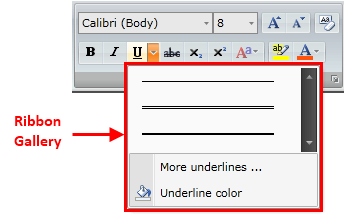
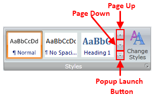
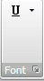
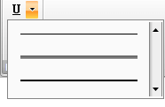
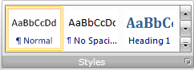
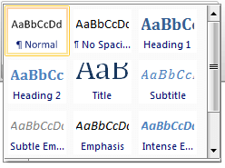
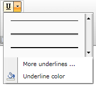
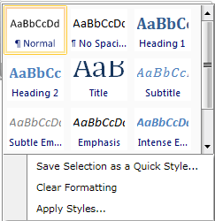
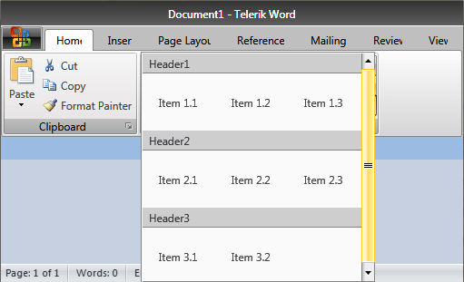
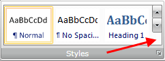

# Ribbon Gallery

Telerik __RadRibbonView__ provides a simple and consistent way for building interfaces similar to the ribbon control used in Microsoft Office. The __RadRibbonView__ may consist of various elements, one of which is the __Ribbon Gallery__. This topic discusses concepts fundamental to the __Ribbon Gallery__ at first and then goes into the usage of the __RadRibbonGallery__ class and its features.	  

>tip Before proceeding with this tutorial, it is recommended to get familiar with the [Visual Structure]() of the __RadRibbonView__ control.		

## Ribbon Gallery - Fundamentals 

__Galleries__ are simple, but a very powerful and flexible user interface concept. They are basically a scrollable list of items and the idea behind them is that each item shows the result of clicking it visually, rather than a static icon which points its purpose.		

The gallery is always rendered in two ways:

* As a popup inside a __RadRibbonDropDownButton__ or in __RadRibbonSplitButton__.

* Directly into a [Ribbon Group]().

>tip The classes that represent the ribbon gallery are __Telerik.Windows.Controls.RadRibbonGallery__ and __Telerik.Windows.Controls.RadGallery__.		  

The __RadGallery__ is a special type of __ListBox__ (it derives from __ListBox__). The __RadGallery__ class is used when you want to add a ribbon gallery as a popup. One important feature of the __RadGallery__ is that it is __scrollable__. That's why you should always specify the [ViewportWidth](http://msdn.microsoft.com/en-us/library/system.windows.controls.scrollviewer.viewportwidth.aspx) property. This controls the horizontal size of the content's viewport. On the other hand, the size of the items themselves is controlled by the __ItemWidth__ and __ItemHeight__ properties.		

>tip When you want to declare a ribbon gallery inside a [RadRibbonDropDownButton]()/[RadRibbonSplitButton]() use the __RadGallery__ class.		  

>tip When you use the __RadGallery__ class, you __should always specify__ the __ViewportWidht__ property.

The __RadRibbonGallery__ is a special type of gallery (it derives from __RadGallery__ class), that is designed to be hosted directly in a __RadRibbonControl__. Like the normal __RadGallery__, it has __Viewport Width\Height__ and __Item Width\Height__. However, the viewport is constrained to the size of the ribbon itself.		

>tip When you use the __RadRibbonGallery__ class, __do not specify__ the __ViewportWidth__ property.

The __RadRibbonGallery__ always should have a popup associated with it, otherwise the user won't be able to drop down the ribbon gallery. In the popup you may want to include a __RadMenu__ that has other additional options regarding the gallery. However, when you drop down a __RadRibbonGallery__ the items are automatically moved into the popup. So even if you specify a menu, the first item in the popup will be a gallery. On the other hand, while the items are hosted in the ribbon you can page up/down smoothly using the buttons inside the gallery.

>tip When you want to declare a ribbon gallery directly into a [Ribbon Group]() use the __RadRibbonGallery__ class.		  

## Adding Ribbon Galleries to a RadRibbonView Control

Ribbon gallery can be always rendered in two ways - inside a [RadRibbonDropDownButton]()/[RadRibbonSplitButton]() or directly into a [Ribbon Group]().		

### Adding Ribbon Gallery Inside a RadRibbonDropDownButton/RadRibbonSplitButton

When you want to declare a __Ribbon Gallery__ as popup inside a [RadRibbonDropDownButton]()/[RadRibbonSplitButton](), you should use the __RadGallery__ class. The next example demonstrates how to do that.			

#### __XAML__
{{region radribbonview-ribbon-gallery-0}}
	<telerik:RadRibbonView x:Name="radRibbonView">
	    <telerik:RadRibbonTab Header="Home">
	        <telerik:RadRibbonGroup Header="Font" DialogLauncherVisibility="Visible">
	            <StackPanel>
	                <telerik:RadRibbonSplitButton x:Name="UnderlineButton"
	                        SmallImage="Images/IconMSOffice/16/underline.png">
	                    <telerik:RadRibbonSplitButton.DropDownContent>
	                        <StackPanel>
	                            <telerik:RadGallery ViewportWidth="157" ItemWidth="156"
	                                    ItemHeight="26">
	                                <telerik:RadGalleryItem Image="Images/IconMSOffice/underline1.png"
	                                        ToolTipService.ToolTip="Underline" />
	                                <telerik:RadGalleryItem Image="Images/IconMSOffice/underline2.png"
	                                        ToolTipService.ToolTip="Double underline" />
	                                <telerik:RadGalleryItem Image="Images/IconMSOffice/underline3.png"
	                                        ToolTipService.ToolTip="Thick underline" />
	                            </telerik:RadGallery>
	                        </StackPanel>
	                    </telerik:RadRibbonSplitButton.DropDownContent>
	                </telerik:RadRibbonSplitButton>
	            </StackPanel>
	        </telerik:RadRibbonGroup>
	    </telerik:RadRibbonTab>
	</telerik:RadRibbonView>
{{endregion}}

Note that when you use the __RadGallery__, you should specify the __ViewportWidth__ property. It controls the horizontal size of the content's viewport. On the other hand, the size of the items themselves is controlled by the __ItemWidth__ and __ItemHeight__ properties. The result from the example is shown on the next two snapshots.

When you press the popup launch button, the gallery is shown.

### Adding Ribbon Gallery Directly Into a Ribbon Group

When you want to declare a __Ribbon Gallery__ directly into a [Ribbon Group](), you should use the __RadRibbonGallery__ class. Consider again the previous example, add an additional __RadRibbonGroup__ and declare a __RadRibbonGallery__ like in the example below.			

#### __XAML__
{{region radribbonview-ribbon-gallery-1}}
	<telerik:RadRibbonView x:Name="radRibbonView">
	    <telerik:RadRibbonTab Header="Home">
	        <telerik:RadRibbonGroup Header="Font" DialogLauncherVisibility="Visible">
	            <StackPanel>
	                <telerik:RadRibbonSplitButton x:Name="UnderlineButton"
	                        SmallImage="Images/IconMSOffice/16/underline.png">
	                    <telerik:RadRibbonSplitButton.DropDownContent>
	                        <StackPanel>
	                            <telerik:RadGallery ViewportWidth="157" ItemWidth="156"
	                                    ItemHeight="26">
	                                <telerik:RadGalleryItem
	                                        Image="Images/IconMSOffice/underline1.png"
	                                        ToolTipService.ToolTip="Underline" />
	                                <telerik:RadGalleryItem
	                                        Image="Images/IconMSOffice/underline2.png"
	                                        ToolTipService.ToolTip="Double underline" />
	                                <telerik:RadGalleryItem
	                                        Image="Images/IconMSOffice/underline3.png"
	                                        ToolTipService.ToolTip="Thick underline" />
	                            </telerik:RadGallery>
	                        </StackPanel>
	                    </telerik:RadRibbonSplitButton.DropDownContent>
	                </telerik:RadRibbonSplitButton>
	            </StackPanel>
	        </telerik:RadRibbonGroup>
	        <telerik:RadRibbonGroup Header="Styles" DialogLauncherVisibility="Visible">
	            <telerik:RadRibbonGallery Title="Quick Styles" x:Name="QuickStyles" ItemWidth="72" ItemHeight="56">
	                <telerik:RadGalleryItem IsSelected="True" Name="Normal"
	                        Image="Images/IconMSOffice/paragraph.png"
	                        ToolTipService.ToolTip="Normal" />
	                <telerik:RadGalleryItem Name="No_Spacing"
	                        Image="Images/IconMSOffice/paragraph9.png"
	                        ToolTipService.ToolTip="No Spacing" />
	                <telerik:RadGalleryItem Name="Heading1"
	                        Image="Images/IconMSOffice/paragraph8.png"
	                        ToolTipService.ToolTip="Heading 1" />
	                <telerik:RadGalleryItem Name="Heading2"
	                        Image="Images/IconMSOffice/paragraph7.png"
	                        ToolTipService.ToolTip="Heading 2" />
	                <telerik:RadGalleryItem Name="Title"
	                        Image="Images/IconMSOffice/paragraph6.png"
	                        ToolTipService.ToolTip="Title" />
	                <telerik:RadGalleryItem Name="Subtitle"
	                        Image="Images/IconMSOffice/paragraph5.png"
	                        ToolTipService.ToolTip="Subtitle" />
	                <telerik:RadGalleryItem Name="Subtitle_Emphasis"
	                        Image="Images/IconMSOffice/paragraph4.png"
	                        ToolTipService.ToolTip="Subtitle Emphasis" />
	                <telerik:RadGalleryItem Name="Emphasis"
	                        Image="Images/IconMSOffice/paragraph3.png"
	                        ToolTipService.ToolTip="Emphasis" />
	                <telerik:RadGalleryItem Name="Intense_Emphasis"
	                        Image="Images/IconMSOffice/paragraph2.png"
	                        ToolTipService.ToolTip="Intense Emphasis" />
	                <telerik:RadGalleryItem Name="Strong"
	                        Image="Images/IconMSOffice/paragraph1.png"
	                        ToolTipService.ToolTip="Strong" />
	            </telerik:RadRibbonGallery>
	        </telerik:RadRibbonGroup>
	    </telerik:RadRibbonTab>
	</telerik:RadRibbonView>
{{endregion}}

The result is shown on the image below.

When you press the popup launch button, the gallery is shown. 

>tip While the items are hosted in the ribbon, you could __page up/down__ smoothly using the buttons beside the gallery.			  

## Adding Additional Menu Items to a RadGallery 

The __RadGallery__ allows you to place in the popup additional menu options regarding the gallery. For that purpose you should use the __RadContextMenu__ control.		

The next code snippet demonstrates how to add additional menu items.

#### __XAML__
{{region radribbonview-ribbon-gallery-2}}
	<telerik:RadRibbonView x:Name="radRibbonView">
	    <telerik:RadRibbonTab Header="Home">
	        <telerik:RadRibbonGroup Header="Font" DialogLauncherVisibility="Visible">
	            <StackPanel>
	                <telerik:RadRibbonSplitButton x:Name="UnderlineButton"
	                        SmallImage="Images/IconMSOffice/16/underline.png">
	                    <telerik:RadRibbonSplitButton.DropDownContent>
	                        <StackPanel>
	                            <telerik:RadGallery ViewportWidth="157" ItemWidth="156"
	                                    ItemHeight="26">
	                                <telerik:RadGalleryItem Image="Images/IconMSOffice/underline1.png"
	                                        ToolTipService.ToolTip="Underline" />
	                                <telerik:RadGalleryItem Image="Images/IconMSOffice/underline2.png"
	                                        ToolTipService.ToolTip="Double underline" />
	                                <telerik:RadGalleryItem Image="Images/IconMSOffice/underline3.png"
	                                        ToolTipService.ToolTip="Thick underline" />
	                            </telerik:RadGallery>
	                            <telerik:RadContextMenu BorderThickness="0">
	                                <telerik:RadMenuItem Header="More underlines ..." />
	                                <telerik:RadMenuItem Header="Underline color">
	                                    <telerik:RadMenuItem.Icon>
	                                        <Image Source="Images/IconMSOffice/colorpicker.png" />
	                                    </telerik:RadMenuItem.Icon>
	                                </telerik:RadMenuItem>
	                            </telerik:RadContextMenu>
	                        </StackPanel>
	                    </telerik:RadRibbonSplitButton.DropDownContent>
	                </telerik:RadRibbonSplitButton>
	            </StackPanel>
	        </telerik:RadRibbonGroup>
	    </telerik:RadRibbonTab>
	</telerik:RadRibbonView>
{{endregion}}

And the result is shown on the next image.

## Adding Additional Menu Items to a RadRibbonGallery

You could also associate additional menu options with the __RadRibbonGallery__ popup. In contrast to the __RadGallery__ class, here the __RadRibbonGallery__ exposes a special property for that purpose - __PopupMenuItems__.		

In the next example several __RadMenuItem__ objects are added to the __RadRibbonGallery__'s __PopupMenuItems__ collection.		

#### __XAML__
{{region radribbonview-ribbon-gallery-3}}
	<telerik:RadRibbonView x:Name="radRibbonView">
	    <telerik:RadRibbonTab Header="Home">
	        <telerik:RadRibbonGroup Header="Styles" DialogLauncherVisibility="Visible">
	            <telerik:RadRibbonGallery Title="Quick Styles" x:Name="QuickStyles" ItemWidth="72" ItemHeight="56">
	                <telerik:RadRibbonGallery.PopupMenuItems>
	                    <telerik:RadMenuItem Header="Save Selection as a Quick Style..." />
	                    <telerik:RadMenuItem Header="Clear Formatting" />
	                    <telerik:RadMenuItem Header="Apply Styles..." />
	                </telerik:RadRibbonGallery.PopupMenuItems>
	                <telerik:RadGalleryItem IsSelected="True" Name="Normal"
	                        Image="Images/IconMSOffice/paragraph.png" ToolTipService.ToolTip="Normal" />
	                <telerik:RadGalleryItem Name="No_Spacing" Image="Images/IconMSOffice/paragraph9.png"
	                        ToolTipService.ToolTip="No Spacing" />
	                <telerik:RadGalleryItem Name="Heading1" Image="Images/IconMSOffice/paragraph8.png"
	                        ToolTipService.ToolTip="Heading 1" />
	                <telerik:RadGalleryItem Name="Heading2" Image="Images/IconMSOffice/paragraph7.png"
	                        ToolTipService.ToolTip="Heading 2" />
	                <telerik:RadGalleryItem Name="Title" Image="Images/IconMSOffice/paragraph6.png"
	                        ToolTipService.ToolTip="Title" />
	                <telerik:RadGalleryItem Name="Subtitle" Image="Images/IconMSOffice/paragraph5.png"
	                        ToolTipService.ToolTip="Subtitle" />
	                <telerik:RadGalleryItem Name="Subtitle_Emphasis" Image="Images/IconMSOffice/paragraph4.png"
	                        ToolTipService.ToolTip="Subtitle Emphasis" />
	                <telerik:RadGalleryItem Name="Emphasis" Image="Images/IconMSOffice/paragraph3.png"
	                        ToolTipService.ToolTip="Emphasis" />
	                <telerik:RadGalleryItem Name="Intense_Emphasis" Image="Images/IconMSOffice/paragraph2.png"
	                        ToolTipService.ToolTip="Intense Emphasis" />
	                <telerik:RadGalleryItem Name="Strong" Image="Images/IconMSOffice/paragraph1.png"
	                        ToolTipService.ToolTip="Strong" />
	            </telerik:RadRibbonGallery>
	        </telerik:RadRibbonGroup>
	    </telerik:RadRibbonTab>
	</telerik:RadRibbonView>
{{endregion}}

## Adding Header RadRibbonGalleryItems

You can visually group the __RadRibbonGallery__ items when the gallery is in open state. You can do that by defining some of the __RadRibbonGalleryItems__ as headers through the __IsHeader__ bool property.		

However, in order to properly display header items in the __RadRibbonGallery__, you need to change its default __ItemsPanel__ to a __RibbonGalleryPanel__:		

#### __XAML__
{{region radribbonview-ribbon-gallery-6}}
	<telerik:RadRibbonGallery>
	    <telerik:RadRibbonGallery.ItemsPanel>
	        <ItemsPanelTemplate>
	            <telerikRibbonViewPrimitives:RibbonGalleryPanel />
	        </ItemsPanelTemplate>
	    </telerik:RadRibbonGallery.ItemsPanel>
	    <telerik:RadGalleryItem Content="Header1" IsHeader="True" />
	    <telerik:RadGalleryItem Content="Item 1.1" />
		<telerik:RadGalleryItem Content="Item 1.2" />
		<telerik:RadGalleryItem Content="Item 1.3" />
	    <telerik:RadGalleryItem Content="Header2" IsHeader="True" />
	    <telerik:RadGalleryItem Content="Item 2.1" />
		<telerik:RadGalleryItem Content="Item 2.2" />
		<telerik:RadGalleryItem Content="Item 2.3" />
	    <telerik:RadGalleryItem Content="Header3" IsHeader="True" />
	    <telerik:RadGalleryItem Content="Item 3.1" />
		<telerik:RadGalleryItem Content="Item 3.2" />
	</telerik:RadRibbonGallery>
{{endregion}}

>The __telerikRibbonViewPrimitives__ alias points to the __Telerik.Windows.Controls.RibbonView.Primitives__
>`namespace:xmlns:telerikRibbonViewPrimitives="clr-namespace:Telerik.Windows.Controls.RibbonView.Primitives;assembly=Telerik.Windows.Controls.RibbonView"`

## Setting RadRibbonGallery's PopupLaunchButtonVisibility

The __RadRibbonGallery__ class allows you to set the visibility of the launch popup button. The next example shows you how to set the __RadRibbonGallery__'s __PopupLaunchButtonVisibility__ property to __Visibility.Collapsed__.		

#### __XAML__
{{region radribbonview-ribbon-gallery-4}}
	<telerik:RadRibbonGallery Title="Quick Styles" x:Name="QuickStyles" ItemWidth="72" ItemHeight="56" PopupLaunchButtonVisibility="Collapsed">
	 ...
	</telerik:RadRibbonGallery>
{{endregion}}



## Setting RadRibbonGallery's LayoutMode

Since the __R2 2019__ version, the RadRibbonGallery exposes a __LayoutMode__ property, which is of type __RibbonLayout__. When this property is set to __Simplified__, the scroll buttons are collapsed and the RadRibbonGroup has a more streamlined look. This property is useful when the RadRibbonGroup is in the __SimplifiedItems__ of a RadRibbonTab. For more information about it, check out the [Simplified Ribbon]() article.



## Working with Selection

The __RadGallery__ derives directly from __ListBox__. So working with it is no different than using a standard __ListBox__ control. Here are the related properties regarding the selection:		

* __RadGallery.SelectedItem__ - specifies the selected gallery item.		

* __RadGallery.SelectedIndex__ - specifies the selected index.			

* __RadGalleryItem.IsSelected__ - specifies whether the item is selected or not.			

Also, to get notified about the change in the selection you can handle the __SelectionChanged__ event.		

## Events

The __RadGallery__ class exposes two events - __ActivatePreview__ and __DeactivatePreview__.		

The __ActivatePreview__ event is raised when the mouse cursor is over the gallery item. The __ActivatePreview__ event handler receives two arguments:		
* The sender argument contains the __RadGallery__. This argument is of type __object__, but can be cast to the __RadGallery__ type.
* The second argument is a __RadRoutedEventArgs__ object.			

The __DeactivatePreview__ event is raised when the mouse cursor leaves the gallery item. The __DeactivatePreview__ event handler receives two arguments:
* The sender argument contains the __RadGallery__. This argument is of type __object__, but can be cast to the __RadGallery__ type.
* The second argument is a __RadRoutedEventArgs__ object.			

>tip Since the __RadRibbonGallery__ inherits the __RadGallery__ class, you can handle the __ActivatePreview__ and __DeactivatePreview__ events in the __RadRibbonGallery__ control as well.		  

#### __XAML__
{{region radribbonview-ribbon-gallery-5}}
	<telerik:RadRibbonGallery Title="Quick Styles" x:Name="QuickStyles" ItemWidth="72" ItemHeight="56" 
	                          ActivatePreview="QuickStyles_ActivatePreview" 
	                          DeactivatePreview="QuickStyles_DeactivatePreview">
	 ...
	</telerik:RadRibbonGallery>
{{endregion}}

#### __C#__

{{region radribbonview-ribbon-gallery_6}}
	private void QuickStyles_ActivatePreview(object sender, Telerik.Windows.RadRoutedEventArgs e)
	{
	 // Grab the RadRibbonGallery object
	 RadRibbonGallery gallery = sender as RadRibbonGallery;
	 // Get the selected item
	 RadGalleryItem selectedItem = gallery.SelectedItem as RadGalleryItem;
	}
	private void QuickStyles_DeactivatePreview(object sender, Telerik.Windows.RadRoutedEventArgs e)
	{
	 // Grab the RadRibbonGallery object
	 RadRibbonGallery gallery = sender as RadRibbonGallery;
	 // Get the selected item
	 RadGalleryItem selectedItem = gallery.SelectedItem as RadGalleryItem;
	}
{{endregion}}

#### __VB.NET__

{{region radribbonview-ribbon-gallery_7}}
	Private Sub QuickStyles_ActivatePreview(sender As Object, e As Telerik.Windows.RadRoutedEventArgs)
		' Grab the RadRibbonGallery object'
		Dim gallery As RadRibbonGallery = TryCast(sender, RadRibbonGallery)
		' Get the selected item'
		Dim selectedItem As RadGalleryItem = TryCast(gallery.SelectedItem, RadGalleryItem)
	
	End Sub
	
	Private Sub QuickStyles_DeactivatePreview(sender As Object, e As Telerik.Windows.RadRoutedEventArgs)
		' Grab the RadRibbonGallery object'
		Dim gallery As RadRibbonGallery = TryCast(sender, RadRibbonGallery)
		' Get the selected item'
		Dim selectedItem As RadGalleryItem = TryCast(gallery.SelectedItem, RadGalleryItem)
	End Sub
{{endregion}}

For a full list of the exposed by the __RadRibbonView__ events, take a look at the [Events - Overview]() topic.		

The __RadRibbonView__ is a complex control and the __ribbon galleries__ are only a small part of it. The __RadRibbonView__ consists of various elements such as:
* [Application Menu]()
* [Backstage Menu]()
* [Quick Access ToolBar]()
* [Ribbon Tab]()
* [Ribbon Group]()
* [RibbonButtons Overview]()
* [Ribbon ComboBox]()
* [Screen Tips]()

## See Also
 * [Selection]()
 * [Resizing]()
 * [Minimization]()
 * [Localization]()
 * [Styling the RadRibbonGallery]()
