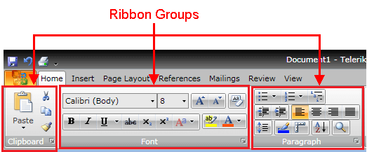
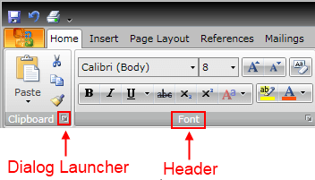
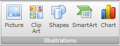
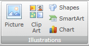
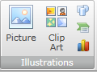
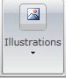
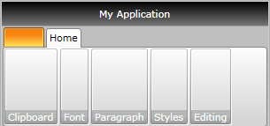
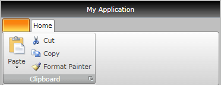
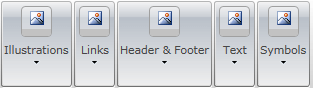

# Ribbon Group

Telerik __RadRibbonView__ provides a simple and consistent way for building interfaces similar to the ribbon control used in Microsoft Office. The __RadRibbonView__ consists of various elements, one of which is the __Ribbon Group__. This topic discusses concepts fundamental to the __Ribbon Group__ at first and then goes into the usage of the __RadRibbonGroup__ class and its features.	  

>tip Before proceeding with this tutorial, it is recommended to get familiar with the [Visual Structure]() of the __RadRibbonView__ control.		

## Ribbon Group - Fundamentals

* [Layout Resizing](#layout-resizing)

The __RadRibbonView__ helps end-users to quickly find the tools and options they need in order to complete a task. Tools and options are organized in __logical groups__ that are collected together under specific [tabs](). Or in other words - the __Ribbon Group__ lets you categorize the commands to be displayed for the end-users.		

__Ribbon Groups__ are defined into the [Ribbon Tab](). A single __Ribbon Tab__ usually contains many __Ribbon Groups__ to layout its content.


Each Ribbon Group may have a __Header__ and a __Dialog Launcher__. The __Dialog Launcher__ appears in the bottom right corner of the group.


>tip The class that represents the ribbon group is __Telerik.Windows.Controls.RadRibbonGroup__.		  

The __RadRibbonGroup__ is a [HeaderedItemsControl](http://msdn.microsoft.com/en-us/library/system.windows.controls.headereditemscontrol.aspx) and is the main part of the layout mechanism of the __RadRibbonView__.		

## Layout Resizing

One of the most important feature of the __RadRibbonGroup__ is the __dynamic resizing__. It refers to the ability of the __RadRibbonView__ to optimize its layout depending on how much space is available.		

Each __RadRibbonGroup__ in a __RadRibbonTab__ may have four possible sizes (__Variants__):		

* __Large__ - this is the default size (__Variant__).

	

	>tip The __RadRibbonGroups__ assumes their __DefaultVariant__ (which by default is __Large__) state whenever they can.			  

* __Medium__
	

* __Small__
	

* __Collapsed__
	

For more information about the layout resizing mechanism, please refer to the [Resizing]() topic. Check out the rest of the topic which is entirely dedicated to the __RadRibbonGroup__.		

## Adding Ribbon Groups to a RadRibbonView Control

As it is described in the [Fundamentals](#ribbon-group---fundamentals) section, various user commands are organized in logical groups that are collected together under specific __RadRibbonTabs__. So the first step before declaring the __RadRibbonGroups__ is to add __RadRibbonTabs__ to your ribbon control. For more information about how to add ribbon tabs, take a look at the [Ribbon Tab]() topic.		

Adding __RadRibbonGroups__ is done through the __RadRibbonTab__'s __Items__ property. The next example shows how to add several __RadRibbonGroups__ and how to set their __Header__ property.		


```XAML
	<telerik:RadRibbonView x:Name="radRibbonView">
	    <telerik:RadRibbonTab Header="Home">
	        <telerik:RadRibbonGroup Header="Clipboard">
	        </telerik:RadRibbonGroup>
	        <telerik:RadRibbonGroup Header="Font">
	        </telerik:RadRibbonGroup>
	        <telerik:RadRibbonGroup Header="Paragraph">
	        </telerik:RadRibbonGroup>
	        <telerik:RadRibbonGroup Header="Styles">
	        </telerik:RadRibbonGroup>
	        <telerik:RadRibbonGroup Header="Editing">
	        </telerik:RadRibbonGroup>
	    </telerik:RadRibbonTab>
	</telerik:RadRibbonView>
```



## Enabling the Dialog Launcher

Any group can have a dialog launcher button which appears in the bottom right corner of the group. By default the dialog launcher is not visible. In order to enable it you should set the __RadRibbonGroup__'s __DialogLauncherVisibility__ property to __Visibility.Visible__.		


```XAML
	<telerik:RadRibbonView x:Name="radRibbonView">
	    <telerik:RadRibbonTab Header="Home">
	        <telerik:RadRibbonGroup Header="Clipboard" DialogLauncherVisibility="Visible">
	        </telerik:RadRibbonGroup>
	        <telerik:RadRibbonGroup Header="Font" DialogLauncherVisibility="Visible">
	        </telerik:RadRibbonGroup>
	        <telerik:RadRibbonGroup Header="Paragraph" DialogLauncherVisibility="Visible">
	        </telerik:RadRibbonGroup>
	        <telerik:RadRibbonGroup Header="Styles" DialogLauncherVisibility="Visible">
	        </telerik:RadRibbonGroup>
	        <telerik:RadRibbonGroup Header="Editing" DialogLauncherVisibility="Visible">
	        </telerik:RadRibbonGroup>
	    </telerik:RadRibbonTab>
	</telerik:RadRibbonView>
```


>tip The default value of the __RadRibbonGroup__'s __DialogLauncherVisibility__ property is __Visibility.Collapsed.__

## Adding Content to the Ribbon Groups

The __RadRibbonGroup__ is a [HeaderedItemsControl](http://msdn.microsoft.com/en-us/library/system.windows.controls.headereditemscontrol.aspx). Which means that the __RadRibbonGroup__ contains a heading (or title) and multiple items. You already learned how to [set](#adding-ribbon-groups-to-a-radribbonview-control) the __Header__ property. Now it's time to add some content to the __RadRibbonGroup__. You should do this using the __RadRibbonGroup__'s __Items__ property. The next example shows you how to build the "Clipboard" __RadRibbonGroup__.		


```XAML
	<telerik:RadRibbonView x:Name="radRibbonView">
	    <telerik:RadRibbonTab Header="Home">
	        <telerik:RadRibbonGroup DialogLauncherVisibility="Visible" Header="Clipboard">
	            <telerik:RadRibbonSplitButton LargeImage="Images/IconMSOffice/32/paste.png" 
	                                            Size="Large"
	                                            SmallImage="Images/IconMSOffice/16/paste.png"
	                                            telerik:ScreenTip.Description="Paste the contents of the Clipboard."
	                                            telerik:ScreenTip.Title="Paste"
	                                            Text="Paste">
	                <telerik:RadRibbonSplitButton.DropDownContent>
	                    <telerik:RadContextMenu BorderThickness="0">
	                        <telerik:RadMenuItem Header="Paste">
	                            <telerik:RadMenuItem.Icon>
	                                <Image Source="Images/IconMSOffice/16/paste.png" />
	                            </telerik:RadMenuItem.Icon>
	                        </telerik:RadMenuItem>
	                        <telerik:RadMenuItem Header="Paste Special...">
	                            <telerik:RadMenuItem.Icon>
	                                <Image Source="Images/IconMSOffice/16/pastespecial.png" />
	                            </telerik:RadMenuItem.Icon>
	                        </telerik:RadMenuItem>
	                        <telerik:RadMenuItem Header="Paste as Hyperlink" IsEnabled="False">
	                            <telerik:RadMenuItem.Icon>
	                                <Image Source="Images/IconMSOffice/16/pastehyperlink.png" />
	                            </telerik:RadMenuItem.Icon>
	                        </telerik:RadMenuItem>
	                    </telerik:RadContextMenu>
	                </telerik:RadRibbonSplitButton.DropDownContent>
	            </telerik:RadRibbonSplitButton>
	            <StackPanel>
	                <telerik:RadRibbonButton CollapseToSmall="WhenGroupIsMedium" 
	                                            SmallImage="Images/IconMSOffice/16/cut.png"
	                                            telerik:ScreenTip.Description="Cut the selection from the document and put it on the Clipboard."
	                                            telerik:ScreenTip.Title="Cut"
	                                            Text="Cut" />
	                <telerik:RadRibbonButton CollapseToSmall="WhenGroupIsMedium" 
	                                            SmallImage="Images/IconMSOffice/16/copy.png"
	                                            telerik:ScreenTip.Description="Copy the selection and put it on the Clipboard."
	                                            telerik:ScreenTip.Title="Copy"
	                                            Text="Copy" />
	                <telerik:RadRibbonButton CollapseToSmall="WhenGroupIsMedium" 
	                                            SmallImage="Images/IconMSOffice/16/formatpainter.png"
	                                            telerik:ScreenTip.Description="Copy formatting from one place and apply it to another.Double-click this button to apply the same formatting to multiple places in the document."
	                                            telerik:ScreenTip.Title="Format Painter"
	                                            Text="Format Painter" />
	            </StackPanel>
	        </telerik:RadRibbonGroup>
	    </telerik:RadRibbonTab>
	</telerik:RadRibbonView>
```



## Setting Screen Tip

The Telerik __RadRibbonView__'s API allows you to associate screen tips with each one of the __RibbonGroup__. For more information, take a look at the [Screen Tips]() topic.

## Specifying Group Variants

Each __RadRibbonGroup__ in a __RadRibbonTab__ may have four possible sizes (__Variants__): __Large__, __Medium__, __Small__ and __Collapsed__. __Collapsed__ groups always look the same - only the __Header__ and an __image__ are shown.


The resizing of the elements is defined per __RadRibbonTab__. The resizing behavior of the tab is defined by setting the __Variant__ collection to each of its __RadRibbonGroups__ and is based on __priorities__. By default, if no __priorities__ are set to the __Variants__ of the __RibbonGroups,__ they will be resized from __right to left__. In order to customize the order by which the groups will be resized, the developer needs to specify a __Priority__ for each of the __RibbonGroup__ __Variants__.		

For more information and explanations about the __Variants__ and __Priorities__, take a look at the [Resizing]() topic.		

## Setting Collapsed Icon

When a __RibbonGroup__ is in __Collapsed__ state only __Header__ and __Icon__ (image) are shown. To set the image source for the collapsed icon you need to set the __RadRibbonGroup__'s __Icon__ property.		

The collapsed state icon is displayed inside an __Image__ element with Width/Height set to __16__ and __Stretch__ set to __None__. If your image is not displayed as intended, resize it to 16x16 or edit the ControlTemplate of the RadRibbonDropDownButton inside the RadRibbonGroup, which hosts the Image. The recommended DPI for the image files is 96dpi.

## Events

Any group can have a dialog launcher button. When you want to handle the click over this button you should attach to the __RadRibbonGroup__'s __LaunchDialog__ event.		


```XAML
	<telerik:RadRibbonGroup DialogLauncherVisibility="Visible" Header="Clipboard" LaunchDialog="RadRibbonGroup_LaunchDialog">
	 ...
	</telerik:RadRibbonGroup>
```

The __LaunchDialog__ event handler receives two arguments:		

* The sender argument contains the __RadRibbonGroup__. This argument is of type __object__, but can be cast to the __RadRibbonGroup__ type.			

* The second argument is a __RadRoutedEventArgs__ object.			

For a full list of the exposed by the __RadRibbonView__ events, take a look at the [Events - Overview]() topic.		

The __RadRibbonView__ is a complex control and the __ribbon groups__ are only a small part of it. The __RadRibbonView__ consists of various elements such as:	
* [Application Menu]()
* [Backstage Menu]()
* [Quick Access ToolBar]()
* [Ribbon Tab]()
* [Ribbon Gallery]()
* [RibbonButtons Overview]()
* [Ribbon ComboBox]()
* [Screen Tips]()

Additional features that you may find interesting are:
* [Selection]()
* [Resizing]()
* [Minimization]()
* [Localization]()

## See Also
 * [Styling the RadRibbonGroup]()
