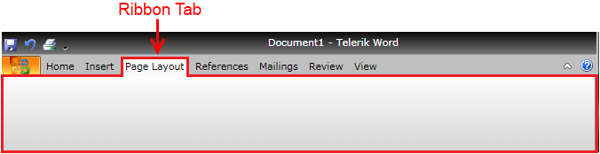
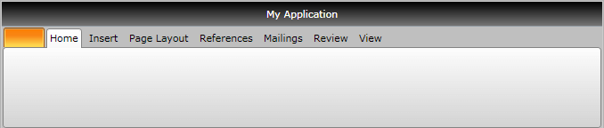

# Ribbon Tab

Telerik __RadRibbonView__ provides a simple and consistent way for building interfaces similar to the ribbon control used in Microsoft Office. The __RadRibbonView__ consists of various elements, one of which is the __Ribbon Tab__. This topic discusses concepts fundamental to the __Ribbon Tab__ at first and then goes into the usage of the __RadRibbonTab__ class and its features.	  

>tip Before proceeding with this tutorial, it is recommended to get familiar with the [Visual Structure]() of the __RadRibbonView__ control.		

## Ribbon Tab - Fundamentals

The __RadRibbonView__ helps end-users to quickly find the tools and options they need in order to complete a task. Tools and options are organized in [logical groups]() that are collected together under specific __tabs__. Or in other words - the __Ribbon Tab__ lets you categorize the commands to be displayed for the end-users.



>The class that represents the ribbon tab is __Telerik.Windows.Controls.RadRibbonTab__.		  

The __RadRibbonTab__ is a [HeaderedItemsControl](http://msdn.microsoft.com/en-us/library/system.windows.controls.headereditemscontrol.aspx). Which means that the __RadRibbonTab__ contains a heading (or title) and multiple items.		

Check out the rest of this topic, which is entirely dedicated to the __RadRibbonTab__.		

## Adding Tab Items

When you are designing a new __RadRibbonView__, one of your first tasks will be to add tabs. In order to add __RibbonTabs__ to your __RadRibbonView__ control, you need to populate the __RadRibbonView__'s __Items__ collection.		

The next example demonstrates how to add several __RadRibbonTab__ to your ribbon and how to set their __Header__ property.		

```XAML
	<telerik:RadRibbonView x:Name="radRibbonView">
	    <telerik:RadRibbonTab Header="Home">
	    </telerik:RadRibbonTab>
	    <telerik:RadRibbonTab Header="Insert">
	    </telerik:RadRibbonTab>
	    <telerik:RadRibbonTab Header="Page Layout">
	    </telerik:RadRibbonTab>
	    <telerik:RadRibbonTab Header="References">
	    </telerik:RadRibbonTab>
	    <telerik:RadRibbonTab Header="Mailings">
	    </telerik:RadRibbonTab>
	    <telerik:RadRibbonTab Header="Review">
	    </telerik:RadRibbonTab>
	    <telerik:RadRibbonTab Header="View">
	    </telerik:RadRibbonTab>
	</telerik:RadRibbonView>
```



>tip Use the __RadRibbonTab__'s __HeaderVisibility__ property, when you want to change the visibility of the TabItem's header.		  

## Working with Selection

For more information, please take a look at the [Selection]() topic.		

### Changing the Default Selected Tab

The first item in the __Items__ collection is the default selected __RibbonTab__. However, you have the ability to change the default selected __RibbonTab__, by setting the __RadRibbonTab__'s __IsSelected__ property.			

The example below sets the __IsSelected__ property to __True__ of the "References" __RibbonTab__.			

```XAML
	<telerik:RadRibbonView x:Name="radRibbonView">
	    <telerik:RadRibbonTab Header="Home">
	    </telerik:RadRibbonTab>
	    <telerik:RadRibbonTab Header="Insert">
	    </telerik:RadRibbonTab>
	    <telerik:RadRibbonTab Header="Page Layout">
	    </telerik:RadRibbonTab>
	    <telerik:RadRibbonTab Header="References" IsSelected="True">
	    </telerik:RadRibbonTab>
	    <telerik:RadRibbonTab Header="Mailings">
	    </telerik:RadRibbonTab>
	    <telerik:RadRibbonTab Header="Review">
	    </telerik:RadRibbonTab>
	    <telerik:RadRibbonTab Header="View">
	    </telerik:RadRibbonTab>
	</telerik:RadRibbonView>
```

### Accessing the Selected Tab Run-Time

Sometimes you may want to access the currently selected tab run-time. In this case, you should use the __RadRibbonView__'s __SelectedTab__ property.			

```C#
	RadRibbonTab currentlySelectedTab = radRibbonView.SelectedTab;
```
```VB.NET
	Dim currentlySelectedTab As RadRibbonTab = radRibbonView.SelectedTab
```

## Minimization

__RadRibbonView__ supports minimization, which means that the ribbon may be hidden so that only its tabs appear. The end-user can toggle the minimization of the ribbon by __double-clicking the selected tab__.		

For more information, please take a look at the [Minimization]() topic.		

## Events

The __RadRibbonView__ exposes two events related to the __RadRibbonTab__ element:		

* __PreviewSelectionChanged__ - event raised when the tab selection is about to be done. The __PreviewSelectionChanged__ event handler receives two arguments:
	* The __sender__ argument contains the __RadRibbonView__. This argument is of type __object__, but can be cast to the __RadRibbonView__ type.
	* The second argument is __RadSelectionChangedEventArgs__ containing all additional information about the event:
		* __AddedItems__ - an __IList__ collection of the selected items
		* __RemovedItems__ - an __IList__ collection of the unselected items

	>tip You can cancel the selection by setting the __RadSelectionChangedEventArgs's__ __Handled__ property to __True__.			  

	```XAML
		<telerik:RadRibbonView x:Name="radRibbonView" PreviewSelectionChanged="radRibbonView_PreviewSelectionChanged">
		 ...
		</telerik:RadRibbonView>
	```
	
	```C#
		private void radRibbonView_PreviewSelectionChanged(object sender, RadSelectionChangedEventArgs e)
		{
		 // Get the ribbonView
		 RadRibbonView ribbonView = sender as RadRibbonView;
		 //Get the selected items
		 IList selectedItems = e.AddedItems;
		 //Get the unselected items
		 IList unselectedItems = e.RemovedItems;
		 // Cancel the selection
		 e.Handled = true;
		}
	```
	```VB.NET
		Private Sub radRibbonView_PreviewSelectionChanged(sender As Object, e As RadSelectionChangedEventArgs)
			' Get the ribbonView'
			Dim ribbonView As RadRibbonView = TryCast(sender, RadRibbonView)
			'Get the selected items'
			Dim selectedItems As IList = e.AddedItems
			'Get the unselected items'
			Dim unselectedItems As IList = e.RemovedItems
			' Cancel the selection'
			e.Handled = True
		End Sub
	```

* __SelectionChanged__ - event raised after the tab selection is done. The __SelectionChanged__ event handler receives two arguments:
	* The sender argument contains the __RadRibbonView__. This argument is of type __object__, but can be cast to the __RadRibbonView__ type.
	* The second argument is __RadSelectionChangedEventArgs__ containing all additional information about the event:
		* __AddedItems__ - an __IList__ collection of the selected items
		* __RemovedItems__ - an __IList__ collection of the unselected items					

	```XAML
		<telerik:RadRibbonView x:Name="radRibbonView" SelectionChanged="radRibbonView_SelectionChanged">
		 ...
		</telerik:RadRibbonView>
	```

	```C#
		private void radRibbonView_SelectionChanged(object sender, RadSelectionChangedEventArgs e)
		{
		 // Get the ribbonView
		 RadRibbonView ribbonView = sender as RadRibbonView;
		 //Get the selected items
		 IList selectedItems = e.AddedItems;
		 //Get the unselected items
		 IList unselectedItems = e.RemovedItems;
		}
	```
	```VB.NET
		Private Sub radRibbonView_SelectionChanged(sender As Object, e As RadSelectionChangedEventArgs)
			' Get the ribbonView'
			Dim ribbonView As RadRibbonView = TryCast(sender, RadRibbonView)
			'Get the selected items'
			Dim selectedItems As IList = e.AddedItems
			'Get the unselected items'
			Dim unselectedItems As IList = e.RemovedItems
		End Sub
	```

For a full list of the exposed by the __RadRibbonView__ events, take a look at the [Events - Overview]() topic. The __RadRibbonView__ is a complex control and the __RibbonTab__ is only a small part of it. The __RadRibbonView__ consists of various elements such as:
* [Application Menu]()
* [Backstage Menu]()
* [Quick Access ToolBar]()
* [Ribbon Group]()
* [Ribbon Gallery]()
* [RibbonButtons Overview]()
* [Ribbon ComboBox]()
* [Screen Tips]()

 Additional features that you may find interesting are:
* [Selection]()
* [Resizing]()
* [Minimization]()
* [Localization]()

## See Also
 * [Styling the RadRibbonTab]()