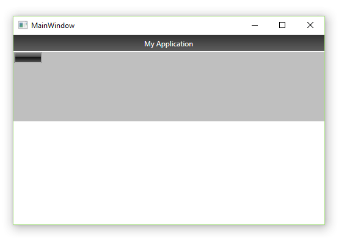
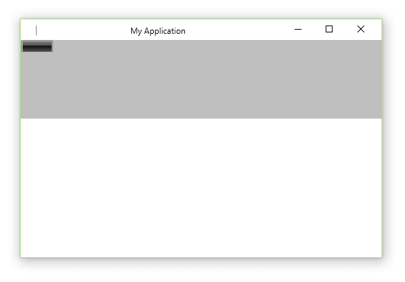
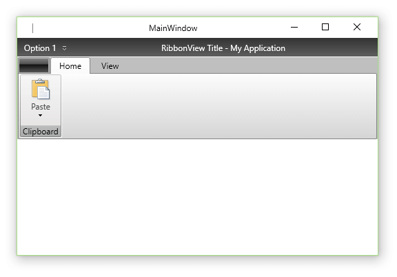
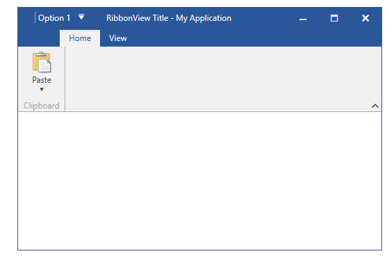

# Ribbon Window

The __RadRibbonWindow__ control is used to replace the __Window__ control that represents the root UI of a WPF application. Its purpose is to allow a smoother UI when hosting the __RadRibbonView__ at the root level of the application.

__Figure 1__ demonstrates the result, after placing a __RadRibbonView__ in the __MainWindow__ of your WPF application. 

#### __Figure 1: RadRibbonView inside MainWindow__


You will have two title bars which makes the UI messy. The __RadRibbonWindow__ integrates with the __RadRibbonView__ and prevents this. In order to use the __RadRibbonWindow__ you have to replace the __Window__ control in your __MainWindow__ class with the __RadRibbonWindow__ one.		

__Example 1: Replacing Window with RadRibbonWindow__
```XAML
	<telerik:RadRibbonWindow  x:Class="RibbonWindow.MainWindow"
	        xmlns="http://schemas.microsoft.com/winfx/2006/xaml/presentation"
	        xmlns:x="http://schemas.microsoft.com/winfx/2006/xaml"
	        xmlns:telerik="http://schemas.telerik.com/2008/xaml/presentation"
	        Title="MainWindow" Height="350" Width="525">
	    <Grid>
	        <telerik:RadRibbonView />
	    </Grid>
	</telerik:RadRibbonWindow>
```

__Example 2: Inheriting RadRibbonWindow__
```C#
	public partial class MainWindow : RadRibbonWindow
	{
		public MainWindow()
		{
			InitializeComponent();
		}
	}
```
```VB.NET
	Public Partial Class MainWindow
		Inherits RadRibbonWindow
		Public Sub New()
			InitializeComponent()
		End Sub
	End Class
```

#### __Figure 2: RadRibbonWindow as MainWindow__


By default, when you add a __RadRibbonView__ in a __RadRibbonWindow__, the components are integrated together to create a seamless UI experience. For that purpose the __QuickAccessToolbar__ as well as the __ApplicationName__  and the __Title__ of the __RadRibbonView__ are displayed in the title tray of the __RadRibbonWindow__. In this case, the value of the __RadRibbonWindow Title__ is ignored.		

## Icon

In order to provide a custom icon for the RadRibbonWindow, you have to set its __Icon__ property as demonstrated in __Example 3__. 

__Example 3: Providing a custom Icon__
```XAML
	<telerik:RadRibbonWindow Icon="Images/application-icon.ico">
```

## Title Visibility

With __Q1 2014__ we introduced a new property, which you can use to control this behavior. The __IsTitleVisible__ property is of type __bool__ and it defines whether the __RadRibbonWindow Title__ should be displayed. The default value of the property is __false__, but when changed to __true__, it makes the __RibbonWindow__ display its own __Title__. In that case the __RadRibbonView__ title bar - the __QuickAccessToolbar, Title__ and __ApplicationName__ are displayed underneath the window's title.		

__Example 4: Setting IsTitleVisible__
```XAML
	<telerik:RadRibbonWindow x:Class="Example.MainWindow"
	                         xmlns="http://schemas.microsoft.com/winfx/2006/xaml/presentation"
	                         xmlns:x="http://schemas.microsoft.com/winfx/2006/xaml"
	                         xmlns:telerik="http://schemas.telerik.com/2008/xaml/presentation"
	                         Title="MainWindow"
	                         Width="525"
	                         Height="350"
	                         IsTitleVisible="True">
	    <Grid>
	        <telerik:RadRibbonView Title="RibbonView Title" ApplicationName="My Application">
			    <telerik:RadRibbonView.QuickAccessToolBar>
	                <telerik:QuickAccessToolBar>
	                    <telerik:RadRibbonButton Foreground="White" Text="Option 1" />
	                </telerik:QuickAccessToolBar>
	            </telerik:RadRibbonView.QuickAccessToolBar>
	            <telerik:RadRibbonTab Header="Home">
	                <telerik:RadRibbonGroup Header="Clipboard">
	                    <telerik:RadRibbonSplitButton LargeImage="paste.png"
	                                                  Size="Large"
	                                                  Text="Paste"
	                                                  telerik:ScreenTip.Description="Paste the contents the Clipboard."
	                                                  telerik:ScreenTip.Title="Paste(Ctrl+V)">
	                        <telerik:RadRibbonSplitButton.DropDownContent>
	                            <telerik:RadContextMenu BorderThickness="0">
	                                <telerik:RadMenuItem Header="Paste" />
	                                <telerik:RadMenuItem Header="Paste Form" />
	                            </telerik:RadContextMenu>
	                        </telerik:RadRibbonSplitButton.DropDownContent>
	                    </telerik:RadRibbonSplitButton>
	                </telerik:RadRibbonGroup>
	            </telerik:RadRibbonTab>
	            <telerik:RadRibbonTab Header="View" />
	        </telerik:RadRibbonView>
	    </Grid>
	</telerik:RadRibbonWindow>
```

#### __Figure 3: RadRibbonWindow with visible title__


## Setting a Theme

By default the __RadRibbonWindow__ uses the Windows OS theme. However, you can also apply any of the Telerik predefined themes. In order to do so, you need to set the __RadRibbonWindow.IsWindowsThemeEnabled__ static property to __False__ in the static constructor of the __RadRibbonWindow__ or in the constructor of the __App__ class.		

__Example 5: Setting IsWindowsThemeEnabled__
```C#
	public partial class MainWindow : RadRibbonWindow
	{
		static MainWindow()
		{
			RadRibbonWindow.IsWindowsThemeEnabled = false;
		}
		public MainWindow()
		{
			InitializeComponent();
		}
	}
```
```VB.NET
	Partial Public Class MainWindow
		Inherits RadRibbonWindow
		Shared Sub New()
			RadRibbonWindow.IsWindowsThemeEnabled = False
		End Sub
		Public Sub New()
			InitializeComponent()
		End Sub
	End 
```

In order to apply a Telerik style on the __RadRibbonWindow__, it is best to use the implicit styling mechanism further described in the [Setting a Theme (Using Implicit Styles)](http://www.telerik.com/help/wpf/styling-apperance-implicit-styles-overview.html) tutorial.

Please note that the default __RadRibbonWindow__ implicit style cannot be applied on derived controls as their __Type__ is different than the one defined as a __TargetType__ in the implicit style. This is why in order to apply a Telerik predefined style on a __Window/UserControl__ deriving from __RadRibbonWindow__ you need to define a __Style__ targeting the __Window/UserControl__ type in the __Resources__ of the application. Make sure to define that style after merging the Telerik __ResourseDictionaries__ so that you can base it on the predefined __"RadRibbonWindowStyle"__.		

__Example 6: Basing the MainWindow style on the RadRibbonWindowStyle__

```XAML
	<ResourceDictionary xmlns="http://schemas.microsoft.com/winfx/2006/xaml/presentation"
	                    xmlns:x="http://schemas.microsoft.com/winfx/2006/xaml"
						xmlns:local="clr-namespace:RibbonWindow_ImplicitStylesDemo">
		<Style TargetType="local:MainWindow" BasedOn="{StaticResource RadRibbonWindowStyle}" />
	</ResourceDictionary>
```

__Example 7: Merging the needed resources__

```XAML
	<Application.Resources>
	    <ResourceDictionary>
	        <ResourceDictionary.MergedDictionaries>
	            <ResourceDictionary Source="/Telerik.Windows.Themes.Office2016;component/Themes/System.Windows.xaml" />
	            <ResourceDictionary Source="/Telerik.Windows.Themes.Office2016;component/Themes/Telerik.Windows.Controls.xaml" />
	            <ResourceDictionary Source="/Telerik.Windows.Themes.Office2016;component/Themes/Telerik.Windows.Controls.Input.xaml" />
	            <ResourceDictionary Source="/Telerik.Windows.Themes.Office2016;component/Themes/Telerik.Windows.Controls.Navigation.xaml" />
	            <ResourceDictionary Source="/Telerik.Windows.Themes.Office2016;component/Themes/Telerik.Windows.Controls.RibbonView.xaml" />
	            <ResourceDictionary Source="RibbonWindowStyle.xaml" />
	        </ResourceDictionary.MergedDictionaries>
	    </ResourceDictionary>
	</Application.Resources>
```

#### __Figure 4: RadRibbonWindow in the Office2016 theme__


## Customize Appearance

You can customize the window's appearance by setting its various properties via the appropriate style.

__Example 8: Adding a CornerRadius to the RadRibbonWindow__

```XAML
	<!-- If you're using the StyleManager approach for styling the controls you need to remove the BasedOn attribute. -->
	<Style TargetType="local:MainWindow" BasedOn="{StaticResource RadRibbonWindowStyle}"
		xmlns:shell="clr-namespace:Telerik.Windows.Controls.RibbonView.Shell;assembly=Telerik.Windows.Controls.RibbonView">
		<Setter Property="CornerRadius" Value="20"/>
		<Setter Property="shell:WindowChrome.WindowChromeCornerRadius" Value="20"/>
	</Style>
```