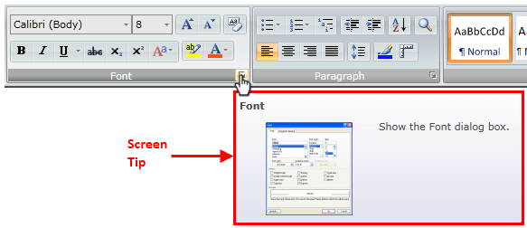
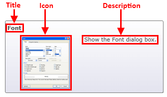
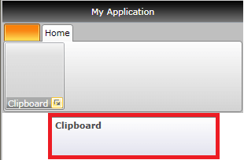
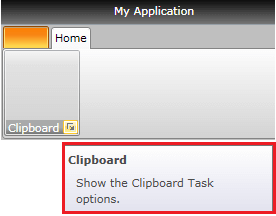
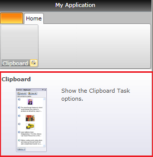

# Screen Tips

Telerik __RibbonView__ provides a simple and consistent way for building interfaces similar to the ribbon control used in Microsoft Office. The __RibbonView__ consists of various elements, one of which are the `ScreenTip`. This topic discusses concepts fundamental to the screen tips at first and then goes into the usage of the `ScreenTip` class and its features.			

>tip Before proceeding with this tutorial, it is recommended to get familiar with the [Visual Structure]() of the `RadRibbonView` control.			

The screen tip is a type of tooltip. UI feature in which a small window appears when the mouse cursor hovers a ribbon element (tab, group, button, etc.). The popup that is displayed on hover provides details that explain the associated ribbon element. When the mouse is moved away from the ribbon element, the __Screen Tip__ will disappear from view.



The class that represents the screen tip is `Telerik.Windows.Controls.ScreenTip` which derives from the native `ToolTip`. The class allows you to set the following attached properties on any __RibbonView__ control:

* `Title`&mdash;Specifies the title of the screen tip.

* `Description`&mdash;Specifies the description of the screen tip.

* `Icon`&mdash;Specifies the image of the screen tip.



### Setting Title

To enable the screen tip, set the `ScreenTip.Title` attached property on the associated ribbon control.

__Setting the screen tip title on a RadRibbonGroup element__
```XAML
	<telerik:RadRibbonView x:Name="radRibbonView">
	    <telerik:RadRibbonTab Header="Home">
	        <telerik:RadRibbonGroup x:Name="radRibbonGroupClipboard" 
	                                DialogLauncherVisibility="Visible"
	                                Header="Clipboard"
	                                telerik:ScreenTip.Title="Clipboard" />
	    </telerik:RadRibbonTab>
	</telerik:RadRibbonView>
```

__Setting screen tip title in code-behind__
```C#
	ScreenTip.SetTitle(this.radRibbonGroupClipboard, "Clipboard");
```
```VB.NET
	ScreenTip.SetTitle(Me.radRibbonGroupClipboard, "Clipboard")
```

__ScreenTip's Title example__  



### Setting Description

The description is displayed in the content area under the Title. To set the description, use `ScreenTip.Description` attached property.

__Setting the screen tip description on a RadRibbonGroup element__
```XAML
	<telerik:RadRibbonView x:Name="radRibbonView">
	    <telerik:RadRibbonTab Header="Home">
	        <telerik:RadRibbonGroup x:Name="radRibbonGroupClipboard" 
	                                DialogLauncherVisibility="Visible"
	                                Header="Clipboard"
	                                telerik:ScreenTip.Description="Show the Clipboard Task options."
	                                telerik:ScreenTip.Title="Clipboard" />
	    </telerik:RadRibbonTab>
	</telerik:RadRibbonView>
```

__Setting screen tip description in code-behind__
```C#
	ScreenTip.SetTitle(this.radRibbonGroupClipboard, "Clipboard");
	ScreenTip.SetDescription(this.radRibbonGroupClipboard, "Show the Clipboard Task options.");
```
```VB.NET
	ScreenTip.SetTitle(Me.radRibbonGroupClipboard, "Clipboard")
	ScreenTip.SetDescription(Me.radRibbonGroupClipboard, "Show the Clipboard Task options.")
```

__ScreenTip's Description example__  



### Setting Icon

The screen tip allows you to display an image next to the Description content. To set the icon, use the `ScreenTip.Icon` attached property.

__Setting screen tip icon__
```XAML
	<telerik:RadRibbonView x:Name="radRibbonView">
	    <telerik:RadRibbonTab Header="Home">
	        <telerik:RadRibbonGroup x:Name="radRibbonGroupClipboard" 
	                                DialogLauncherVisibility="Visible"
	                                Header="Clipboard"
	                                telerik:ScreenTip.Description="Show the Clipboard Task options."
	                                telerik:ScreenTip.Icon="Images/IconMSOffice/ClipboardScreenTipIcon.png"
	                                telerik:ScreenTip.Title="Clipboard" />
	    </telerik:RadRibbonTab>
	</telerik:RadRibbonView>
```

__Setting screen tip icon in code-behind__
```C#
	ScreenTip.SetTitle(this.radRibbonGroupClipboard, "Clipboard");
	ScreenTip.SetDescription(this.radRibbonGroupClipboard, "Show the Clipboard Task options.");
	ScreenTip.SetIcon(this.radRibbonGroupClipboard, new BitmapImage(new Uri("Images/IconMSOffice/ClipboardScreenTipIcon.png",UriKind.Relative)));
```
```VB.NET
	ScreenTip.SetTitle(Me.radRibbonGroupClipboard, "Clipboard")
	ScreenTip.SetDescription(Me.radRibbonGroupClipboard, "Show the Clipboard Task options.")
	ScreenTip.SetIcon(Me.radRibbonGroupClipboard, New BitmapImage(New Uri("Images/IconMSOffice/ClipboardScreenTipIcon.png", UriKind.Relative)))
```

__ScreenTip's Icon example__  



### Setting Initial and Between Show Delay

The screen tip allows you to define a custom initial and between show delays.

The initial show delay is the time that should pass from the moment the mouse enters the associated element to the moment when the screen tip popup is opened. After the first opening of the tooltip there is a period during which another screen tip can be shown without waiting for the initial show delay time to pass. This period is defined with the between show delay. When the user moves the mouse within this period from one element with visible screen tip to another, the screen tip of the second element shows immediately.

The delays are controlled with the `ScreenTip.InitialShowDelay` and `ScreenTip.BetweenShowDelay` attached properties.

__Setting screen tip show delay properties__
```XAML
	<telerik:RadRibbonView>
	    <telerik:RadRibbonTab Header="Home">
	        <telerik:RadRibbonGroup x:Name="radRibbonGroupClipboard" 
	                                DialogLauncherVisibility="Visible"
	                                Header="Clipboard"
	                                telerik:ScreenTip.Title="Clipboard"
	                                telerik:ScreenTip.InitialShowDelay="3000"
	                                telerik:ScreenTip.BetweenShowDelay="1000"/>
	    </telerik:RadRibbonTab>
	</telerik:RadRibbonView>
```

__Setting screen tip show delay properties in code-behind__
```C#
	ScreenTip.SetTitle(this.radRibbonGroupClipboard, "Clipboard");
	ScreenTip.SetInitialShowDelay(this.radRibbonGroupClipboard, 3000);
	ScreenTip.SetBetweenShowDelay(this.radRibbonGroupClipboard, 1000);
```
```VB.NET
	ScreenTip.SetTitle(Me.radRibbonGroupClipboard, "Clipboard");
	ScreenTip.SetInitialShowDelay(Me.radRibbonGroupClipboard, 3000);
	ScreenTip.SetBetweenShowDelay(Me.radRibbonGroupClipboard, 1000);
```

## See Also  
* [Application Menu]()
* [Backstage Menu]()
* [Quick Access ToolBar]()
* [Ribbon Tab]()
* [Ribbon Gallery]()
* [Ribbon Group]()
* [RibbonButtons Overview]()
* [Ribbon ComboBox]()
* [Selection]()
* [Resizing]()
* [Minimization]()
* [Localization]()
