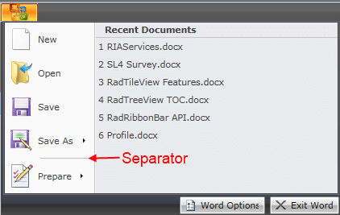

# Separator

Telerik __RadRibbonView__ provides a simple and consistent way for building interfaces similar to the ribbon control used in Microsoft Office. The __RadRibbonView__ may consist of various elements, one of which is the __Separator__.				

The __Separator__ is extremely simple element and it allows you to logically separate elements in [Application Menu]().


>tip The class that represents the separator element is __Telerik.Windows.Controls.Separator__.				

The next example demonstrates how to add a __Separator__ to an __ApplicationMenu__ object.				

#### __XAML__
```XAML
	<telerik:RadRibbonView x:Name="radRibbonView">
	    <telerik:RadRibbonView.ApplicationMenu>
	        <telerik:ApplicationMenu>
	            <telerik:RadRibbonButton Text="New Document" />
	            <telerik:RadRibbonButton Text="Open Document" />
	            <telerik:Separator />
	            <telerik:RadRibbonButton Text="Save Document" />
	        </telerik:ApplicationMenu>
	    </telerik:RadRibbonView.ApplicationMenu>
	</telerik:RadRibbonView>
```