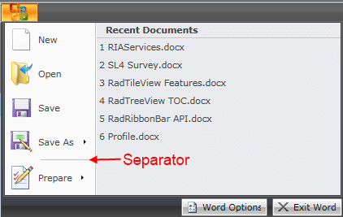

# Separator

Telerik __RadRibbonView__ provides a simple and consistent way for building interfaces similar to the ribbon control used in Microsoft Office. The __RadRibbonView__ may consist of various elements, one of which is the __Separator__.				

The __Separator__ is extremely simple element and it allows you to logically separate elements in [Application Menu]().

>tip The class that represents the separator element is __Telerik.Windows.Controls.Separator__.				

The next example demonstrates how to add a __Separator__ to an __ApplicationMenu__ object.				

<snippet id='radribbonview-features-ribbon-controls-separator-block_1-xaml' />