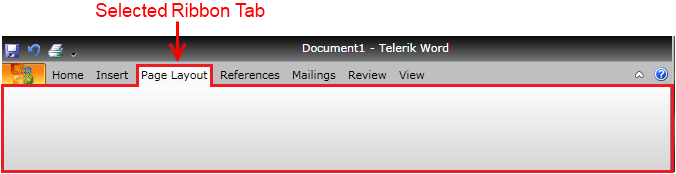

# Selection

__RadRibbonView__ supports single __RadRibbonTab__ selection. You can select it either run-time by clicking with your mouse on the appropriate tab header or programmatically via the properties described below.


## Properties

* __RadRibbonView.SelectedItem__ - sets or gets the currently selected ribbon tab item.						

	>If the __RadRibbonView__ control is bound to a custom collection, then the property __SelectedItem__ will not return __RadRibbonTab__ as you might expect, but item of the type the source collection contains.							

* __RadRibbonView.SelectedTab__ - gets the currently selected __RadRibbonTab__ container.					

* __RadRibbonView.SelectedIndex__ - sets or gets the index of the currently selected ribbon tab item.					

* __RadRibbonTab.IsSelected__ - if you want to make a tab selected, just set its __IsSelected__ property to __True;__ otherwise set it to __False__.					

## Events

* __PreviewSelectionChanged -__ event raised when the tab selection is about to be done. The __PreviewSelectionChanged__ event handler receives two arguments:
	* The __sender__ argument contains the __RadRibbonView.__ This argument is of type __object__, but can be cast to the __RadRibbonView__ type.
	* The second argument is __RadSelectionChangedEventArgs__ containing all additional information about the event:
		* __AddedItems__ - an __IList__ collection of the selected items
		* __RemovedItems__ - an __IList__ collection of the unselected items									

	>tip You can cancel the selection by setting the __RadSelectionChangedEventArgs__'s __Handled__ property to __True__.						

* __SelectionChanged__ - event raised after the tab selection is done. The __SelectionChanged__ event handler receives two arguments:
	* The sender argument contains the __RadRibbonView__. This argument is of type __object__, but can be cast to the __RadRibbonView__ type.
	* The second argument is __RadSelectionChangedEventArgs__ containing all additional information about the event:
		* __AddedItems__ - an __IList__ collection of the selected items
		* __RemovedItems__ - an __IList__ collection of the unselected items

This code snippet shows you how to attach to the selection events:


```XAML
	<telerik:RadRibbonView x:Name="radRibbonView" PreviewSelectionChanged="radRibbonView_PreviewSelectionChanged" SelectionChanged="radRibbonView_SelectionChanged">
	...
	</telerik:RadRibbonView>
```

Below is a sample implementation of both of the event handlers:


```C#
	private void radRibbonView_PreviewSelectionChanged(object sender, RadSelectionChangedEventArgs e)
	{
	 // Get the ribbonView
	 RadRibbonView ribbonView = sender as RadRibbonView;
	 //Get the selected items
	 IList selectedItems = e.AddedItems;
	 //Get the unselected items
	 IList unselectedItems = e.RemovedItems;
	 // Cancel the selection
	 e.Handled = true;
	}
	private void radRibbonView_SelectionChanged(object sender, RadSelectionChangedEventArgs e)
	{
	 // Get the ribbonView
	 RadRibbonView ribbonView = sender as RadRibbonView;
	 //Get the selected items
	 IList selectedItems = e.AddedItems;
	 //Get the unselected items
	 IList unselectedItems = e.RemovedItems;
	}
```


```VB.NET
	Private Sub radRibbonView_PreviewSelectionChanged(sender As Object, e As RadSelectionChangedEventArgs)
	 ' Get the ribbonView'
	 Dim ribbonView As RadRibbonView = TryCast(sender, RadRibbonView)
	 'Get the selected items'
	 Dim selectedItems As IList = e.AddedItems
	 'Get the unselected items'
	 Dim unselectedItems As IList = e.RemovedItems
	 ' Cancel the selection'
	 e.Handled = True
	End Sub
	Private Sub radRibbonView_SelectionChanged(sender As Object, e As RadSelectionChangedEventArgs)
	 ' Get the ribbonView'
	 Dim ribbonView As RadRibbonView = TryCast(sender, RadRibbonView)
	 'Get the selected items'
	 Dim selectedItems As IList = e.AddedItems
	 'Get the unselected items'
	 Dim unselectedItems As IList = e.RemovedItems
	End Sub
```

For a full list of the exposed by the __RadRibbonView__ events, take a look at the [Events - Overview]() topic.