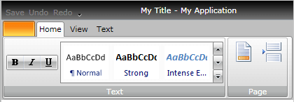

# Functional Structure

This topic aims to explain the controls' structure needed to create a fully functional __RadRibbonView__ control.			

>Before proceeding with this topic, it is recommended to get familiar with the [Visual Structure]() of the __RadRibbonView__ control.

<!-- -->
>This section defines the functional structure of the __RadRibbonView__ which you have to get familiar with before you continue reading the other topics of this help.				

## Fundamentals

The root level container is the __RadRibbonView__ itself. It is separated in two main areas: the __title bar__ and the __tabs container__. The __title bar__ contains the application menu button, the Quick Access Toolbar and the application title, while the __tabs container__ is the place where all of your __RadRibbonTabs__ are hosted just like the tabs of the standard tab control. One single __RadRibbonView__ can contain as many tabs as needed. The only restriction here is the visual area of your application.				

Here is how a sample XAML declaration of these elements looks like:

<snippet id='radribbonview-general-information-functional-structure-block_1-xaml' />

As you can see, the declared structure is pretty staright-forward. You have an empty Backstage menu, an empty Quick Access Toolbar and three empty tabs added as children to the __RadRibbonView__. The title and the application name are defined as attributes of the __RadRibbonView__.				

## Backstage menu

The Backstage control is basically an ItemsControl that can be used to display controls, used to perform actions on the entire document, like Save, Print and Send. The __RibbonBackstage__ can also provide a list of recent documents, access to application options for changing user settings and preferences, and application exit.				

Here is how a sample XAML declaration of these elements looks like:

<snippet id='radribbonview-general-information-functional-structure-block_2-xaml' />

For more information take a look at the [Backstage]() topic.				

## Quick Access Toolbar

The Quick Access Toolbar is composed of two parts: 
* __Toolbar__ - used to host some commonly used actions.
* __Menu__ - contains menu items for minimization or changing the position of the __RadRibbonView__.					

Currently you can only add or remove buttons to the toolbar but cannot modify its menu.

Here is how a sample XAML declaration of these elements looks like:

<snippet id='radribbonview-general-information-functional-structure-block_3-xaml' />

As you can see the declaration of the Quick Access Toolbar contains three buttons: "Save", "Undo" and "Redo".

For more information take a look at the [Quick Access ToolBar]() topic.				

## RadRibbonTab

The __RadRibbonTab__ is the main container control of the __RadRibbonView__. It is actually a tab page that's ment to host your buttons, check boxes, combo boxes, galleries and all the other types of controls that you need. The __RadRibbonTab__ consists of two parts:				
* __Header__ - used to display informational text (i.e. "Formatting") that describes the kind of actions it contains.
* __Content Area__ - this is the area where all your controls are going to be placed in.					

You never add your controls to the __RadRibbonTab__ directly. Instead they should be always placed inside of __RadRibbonGroups__. The __RadRibbonGroup__ container is used to organize your controls in groups and to re-arrange them correctly when the parent container is resized. Additionally you can group your buttons in __RadButtonGroup,__ while all other controls can be hosted in any other container.				

Here is how a sample XAML declaration of these elements looks like:

<snippet id='radribbonview-general-information-functional-structure-block_4-xaml' />

As you can see two __RadRibbonGroups__ - "Text" and "Page", have been declared. The first one - "Text", contains a button group with three buttons inside, plus a __RadRibbonGallery__ with 6 gallery items. The second group - "Page", contains two radio buttons with their size set to __Large__.

Here you can see how the whole XAML declaration of the __RadRibbonView__ looks like:

<snippet id='radribbonview-general-information-functional-structure-block_5-xaml' />

This RibbonView is far from being ready but at least it illustrates the element's structure you have to follow in order to have a fully functional __RadRibbonView__.

## References

The __RadRibbonView__ consists of various elements, for more information on each of them take a look at the topics below:
* [Application Menu]()
* [Backstage]()
* [Quick Access ToolBar]()
* [Ribbon Tab]()
* [Ribbon Group]()
* [Ribbon Buttons]()
* [Ribbon ComboBox]()
* [Screen Tips]()

Additional features that you may find interesting are:
* [Selection]()
* [Resizing]()
* [Minimization]()
* [Localization]()
* [Styling and Appearance]()