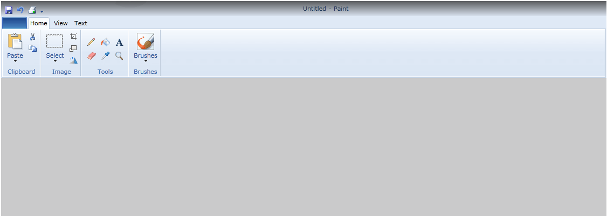

# Key Features

This is a list with short descriptions of the top-of-the-line features of Telerik's __RadRibbonView__ control.				

* __MS Office Interface at your Fingertips__ - The Telerik SilverlightWPF __RadRibbonView__ control enables you to build user interfaces similar to the ribbon control used in Microsoft Office. This feature ensures that your applications will look up to date with the latest Microsoft applications with which your users are already familiar. [Read more]()

* __Automatic Resizing and Minimization__ - Telerik SilverlightWPF  __RibbonView__ and its composite parts fully support automatic [resizing](). The different groups and panels adjust their dimensions and internal layout dynamically to best accommodate the available space. Each [RibbonGroup]() has up to four different layouts, so that the control can be easily resized. The Telerik __RibbonView__ also supports [minimization]() that allows you to hide the __RibbonView__ and let only the tabs appear, thus saving space. Clicking a tab will open the __RibbonView__ popup and let you use all its controls.					

* __Galleries and Pop-ups__ - Telerik SilverlightWPF  __RibbonView__ is built on modular pop-ups, in which are embedded galleries, menus and collapsed groups. All __RibbonView__ galleries and pop-ups mimic Office galleries exactly and fully comply with the ribbon UI requirements. Telerik __RibbonView__ allows you to fully control the pop-ups’ location, size and content.The __RibbonView__'s __ColorPicker__ galleries provide an advanced implementation for color selection. [Read more]()

* __Backstage Menu__ -  the Backstage menu is accessible through the __ApplicationMenuButton__ on the left.  It can be used to display standard buttons like Save, Print and Send, as well as to provide a list of recent documents, access to application options for changing user settings and preferences, and application exit. [Read More]()

* __Application Menu__- the Application menu is accessible through the __ApplicationMenuButton__ on the left. Besides the standard buttons (such as New, Open, Save, Print, etc.) you can use footer buttons. In the right side of the Application Menu you can nest any content – Recent Documents, for example. [Read more]()

* __Quick Access Toolbar__ - the __RibbonView__'s quick access toolbar is usually displayed either in the window's title bar or below the __RibbonView__. It provides quick access to the most commonly used commands in your application. You can fully customize the Quick Access Toolbar to make it most convenient for your application. [Read more]()

* __Nested Controls__ - Telerik SilverlightWPF suite supplies all controls that you will need in a ribbon control. This results in reduced learning curve, because you will not need to learn new tools if you have already worked with the RadControls suite. [Read more]()

* __Screen Tips__ - display helpful information for every __RibbonView__ control using the built-in screen tip support. All you need to do is to specify screen tip's image, title and text for the respective control using attached properties. [Read more]()

* __Styling and Appearance__ - Telerik SilverlightWPF  __RibbonView__ is a fully customizable control, which lets you easily modify all its visual elements. The control comes with several predefined skins that can be customized if needed. [Read more]()

* __Commands Support__ - make your code more clear and reusable using the command support provided by such controls as [RadRibbonButton](), [RadRibbonSplitButton](), [RadRibbonDropDownButton](), [RadRibbonRadioButton]() and [RadToggleButton](). 

* __Localization Support__ - the Telerik SilverlightWPF  __RibbonView__ can be easily globalized. The localization mechanism of __RadRibbonView__ lets you adjust the control to any culture.[Read more]()

* __Enhanced Routed Events Framework__ - to help your code become even more elegant and concise, Enhanced Routed Events Framework for __RadControls__ for SilverlightWPF is implemented. This gives you more freedom when you design your applications, since you can write instance handlers as well as class handlers for the routed events of your controls					

* __Expression Blend support__ - all __RadControls__ for SilverlightWPF can be easily customized using Expression Blend.					

* __WPF/Silverlight Code Compatibility__ - the Silverlight RibbonView shares a single code-base with its WPF counterpart. This means that you can achieve close to 100% code reuse for your RibbonView logic if you have parallel Silverlight/WPF development.					

* __Codeless Test Automation for RibbonView__ - now you can record, execute and debug functional tests for the RibbonView without leaving the familiar Visual Studio environment. Telerik [Test Studio](http://www.telerik.com/automated-testing-tools.aspx) is an advanced click and plays application testing tool for automating Silverlight and WPF applications. The Studio ships with special translators for Telerik RadControls for Silverlight and WPF.