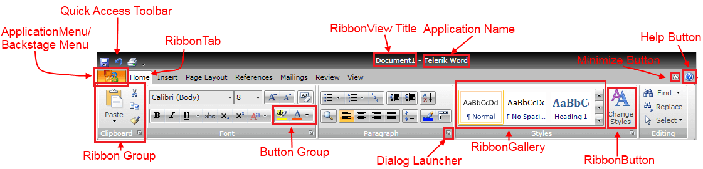

# Visual Structure

>This section defines the terms and the concepts used in the scope of __RadRibbonView__ which you have to get familiar with before you continue reading this help.

Below you can see a snapshot and explanation of the main visual elements of the __RadRibbonView__ control.

The structure of a __RadRibbonView__ consists of the following main elements:

* __Application/Backstage Menu__- the Application/Backstage menu is accessible through the Application Menu Button on the left. Read more about the [ApplicationMenu]() or the [Backstage]().

* __Quick Access Toolbar__ - the RibbonView's quick access toolbar is usually displayed either in the window's title bar or below the RibbonView. It provides quick access to the most commonly used commands in your application. You can fully customize the Quick Access Toolbar to make it most convenient for your application. [Read more]()

* __Application Name and Title__ - the ribbon title and the application name are located in the middle of the top area of the __RadRibbonView__. You can use it to display the currently opened document along with the name of your application. 

* __Ribbon Tab__ - this is the highest level container control in the ribbon bar structure. You can use the __RadRibbonTab__ control to organize the controls in a more logical and convenient way for the user. [Read more]()

* __Ribbon Group__ - this is one of the most frequently used container controls in the RibbonView structure. You can use the __RadRibbonGroup__ control to organize the controls in a more logical and convenient way for the user. Moreover, the ribbon group adjusts its dimensions and internal layout dynamically to best accommodate the available space. [Read more]()

* __Dialog Launcher__ - the dialog launcher button is located in the lower right corner of the ribbon group and it is hidden by default. You can use it to associate configuration dialogs with each ribbon group container.

* __Button Group__ - use the __RadButtonGroup__ to organize your buttons with common functionality i.e. Increase, Decrease Font. 

* __Ribbon Gallery__ - the __RadRibbonGallery__ control provides a list of options to choose from and also a preview functionality. It can be hosted directly in the ribbon group or in a __RadRibbonDropDownButton__. [Read more]()

* __Ribbon Button__ - this is the main action control used in the ribbon, it is responsible for providing interface for the actions exposed by your application. The following types of buttons are available: [RadRibbonButton](), [RadRibbonSplitButton](), [RadRibbonDropDownButton](), [RadRibbonRadioButton]() and [RadToggleButton](). [Read more]()

* __Help Button__ - the help button is located always on the right side of the __RadRibbonView__. It is hidden by default but if you want to make it visible just set the property __RadRibbonView.HelpButtonVisibility__ to __Visible__.

* __Minimize Button__ - the minimize button is located always on the right side of the __RadRibbonView,__ before the __HelpButton__. It is hidden by default but if you want to make it visible just set the property __RadRibbonView.MinimizeButtonVisibility__ to __Visible__.
