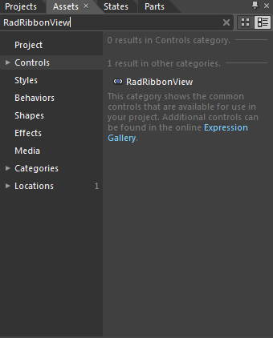
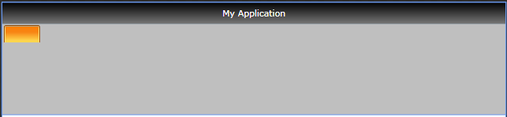
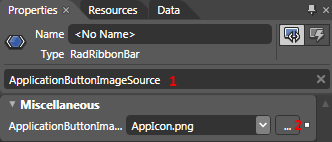
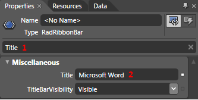
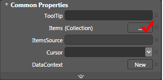
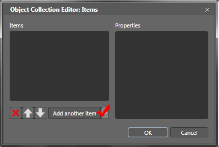
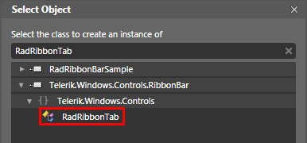
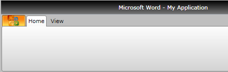
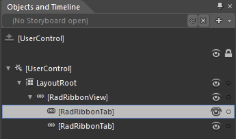
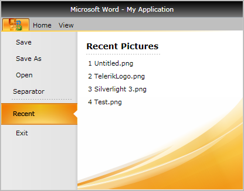

# Getting Started

__RadRibbonView__ is an advanced SilverlightWPF control providing full Blend support. From within the visual environment of Blend, you can easily perform various tasks such as editing control properties, modifying themes, creating and modifying templates and more.
			

This tutorial will walk you through the creation of a __RadRibbonView__.
			

>Before reading this tutorial you should get familiar with the
					[Visual]() and
					[Functional]() structure of the standard
					__RadRibbonView__ control.
				

For the purpose of this tutorial, you will need to create an empty SilverlightWPF Application project and open it in Blend.

>

							In order to use __RadRibbonView__ control in your projects you have to add references to the
							following assemblies:
						

* __Telerik.Windows.Controls__

* __Telerik.Windows.Controls.Input__

* __Telerik.Windows.Controls.Navigation__

* __Telerik.Windows.Controls.RibbonView__

							You can find more info
							[here](http://www.telerik.com/help/silverlight/installation-installing-controls-dependencies.html).
						

>

							In order to use __RadRibbonView__ control in your projects you have to add references to the
							following assemblies:
						

* __Telerik.Windows.Controls__

* __Telerik.Windows.Controls.Input__

* __Telerik.Windows.Controls.Navigation__

* __Telerik.Windows.Controls.RibbonView__

* __Telerik.Windows.Data__

							You can find more info
							[here](http://www.telerik.com/help/wpf/installation-installing-controls-dependencies-wpf.html).
						

## Add RadRibbonView Using Expression Blend

* 
						Open the __Asset Library__ (*Window->Assets*) in Expression Blend and start writing the name of the __RadRibbonView__ in the search box.
						

* 
						Drag a __RadRibbonView__ on the artboard.

						

#### __XAML__

{{region radribbonview-gettingstarted_0}}
	<UserControl
	 ...
	 xmlns:telerik="http://schemas.telerik.com/2008/xaml/presentation"
	 ...>
	 <Grid x:Name="LayoutRoot" Background="White">
	  <telerik:RadRibbonView />
	 </Grid>
	</UserControl>
	{{endregion}}

							There are two things you should pay attention to in the above code snippet. The first is the declaration of the __telerik__namespace from and the second is the declaration of the __RadRibbonView__ control itself.
						

					If you run your application now you will see an empty __RadRibbonView__ that contains no tabs, no application/backstage menu and no elements. To learn about each one of the controls, that the __RadRibbonView__ may contain, check out the __Ribbon Controls__ subsection in the __Features__ section.
				

## Add Application Icon

In order to add an application icon perform the following instructions:

* Select your control in Expression Blend. 

* 
						In the __Properties Pane__, find the __ApplicationButtonImageSource__ property and select the desired image from your local hard drive.
						

#### __XAML__

{{region radribbonview-gettingstarted_1}}
	<telerik:RadRibbonView ApplicationButtonImageSource="AppIcon.png" />
	{{endregion}}

Note that the selected image will be included in your project.

## Set Application Title

					In order to set the application title, you need to use the __RadRibbonView__'s __Title__ property. This can be done in two easy steps:
				

* Select your RibbonView control in Expression Blend 

* 
						In the __Properties Pane__, find the __Title__ property and set its value.
						

#### __XAML__

{{region radribbonview-gettingstarted_2}}
	<telerik:RadRibbonView ApplicationButtonImageSource="AppIcon.png" Title="Microsoft Word" />
	{{endregion}}

The result can be seen on the next snapshot.

## Add Ribbon Tabs

					The __RadRibbonView__ helps end-users to quickly find the tools and options they need in order to complete a task. Tools and options are organized in logical groups that are collected together under specific __tabs__. Or in other words - the __Ribbon Tab__ lets you categorize the commands to be displayed for the end-users.
				

>
						The class that represents the ribbon tab is __Telerik.Windows.Controls.RadRibbonTab__.
					

In order to add ribbon tabs to your ribbon control in Expression Blend, you should perform the following instructions:

* Select your RibbonView control. 

* 
						In the __Properties Pane__, find and edit the __Items__ property.
						

* 
						The "Object Collection Editor" dialog will open.
						

* 
						Add two items of type __RadRibbonTab__.
						

* 
						Set their __Header__ properties respectively to "Header" and "View". The result from the operations above is shown on the next image.
						

#### __XAML__

{{region radribbonview-gettingstarted_3}}
	<telerik:RadRibbonView ApplicationButtonImageSource="AppIcon.png" Title="Microsoft Word" >
	 <telerik:RadRibbonTab Header="Home"/>
	 <telerik:RadRibbonTab Header="View"/>
	</telerik:RadRibbonView>
	{{endregion}}

					For more information about the __RadRibbonTab__, check out the [Ribbon Tab]() topic in the __Ribbon Controls__ section
				

## Add Content to the Ribbon Tabs

					The content of the ribbon is inserted into the __RadRibbonGroups__ which are rendered inside the __RadRibbonTabs__.
				

* 
						In the "Object and Timeline" pane in Expression Blend, select the first __RadRibbonTab__.
						

* 
						Using the __RadRibbonTab__'s __Items__ property add a new item of type __RadRibbonGroup__. Set its __Header__ property to "Clipboard".
						

The result XAML so far is shown on the next code-snippet.

#### __XAML__

{{region radribbonview-gettingstarted_4}}
	<telerik:RadRibbonView ApplicationButtonImageSource="AppIcon.png" Title="Microsoft Word" >
	 <telerik:RadRibbonTab Header="Home">
	  <telerik:RadRibbonGroup Header="Clipboard"/>
	 </telerik:RadRibbonTab>
	 <telerik:RadRibbonTab Header="View"/>
	</telerik:RadRibbonView>
	{{endregion}}

							For more information about the ribbon group, read the main [Ribbon Group]() topic.
						

* 
						The final step is to add content to the ribbon group. You should again use the __Items__ property, however this time you use the __Items__ property of the __RadRibbonGroup__ object.
					

					For example, the next code snippet adds a __RadRibbonSplitButton__ as a child of the group.
				

#### __XAML__

{{region radribbonview-gettingstarted_5}}
	<telerik:RadRibbonView ApplicationButtonImageSource="AppIcon.png" Title="Microsoft Word">
	    <telerik:RadRibbonTab Header="Home">
	        <telerik:RadRibbonGroup Header="Clipboard">
	
	            <telerik:RadRibbonSplitButton Text="Paste" LargeImage="paste.png" Size="Large"
	                    telerik:ScreenTip.Title="Paste(Ctrl+V)"
	                    telerik:ScreenTip.Description="Paste the contents the Clipboard.">
	                <telerik:RadRibbonSplitButton.DropDownContent>
	                    <telerik:RadContextMenu BorderThickness="0">
	                        <telerik:RadMenuItem Header="Paste" />
	                        <telerik:RadMenuItem Header="Paste Form" />
	                    </telerik:RadContextMenu>
	                </telerik:RadRibbonSplitButton.DropDownContent>
	            </telerik:RadRibbonSplitButton>
	
	        </telerik:RadRibbonGroup>
	    </telerik:RadRibbonTab>
	    <telerik:RadRibbonTab Header="View" />
	</telerik:RadRibbonView>
	{{endregion}}

					There are two things you should pay attention to in the above code snippet. The first is the declaration of the __RadRibbonSplitButton__ and its drop down content. In fact the __RadRibbonView__'s API exposes several __buttons__ you could use with the ribbon. For more information, check out tha [RibbonButtons - Overview]() topic. The second is the declaration of the __screen tips__. __Screen Tip__ is a UI feature in which a small window appears when the __mouse cursor__ is hovered over an icon or a ribbon element (command). The __popup__ window will provide details that explain the command's function. For more information see the [Screen Tips]() topic.
				

## Declare Backstage

					The __Backstage Menu__ is equivalent to the __File__ menu of the traditional menu UIs. It is represented by the rectangular button (named __Application Button__) on the upper-left corner of the __RadRibbonView__ control. The __Backstage Menu__ appears when a user __clicks__ the __Application Button__. This menu displays controls used to perform actions on the entire document, like Save, Print and Send. The __Backstage Menu__ also provides a list of recent documents, access to application options for changing user settings and preferences, and application exit.
				

					To declare a Backstage menu you need to set the __Backstage__ property like the example below.
				

#### __XAML__

{{region radribbonview-gettingstarted_6}}
	<telerik:RadRibbonView ApplicationButtonImageSource="AppIcon.png" Title="Microsoft Word">
	    <telerik:RadRibbonView.Backstage>
	        <telerik:RadRibbonBackstage>
	            <telerik:RadRibbonBackstageItem CloseOnClick="False" Header="Save" Icon="Images/Save.png"
	                    IsSelectable="False" />
	            <telerik:RadRibbonBackstageItem Header="Save As" Icon="Images/SaveAs.png" IsSelectable="False" />
	            <telerik:RadRibbonBackstageItem Header="Open" Icon="Images/Open.png" IsSelectable="False" />
	            <telerik:RadRibbonBackstageItem Header="Separator" IsGroupSeparator="True" />
	            <telerik:RadRibbonBackstageItem Header="Recent" IsDefault="True">
	                <Grid>
	                    <Grid.ColumnDefinitions>
	                        <ColumnDefinition Width="*" />
	                        <ColumnDefinition Width="Auto" />
	                        <ColumnDefinition Width="*" />
	                    </Grid.ColumnDefinitions>
	                    <StackPanel Margin="15 15 0 0">
	                        <TextBlock Margin="0 0 0 2" FontSize="14" FontWeight="Bold" Text="Recent Pictures" />
	                        <Rectangle Height="1">
	                            <Rectangle.Fill>
	                                <LinearGradientBrush MappingMode="Absolute" SpreadMethod="Repeat"
	                                        StartPoint="0,0.5" EndPoint="4,0.5">
	                                    <GradientStop Offset="0" Color="#40000000" />
	                                    <GradientStop Offset="0.5" Color="#40000000" />
	                                    <GradientStop Offset="0.501" Color="Transparent" />
	                                </LinearGradientBrush>
	                            </Rectangle.Fill>
	                        </Rectangle>
	                        <ItemsControl Margin="0 4 0 0">
	                            <telerik:RadRibbonButton Content="1 Untitled.png" HorizontalAlignment="Stretch" />
	                            <telerik:RadRibbonButton Content="2 TelerikLogo.png" HorizontalAlignment="Stretch" />
	                            <telerik:RadRibbonButton Content="3 Silverlight 3.png" HorizontalAlignment="Stretch" />
	                            <telerik:RadRibbonButton Content="4 Test.png" HorizontalAlignment="Stretch" />
	                        </ItemsControl>
	                    </StackPanel>
	                </Grid>
	            </telerik:RadRibbonBackstageItem>
	            <telerik:RadRibbonBackstageItem Header="Exit" Icon="Images/Exit.png" IsSelectable="False" />
	        </telerik:RadRibbonBackstage>
	    </telerik:RadRibbonView.Backstage>
	    <telerik:RadRibbonTab Header="Home">
	        <telerik:RadRibbonGroup Header="Clipboard">
	            <telerik:RadRibbonSplitButton Text="Paste" LargeImage="paste.png" Size="Large"
	                    telerik:ScreenTip.Title="Paste(Ctrl+V)"
	                    telerik:ScreenTip.Description="Paste the contents the Clipboard.">
	                <telerik:RadRibbonSplitButton.DropDownContent>
	                    <telerik:RadContextMenu BorderThickness="0">
	                        <telerik:RadMenuItem Header="Paste" />
	                        <telerik:RadMenuItem Header="Paste Form" />
	                    </telerik:RadContextMenu>
	                </telerik:RadRibbonSplitButton.DropDownContent>
	            </telerik:RadRibbonSplitButton>
	        </telerik:RadRibbonGroup>
	    </telerik:RadRibbonTab>
	    <telerik:RadRibbonTab Header="View" />
	</telerik:RadRibbonView>
	{{endregion}}

The result is shown on the next image.

					For more information see the [Backstage]() topic.
				

## Declare Quick Access Toolbar

					The __Quick Access Toolbar__ is used to render a set of __RadRibbonView__ controls (commands) that are most commonly used in the application. It is rendered right above the ApplicationButton to make it easily accessible to end-users. To declare the Quick Access ToolBar you need to set the __QuickAccessToolBar__ property. For more information and practical example, refer to the [Quick Access Toolbar]() topic.
				

## Resizing

					One of the most important features of the __RadRibbonView__ is the dynamic layout resizing. It refers to the __RadRibbonView__'s ability to optimize its layout depending on how much space is available. This process can't be automated, however, the __RadRibbonView__'s API gives you the ability to specify how you would like the resizing to occur. Check out the following topics, which are tightly connected to the resizing behavior:
				

* [Resizing]()

* [Ordered Wrap Panel]()

* [Collapsible Panel]()

# See Also

 * [Ribbon Backstage]()

 * [Application Menu]()

 * [Quick Access Toolbar]()

 * [Ribbon Tab]()
