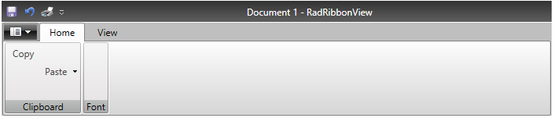

# Getting Started with WPF RibbonView

This tutorial will walk you through the creation of a sample application that contains `RadRibbonView`.

>important Before reading this tutorial you should get familiar with the [visual]() and [functional]() structure of the control.

* [Adding Telerik Assemblies Using NuGet](#adding-telerik-assemblies-using-nuget)
* [Adding Assembly References Manually](#adding-assembly-references-manually)
* [Defining a RadRibbonView](#defining-a-radribbonview)
* [Adding Ribbon Tabs](#adding-ribbon-tabs)
* [Adding Content in the Ribbon Tabs](#adding-content-in-the-ribbon-tabs)
* [Resizing](#resizing)
* [Setting up the Application Button Icon](#setting-up-the-application-button-icon)
* [Setting up the Application Title and Name](#setting-up-the-application-title-and-name)
* [Setting up the Ribbon Backstage](#setting-up-the-ribbon-backstage)
* [Setting up the Quick Access Toolbar](#setting-up-the-quick-access-toolbar)
* [Code Example](#code-example)

## Adding Telerik Assemblies Using NuGet

To use __RadRibbonView__ when working with NuGet packages, install the `Telerik.Windows.Controls.RibbonView.for.Wpf.Xaml` package. The [package name may vary]() slightly based on the Telerik dlls set - [Xaml or NoXaml]()

Read more about NuGet installation in the [Installing UI for WPF from NuGet Package]() article.

>tip With the 2025 Q1 release, the Telerik UI for WPF has a new licensing mechanism. You can learn more about it [here]().

## Adding Assembly References Manually

If you are not using NuGet packages, you can add a reference to the following assemblies:

* __Telerik.Licensing.Runtime__
* __Telerik.Windows.Controls__
* __Telerik.Windows.Controls.Input__
* __Telerik.Windows.Controls.Navigation__
* __Telerik.Windows.Controls.RibbonView__
* __Telerik.Windows.Data__

## Defining a RadRibbonView

You can add a RadRibbonView manually in XAML as demonstrated in the following example:

#### __[XAML] Adding a RadRibbonView in XAML__
{{region radribbonview-gettingstarted-0}}
	<telerik:RadRibbonView />
{{endregion}}
	
At this state, the ribbonview is empty - there are not tabs, backstage or any other ribbon components. You can learn about the controls that the RadRibbonView can contain from the [Features]() section of the documentation.

__Empty RadRibbonView__

## Adding Ribbon Tabs

The RadRibbonView helps users to quickly find the tools and options they need in order to complete a task. Tools and options are organized in logical groups that are collected together under specific tabs. The ribbon tabs allows you to categorize the commands to be displayed to the users. The class that represents the ribbon tab is the [RadRibbonTab]().

>tip You can also use contextual tabs. You can read more about this in the [Contextual Tabs]() topic.

The tabs can be added in the `Items` collection of RadRibbonView. The RadRibbonTab class exposes the `Header` property that is used to define the content of its header. 

The next examples demonstrate how to do this in XAML and code-behind:

#### __[XAML] Adding RadRibbonTabs in XAML__  
{{region radribbonview-gettingstarted-01}}
    <telerik:RadRibbonView>
		<telerik:RadRibbonView.Items>
			<telerik:RadRibbonTab Header="Home" />
			<telerik:RadRibbonTab Header="View" />
			<telerik:RadRibbonTab Header="Insert" />
			<telerik:RadRibbonTab Header="References" />
		</telerik:RadRibbonView.Items>
	</telerik:RadRibbonView>
{{endregion}}
	
#### __[C#] Adding RadRibbonTabs in code__
{{region radribbonview-gettingstarted-02}}
	RadRibbonView ribbonView = new RadRibbonView();
	ribbonView.Items.Add(new RadRibbonTab() { Header = "Home" });
	ribbonView.Items.Add(new RadRibbonTab() { Header = "View" });
	ribbonView.Items.Add(new RadRibbonTab() { Header = "Insert" });
	ribbonView.Items.Add(new RadRibbonTab() { Header = "References" });
{{endregion}}
			
#### __[VB.NET] Adding RadRibbonTabs in code__
{{region radribbonview-gettingstarted-03}}
	Dim ribbonView As New RadRibbonView()
	ribbonView.Items.Add(New RadRibbonTab() With { _
		.Header = "Home" _
	})
	ribbonView.Items.Add(New RadRibbonTab() With { _
		.Header = "View" _
	})
	ribbonView.Items.Add(New RadRibbonTab() With { _
		.Header = "Insert" _
	})
	ribbonView.Items.Add(New RadRibbonTab() With { _
		.Header = "References" _
	})
{{endregion}}

__RadRibbonView with several RadRibbonTabs defined in its Items collection__

## Adding Content in the Ribbon Tabs

RadRibbonTab is a `HeaderedItemsControl`, which means that it can contain a collection of items. The children of the ribbon tab should be objects of type `RadRibbonGroup`. They expose a Header property that is used to define the content of their header.

#### __[XAML] Adding RadRibbonGroups__
{{region radribbonview-gettingstarted-04}}
	<telerik:RadRibbonView>
		<telerik:RadRibbonView.Items>
			<telerik:RadRibbonTab Header="Home">
				<telerik:RadRibbonGroup Header="Clipboard">                        
				</telerik:RadRibbonGroup>
				<telerik:RadRibbonGroup Header="Font">
				</telerik:RadRibbonGroup>
			</telerik:RadRibbonTab>
			<telerik:RadRibbonTab Header="View" />
		</telerik:RadRibbonView.Items>
	</telerik:RadRibbonView>
{{endregion}}

#### __A RadRibbonTab with a couple RadRibbonGroups defined in its Items collection__

The RadRibbonGroup element is also a HeaderedItemsControl and it can have child elements on its own.

#### __[XAML] Adding RadRibbonGroup content__
{{region radribbonview-gettingstarted-05}}
	<telerik:RadRibbonView>
		<telerik:RadRibbonView.Items>
			<telerik:RadRibbonTab Header="Home">
				<telerik:RadRibbonGroup Header="Clipboard">                        
					<telerik:RadRibbonButton Text="Copy" />
					<telerik:RadRibbonSplitButton Text="Paste">
						<telerik:RadRibbonSplitButton.DropDownContent>
							<telerik:RadMenu>
								<telerik:RadMenuItem Header="Paste" />
								<telerik:RadMenuItem Header="Paste from" />
							</telerik:RadMenu>
						</telerik:RadRibbonSplitButton.DropDownContent>
					</telerik:RadRibbonSplitButton>
				</telerik:RadRibbonGroup>
				<telerik:RadRibbonGroup Header="Font">
				</telerik:RadRibbonGroup>
			</telerik:RadRibbonTab>
			<telerik:RadRibbonTab Header="View" />
		</telerik:RadRibbonView.Items>
	</telerik:RadRibbonView>
{{endregion}}

__A RadRibbonGroup with a couple ribbon buttons defined in its Items collection__

>important The Items collection of RadRibbonTab can contain any UIElement. However, if you do not wrap it manually into a RadRibbonGroup control, the ribbonview will do it automatically.

>tip You can find more information about RadRibbonGroup in the [Ribbon Group]() help article.

## Resizing

One of the most important features of RadRibbonView is the dynamic layout resizing. It refers to the RadRibbonView's ability to optimize its layout depending on how much space is available. This process can't be automated; however, the RadRibbonView's API gives you the ability to specify how you would like the resizing to occur. 

Check out the following topics, which are tightly connected to the resizing behavior:  

* [Resizing]()
* [Ordered Wrap Panel]()
* [Collapsible Panel]()
	
## Setting up the Application Button Icon

You can se the icon of the ribbonview's application button through the `ApplicationButtonImageSource` property, which is of type `ImageSource`.

#### __[XAML] Setting the RadRibbonView application button image source in XAML__
{{region radribbonview-gettingstarted-06}}
	<telerik:RadRibbonView ApplicationButtonImageSource="images/appIcon.png" />
{{endregion}}
	
#### __[C#] Setting the RadRibbonView application button image source in code__
{{region radribbonview-gettingstarted-07}}
	RadRibbonView ribbonView = new RadRibbonView();
	ribbonView.ApplicationButtonImageSource = new BitmapImage(new Uri(appIconStringPath));
{{endregion}}
	
#### __[VB.NET] Setting the RadRibbonView application button image source in code__
{{region radribbonview-gettingstarted-08}}
	Dim ribbonView As New RadRibbonView()
	ribbonView.ApplicationButtonImageSource = New BitmapImage(New Uri(appIconStringPath))
{{endregion}}

__RadRibbonView application button image__

## Setting up the Application Title and Name

The header displayed at the title bar of RadRibbonView is constructed by its `Title` and `ApplicationName` properties with a dash separator between them. You can take a peek at the [Visual Structure]() article to see how it looks.

#### __[XAML] Setting the RadRibbonView application title and name__
{{region radribbonview-gettingstarted-09}}
	<telerik:RadRibbonView ApplicationName="RadRibbonView" Title="Document 1" />
{{endregion}}

__Title and ApplicationName properties reflected in the UI__

>important You can also see the [Change Title]() and [Hide the Title]() help articles.

## Setting the Color of the Title

The RadRibbonView control exposes the `TitleBarBackground` property that will allow you to customize the color of the control's title.

#### __[XAML] Setting the color of the RadRibbonView's title__
{{region radribbonview-gettingstarted-10}}
	<telerik:RadRibbonView TitleBarBackground="Red">
		<telerik:RadRibbonView.Items>
			<telerik:RadRibbonTab Header="Home">
				<telerik:RadRibbonGroup Header="Clipboard">                        
					<telerik:RadRibbonButton Text="Copy" />
					<telerik:RadRibbonSplitButton Text="Paste">
						<telerik:RadRibbonSplitButton.DropDownContent>
							<telerik:RadMenu>
								<telerik:RadMenuItem Header="Paste" />
								<telerik:RadMenuItem Header="Paste from" />
							</telerik:RadMenu>
						</telerik:RadRibbonSplitButton.DropDownContent>
					</telerik:RadRibbonSplitButton>
				</telerik:RadRibbonGroup>
				<telerik:RadRibbonGroup Header="Font">
				</telerik:RadRibbonGroup>
			</telerik:RadRibbonTab>
			<telerik:RadRibbonTab Header="View" />
		</telerik:RadRibbonView.Items>
	</telerik:RadRibbonView>
{{endregion}}

__RadRibbonView with a different color set to the title__

## Setting up the Ribbon Backstage

The __backstage menu__ is equivalent to the __File__ menu of the traditional menu UIs. It is represented by the rectangular button (the __application button__) in the upper-left corner of the RadRibbonView control. The backstage menu appears when a user clicks the application button. This menu can be used to display controls used to perform actions on the entire document like save, print and send.

To declare a backstage menu in RadRibbonView you can set its `Backstage` property to an object of type `RadRibbonBackstage`. 

#### __[XAML] Sample backstage definition with several child RadRibbonBackstageItems in its Items collection.__
{{region radribbonview-gettingstarted-11}}
	<telerik:RadRibbonView>
		<telerik:RadRibbonView.Backstage>                
			<telerik:RadRibbonBackstage>
				<telerik:RadRibbonBackstageItem Header="Save" IsSelectable="False" />
				<telerik:RadRibbonBackstageItem Header="Open" IsSelectable="False" />
				<telerik:RadRibbonBackstageItem Header="Recent">
					<StackPanel Margin="10">
						<TextBlock Text="Recent files: " Margin="0 0 0 5" />
						<telerik:RadListBox>
							<telerik:RadListBoxItem Content="Document 1" />
							<telerik:RadListBoxItem Content="Document 2" />
							<telerik:RadListBoxItem Content="Document 3" />
							<telerik:RadListBoxItem Content="Document 4" />
						</telerik:RadListBox>
					</StackPanel>
				</telerik:RadRibbonBackstageItem>
			</telerik:RadRibbonBackstage>
		</telerik:RadRibbonView.Backstage>
	</telerik:RadRibbonView>
{{endregion}}

__RadRibbon Backstage example__

>tip You can learn more about the backstage control in the [Ribbon Backstage]() help article. 

## Setting up the Quick Access Toolbar

The Quick Access Toolbar is used to render a set of RadRibbonView controls (commands) that are most commonly used in the application. It is rendered right above the ApplicationButton to make it easily accessible to users. To declare the Quick Access ToolBar, you need to set the `QuickAccessToolBar` property. 

#### __[XAML] Sample setup of QuickAccessToolBar__
{{region radribbonview-gettingstarted-12}}
	 <telerik:RadRibbonView>
		<telerik:RadRibbonView.QuickAccessToolBar>
			<telerik:QuickAccessToolBar>
				<telerik:RadRibbonButton SmallImage="images/save.png" telerik:RadToolTipService.ToolTipContent="Save"/>
				<telerik:RadRibbonButton SmallImage="images/undo.png" telerik:RadToolTipService.ToolTipContent="Undo"/>
				<telerik:RadRibbonButton SmallImage="images/print.png" telerik:RadToolTipService.ToolTipContent="Print"/>
			</telerik:QuickAccessToolBar>
		</telerik:RadRibbonView.QuickAccessToolBar>		
	</telerik:RadRibbonView>
{{endregion}}

__QuickAccessToolBar visualization with one of its buttons hovered__  

>tip For more information and a practical example you can see the [Quick Access Toolbar]() topic.  

## Code Example

This section contains all features demonstrated in the article assembled into a single example.

#### __[XAML] Complete code example__
{{region radribbonview-gettingstarted-13}}
	<telerik:RadRibbonView ApplicationButtonImageSource="images/appIcon.png"
						   ApplicationName="RadRibbonView"
						   Title="Document 1">
		<telerik:RadRibbonView.QuickAccessToolBar>
			<telerik:QuickAccessToolBar>
				<telerik:RadRibbonButton SmallImage="images/save.png" telerik:RadToolTipService.ToolTipContent="Save"/>
				<telerik:RadRibbonButton SmallImage="images/undo.png" telerik:RadToolTipService.ToolTipContent="Undo"/>
				<telerik:RadRibbonButton SmallImage="images/print.png" telerik:RadToolTipService.ToolTipContent="Print"/>
			</telerik:QuickAccessToolBar>
		</telerik:RadRibbonView.QuickAccessToolBar>
		<telerik:RadRibbonView.Backstage>
			<telerik:RadRibbonBackstage>
				<telerik:RadRibbonBackstageItem Header="Save" IsSelectable="False" />
				<telerik:RadRibbonBackstageItem Header="Open" IsSelectable="False" />
				<telerik:RadRibbonBackstageItem Header="Recent">
					<StackPanel Margin="10">
						<TextBlock Text="Recent files:" Margin="0 0 0 5" />
						<telerik:RadListBox>
							<telerik:RadListBoxItem Content="Document 1" />
							<telerik:RadListBoxItem Content="Document 2" />
							<telerik:RadListBoxItem Content="Document 3" />
							<telerik:RadListBoxItem Content="Document 4" />
						</telerik:RadListBox>
					</StackPanel>
				</telerik:RadRibbonBackstageItem>
			</telerik:RadRibbonBackstage>
		</telerik:RadRibbonView.Backstage>
		<telerik:RadRibbonView.Items>
			<telerik:RadRibbonTab Header="Home">
				<telerik:RadRibbonGroup Header="Clipboard">
					<telerik:RadRibbonButton Text="Copy" />
					<telerik:RadRibbonSplitButton Text="Paste">
						<telerik:RadRibbonSplitButton.DropDownContent>
							<telerik:RadMenu>
								<telerik:RadMenuItem Header="Paste" />
								<telerik:RadMenuItem Header="Paste from" />
							</telerik:RadMenu>
						</telerik:RadRibbonSplitButton.DropDownContent>
					</telerik:RadRibbonSplitButton>
				</telerik:RadRibbonGroup>
				<telerik:RadRibbonGroup Header="Font">
				</telerik:RadRibbonGroup>
			</telerik:RadRibbonTab>
			<telerik:RadRibbonTab Header="View" />
		</telerik:RadRibbonView.Items>
	</telerik:RadRibbonView>
{{endregion}}

__RadRibbonView example__  

## Setting a Theme

The controls from our suite support different themes. You can see how to apply a theme different than the default one in the [Setting a Theme]() help article.

>important Changing the theme using implicit styles will affect all controls that have styles defined in the merged resource dictionaries. This is applicable only for the controls in the scope in which the resources are merged. 

To change the theme, you can follow the steps below:

* Choose between the themes and add reference to the corresponding theme assembly (ex: **Telerik.Windows.Themes.Windows8.dll**). You can see the different themes applied in the **Theming** examples from our [WPF Controls Examples](https://demos.telerik.com/wpf/) application.

* Merge the ResourceDictionaries with the namespace required for the controls that you are using from the theme assembly. For the RadRibbonView, you will need to merge the following resources:

	* __Telerik.Windows.Controls__
	* __Telerik.Windows.Controls.Input__
	* __Telerik.Windows.Controls.Navigation__
	* __Telerik.Windows.Controls.RibbonView__

The following example demonstrates how to merge the ResourceDictionaries so that they are applied globally for the entire application.

#### __[XAML] Merge the ResourceDictionaries__  
{{region radribbonview-getting-started_14}}
	<Application.Resources>
		<ResourceDictionary>
			<ResourceDictionary.MergedDictionaries>
				<ResourceDictionary Source="/Telerik.Windows.Themes.Windows8;component/Themes/System.Windows.xaml"/>
				<ResourceDictionary Source="/Telerik.Windows.Themes.Windows8;component/Themes/Telerik.Windows.Controls.xaml"/>
				<ResourceDictionary Source="/Telerik.Windows.Themes.Windows8;component/Themes/Telerik.Windows.Controls.Input.xaml"/>
				<ResourceDictionary Source="/Telerik.Windows.Themes.Windows8;component/Themes/Telerik.Windows.Controls.Navigation.xaml"/>
				<ResourceDictionary Source="/Telerik.Windows.Themes.Windows8;component/Themes/Telerik.Windows.Controls.RibbonView.xaml"/>
			</ResourceDictionary.MergedDictionaries>
		</ResourceDictionary>
	</Application.Resources>
{{endregion}}

>Alternatively, you can use the theme of the control via the [StyleManager](#setting-a-theme-using-stylemanager) theming approach.

__RadRibbonView with the Windows8 theme__

  

## Telerik UI for WPF Learning Resources

* [Telerik UI for WPF RibbonView Component](https://www.telerik.com/products/wpf/ribbonview.aspx)
* [Getting Started with Telerik UI for WPF Components]()
* [Telerik UI for WPF Installation]()
* [Telerik UI for WPF and WinForms Integration]()
* [Telerik UI for WPF Visual Studio Templates]()
* [Setting a Theme with Telerik UI for WPF]()
* [Telerik UI for WPF Virtual Classroom (Training Courses for Registered Users)](https://learn.telerik.com/learn/course/external/view/elearning/16/telerik-ui-for-wpf) 
* [Telerik UI for WPF License Agreement](https://www.telerik.com/purchase/license-agreement/wpf-dlw-s)

## See Also
 * [Commands Support]()
 * [Developer Focused Examples]()
 * [Events]() 
 * [Keyboard Support]()
 * [Minimization]()
 * [Ribbon Backstage]() 
 * [Ribbon Group]()
 * [Ribbon Tab]()
 * [RibbonButtons - Overview]()
 * [Screen Tips]() 
 * [Quick Access Toolbar]() 