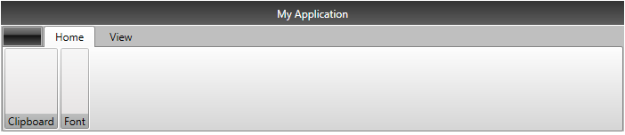

# Getting Started

This tutorial will walk you through the creation of a sample application that contains __RadRibbonView__.

>Before reading this tutorial you should get familiar with the [visual]() and [functional]() structure of the control.

* [Assembly References](#assembly-references)
* [Defining a RadRibbonView](#defining-a-radribbonview)
* [Adding Ribbon Tabs](#adding-ribbon-tabs)
* [Adding Content in the Ribbon Tabs](#adding-content-in-the-ribbon-tabs)
* [Resizing](#resizing)
* [Setting up the Application Button Icon](#setting-up-the-application-button-icon)
* [Setting up the Application Title and Name](#setting-up-the-application-title-and-name)
* [Setting up the Ribbon Backstage](#setting-up-the-ribbon-backstage)
* [Setting up the Quick Access Toolbar](#setting-up-the-quick-access-toolbar)

## Assembly References

In order to use the __RadRibbonView__ control, you will need to add references to the following assemblies:
* __Telerik.Windows.Controls__
* __Telerik.Windows.Controls.Input__
* __Telerik.Windows.Controls.Navigation__
* __Telerik.Windows.Controls.RibbonView__
* __Telerik.Windows.Controls.Data__

You can find the required assemblies for each control from the suite in the [Controls Dependencies]()[Controls Dependencies]() help article.

## Defining a RadRibbonView

You can add a __RadRibbonView__ manually in XAML as demonstrated in __Example 1__.

#### __[XAML] Example 1: Adding a RadRibbonView in XAML__
{{region radribbonview-gettingstarted-0}}
	<telerik:RadRibbonView />
{{endregion}}
	
At this state, the ribbonview is empty - there are not tabs, backstage or any other ribbon components. You can learn about the controls that the __RadRibbonView__ can contain from the [Features]() section of the documentation.

#### __Figure 1: Empty RadRibbonView__

## Adding Ribbon Tabs

The __RadRibbonView__ helps users to quickly find the tools and options they need in order to complete a task. Tools and options are organized in logical groups that are collected together under specific tabs. The ribbon tabs allows you to categorize the commands to be displayed to the users. The class that represents the ribbon tab is the __RadRibbonTab__.

> For more information about the __RadRibbonTab__, check out the [Ribbon Tab]() help article in the __Ribbon Controls__ section.

The tabs can be added in the __Items__ collection of RadRibbonView. The __RadRibbonTab__ class exposes a __Header__ property that is used to define the content of its header. __Example 2__ and __Example 3__ demonstrate how to do this in XAML and code-behind.

#### __[XAML] Example 2: Adding RadRibbonTabs in XAML__  
{{region radribbonview-gettingstarted-01}}
    <telerik:RadRibbonView>
		<telerik:RadRibbonView.Items>
			<telerik:RadRibbonTab Header="Home" />
			<telerik:RadRibbonTab Header="View" />
			<telerik:RadRibbonTab Header="Insert" />
			<telerik:RadRibbonTab Header="References" />
		</telerik:RadRibbonView.Items>
	</telerik:RadRibbonView>
{{endregion}}
	
#### __[C#] Example 3: Adding RadRibbonTabs in code__
{{region radribbonview-gettingstarted-02}}
	RadRibbonView ribbonView = new RadRibbonView();
	ribbonView.Items.Add(new RadRibbonTab() { Header = "Home" });
	ribbonView.Items.Add(new RadRibbonTab() { Header = "View" });
	ribbonView.Items.Add(new RadRibbonTab() { Header = "Insert" });
	ribbonView.Items.Add(new RadRibbonTab() { Header = "References" });
{{endregion}}
			
#### __[VB.NET] Example 3: Adding RadRibbonTabs in code__
{{region radribbonview-gettingstarted-03}}
	Dim ribbonView As New RadRibbonView()
	ribbonView.Items.Add(New RadRibbonTab() With { _
		.Header = "Home" _
	})
	ribbonView.Items.Add(New RadRibbonTab() With { _
		.Header = "View" _
	})
	ribbonView.Items.Add(New RadRibbonTab() With { _
		.Header = "Insert" _
	})
	ribbonView.Items.Add(New RadRibbonTab() With { _
		.Header = "References" _
	})
{{endregion}}

#### __Figure 2: RadRibbonView with several RadRibbonTabs defined in its Items collection__

## Adding Content in the Ribbon Tabs

__RadRibbonTab__ is a HeaderedItemsControl, which means that it can contain a collection of items. The children of the ribbon tab should be objects of type __RadRibbonGroup__. They expose a __Header__ property that is used to define the content of their header.

> The Items collection of RadRibbonTab can contain any UIElement. However, if you do not wrap it manually into a RadRibbonGroup control, the ribbonview will do it automatically.

<!---->  

> You can find more information about __RadRibbonGroup__ in the [Ribbon Group]() help article.

#### __[XAML] Example 4: Adding RadRibbonGroups__
{{region radribbonview-gettingstarted-04}}
	<telerik:RadRibbonView>
		<telerik:RadRibbonView.Items>
			<telerik:RadRibbonTab Header="Home">
				<telerik:RadRibbonGroup Header="Clipboard">                        
				</telerik:RadRibbonGroup>
				<telerik:RadRibbonGroup Header="Font">
				</telerik:RadRibbonGroup>
			</telerik:RadRibbonTab>
			<telerik:RadRibbonTab Header="View" />
		</telerik:RadRibbonView.Items>
	</telerik:RadRibbonView>
{{endregion}}

#### __Figure 3: A RadRibbonTab with a couple RadRibbonGroups defined in its Items collection__

	
__RadRibbonGroup__ is also a HeaderedItemsControl and it can have child elements on its own.

#### __[XAML] Example 5: Adding RadRibbonGroup content__
{{region radribbonview-gettingstarted-05}}
	<telerik:RadRibbonView>
		<telerik:RadRibbonView.Items>
			<telerik:RadRibbonTab Header="Home">
				<telerik:RadRibbonGroup Header="Clipboard">                        
					<telerik:RadRibbonButton Text="Copy" />
					<telerik:RadRibbonSplitButton Text="Paste">
						<telerik:RadRibbonSplitButton.DropDownContent>
							<telerik:RadMenu>
								<telerik:RadMenuItem Header="Paste" />
								<telerik:RadMenuItem Header="Paste from" />
							</telerik:RadMenu>
						</telerik:RadRibbonSplitButton.DropDownContent>
					</telerik:RadRibbonSplitButton>
				</telerik:RadRibbonGroup>
				<telerik:RadRibbonGroup Header="Font">
				</telerik:RadRibbonGroup>
			</telerik:RadRibbonTab>
			<telerik:RadRibbonTab Header="View" />
		</telerik:RadRibbonView.Items>
	</telerik:RadRibbonView>
{{endregion}}

#### __Figure 4: A RadRibbonGroup with a couple ribbon buttons defined in its Items collection__

	
## Resizing

One of the most important features of __RadRibbonView__ is the dynamic layout resizing. It refers to the __RadRibbonView__'s ability to optimize its layout depending on how much space is available. This process can't be automated; however, the __RadRibbonView__'s API gives you the ability to specify how you would like the resizing to occur. 

Check out the following topics, which are tightly connected to the resizing behavior:  
* [Resizing]()
* [Ordered Wrap Panel]()
* [Collapsible Panel]()
	
## Setting up the Application Button Icon

You can se the icon of the ribbonview's application button through the __ApplicationButtonImageSource__ property, which is of type ImageSource.

#### __[XAML] Example 6: Setting the RadRibbonView application button image source in XAML__
{{region radribbonview-gettingstarted-06}}
	<telerik:RadRibbonView ApplicationButtonImageSource="AppIcon.png" />
{{endregion}}
	
#### __[C#] Example 7: Setting the RadRibbonView application button image source in code__
{{region radribbonview-gettingstarted-07}}
	RadRibbonView ribbonView = new RadRibbonView();
	ribbonView.ApplicationButtonImageSource = new BitmapImage(new Uri(appIconStringPath));
{{endregion}}
	
#### __[VB.NET] Example 7: Setting the RadRibbonView application button image source in code__
{{region radribbonview-gettingstarted-08}}
	Dim ribbonView As New RadRibbonView()
	ribbonView.ApplicationButtonImageSource = New BitmapImage(New Uri(appIconStringPath))
{{endregion}}

#### __Figure 5: RadRibbonView application button image__

## Setting up the Application Title and Name

The header displayed at the title bar of __RadRibbonView__ is constructed by its __Title__ and __ApplicationName__ properties with a dash separator between them. You can take a peek at the [Visual Structure]() article to see how it looks.

#### __[XAML] Example 8: Setting the RadRibbonView application title and name__
{{region radribbonview-gettingstarted-09}}
	<telerik:RadRibbonView ApplicationName="RadRibbonView" Title="Document 1" />
{{endregion}}

#### __Figure 6: Title and ApplicationName properties reflected in the UI__

> You can also see the [Change Title]() and [Hide the Title]() help articles.

## Setting up the Ribbon Backstage

The __backstage menu__ is equivalent to the __File__ menu of the traditional menu UIs. It is represented by the rectangular button (the __application button__) in the upper-left corner of the __RadRibbonView__ control. The backstage menu appears when a user clicks the application button. This menu can be used to display controls used to perform actions on the entire document like save, print and send.

To declare a backstage menu in __RadRibbonView__ you can set its __Backstage__ property to an object of type __RadRibbonBackstage__. 

> You can learn more about the backstage control in the [Ribbon Backstage]() help article. 

#### __[XAML] Example 9: Sample backstage definition with several child RadRibbonBackstageItems in its Items collection.__
{{region radribbonview-gettingstarted-10}}
	<telerik:RadRibbonView>
		<telerik:RadRibbonView.Backstage>                
			<telerik:RadRibbonBackstage>
				<telerik:RadRibbonBackstageItem Header="Save" IsSelectable="False" />
				<telerik:RadRibbonBackstageItem Header="Open" IsSelectable="False" />
				<telerik:RadRibbonBackstageItem Header="Recent">
					<StackPanel Margin="10">
						<TextBlock Text="Recent files: " Margin="0 0 0 5" />
						<telerik:RadListBox>
							<telerik:RadListBoxItem Content="Document 1" />
							<telerik:RadListBoxItem Content="Document 2" />
							<telerik:RadListBoxItem Content="Document 3" />
							<telerik:RadListBoxItem Content="Document 4" />
						</telerik:RadListBox>
					</StackPanel>
				</telerik:RadRibbonBackstageItem>
			</telerik:RadRibbonBackstage>
		</telerik:RadRibbonView.Backstage>
	</telerik:RadRibbonView>
{{endregion}}

#### __Figure 7: RadRibbon Backstage example__

## Setting up the Quick Access Toolbar

The __Quick Access Toolbar__ is used to render a set of __RadRibbonView__ controls (commands) that are most commonly used in the application. It is rendered right above the ApplicationButton to make it easily accessible to users. To declare the Quick Access ToolBar, you need to set the __QuickAccessToolBar__ property. 

#### __[XAML] Example 10: Sample setup of QuickAccessToolBar__
{{region radribbonview-gettingstarted-11}}
	 <telerik:RadRibbonView>
		<telerik:RadRibbonView.QuickAccessToolBar>
			<telerik:QuickAccessToolBar>
				<telerik:RadRibbonButton SmallImage="images/save.png" telerik:RadToolTipService.ToolTipContent="Save"/>
				<telerik:RadRibbonButton SmallImage="images/undo.png" telerik:RadToolTipService.ToolTipContent="Undo"/>
				<telerik:RadRibbonButton SmallImage="images/print.png" telerik:RadToolTipService.ToolTipContent="Print"/>
			</telerik:QuickAccessToolBar>
		</telerik:RadRibbonView.QuickAccessToolBar>		
	</telerik:RadRibbonView>
{{endregion}}

#### __Figure  8: QuickAccessToolBar visualization with one of its buttons hovered__  

> For more information and a practical example you can see the [Quick Access Toolbar]() topic.  

# See Also
 * [Commands Support]()
 * [Developer Focused Examples]()
 * [Events]() 
 * [Keyboard Support]()
 * [Minimization]()
 * [Ribbon Backstage]() 
 * [Ribbon Group]()
 * [Ribbon Tab]()
 * [RibbonButtons - Overview]()
 * [Screen Tips]() 
 * [Quick Access Toolbar]() 
