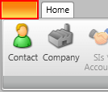

# Change The Image Of The Application Button

The default look of the application button is an empty rectangular button similar to the one on **Figure 1**.

#### __Figure 1: RadRibbonView application button__

When you want to add an image to the application button, you should use RadRibbonView's __ApplicationButtonImageSource__ property. For more information about how to achieve that, read [here](#setting-up-the-application-button-icon).

## See Also

* [Handle double click on application button]()
* [Add Screen Tips in the Code Behind]()
* [Work With Selection]()
