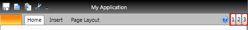

# Add Additional Content near the Help button

The purpose of this tutorial is to show you how to add additional content near the help button.

>By default the help button is collapsed (not visible). If you want to learn how to enable it, read [here]().		  

To add additional content near the help button, you should use the __RadRibbonView__'s __TabStripAdditionalContent__ property. It is of type object and you can insert any content.


```XAML
	<telerik:RadRibbonView x:Name="xRibbonView" HelpButtonVisibility="Visible">
	    <telerik:RadRibbonView.TabStripAdditionalContent>
	        <StackPanel Orientation="Horizontal">
	            <Button Content="1"/>
	            <Button Content="2"/>
	            <Button Content="3"/>
	        </StackPanel>
	    </telerik:RadRibbonView.TabStripAdditionalContent>
	</telerik:RadRibbonView>
```

