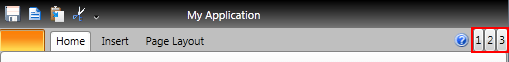

# Add Additional Content near the Help button

The purpose of this tutorial is to show you how to add additional content near the help button.

>By default the help button is collapsed (not visible). If you want to learn how to enable it, read [here]().		  

To add additional content near the help button, you should use the __RadRibbonView__'s __TabStripAdditionalContent__ property. It is of type object and you can insert any content.

<snippet id='radribbonview-how-to-howto-additional-content-near-help-icon-block_1-xaml' />

