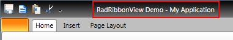

# Change Title

The purpose of this topic is to show you how to change the __RadRibbonView__'s __Title__


The RadRibbonView exposes a string property named __Title__, which should be used in such cases.		


```XAML
	<telerik:RadRibbonView x:Name="xRibbonView" Title="RadRibbonView Demo" />
```


```C#
	xRibbonView.Title = "RadRibbonView Demo";
```


```VB.NET
	xRibbonView.Title = "RadRibbonView Demo";
```



>The __RadRibbonView__'s __Title__ is not entirely changed. Instead, your custom title string is combined with the default "My Application" string. To change the string "My Application" you have to set the __RadRibbonView.ApplciationName__ property to the value you want.

## See Also
 * [Handle double click on application button]()
 * [Add Screen Tips in the Code Behind]()
 * [Change the Application Menu's Image]()