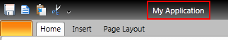
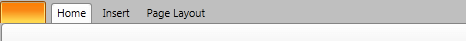

# Hide The Title

The __RadRibbonView__'s API allows you to hide the __Title__ bar of your ribbon control



In order to do this, you need to set the __RadRibbonView__'s __TitleBarVisibility__ property to __Visibility.Collapsed__.

#### __XAML__

```XAML
	<telerik:RadRibbonView x:Name="xRibbonView" TitleBarVisibility="Collapsed" />
```

#### __C#__

```C#
	xRibbonView.TitleBarVisibility = Visibility.Collapsed;
```

#### __VB.NET__

```VB.NET
	xRibbonView.TitleBarVisibility = Visibility.Collapsed;
```

The result is shown on the next image - the title is hidden.


>The __QuckAccessToolBar__ will be also hidden.		  

## See Also
 * [Handle double click on application button]()
 * [Add Screen Tips in the Code Behind]()
 * [Change the Application Menu's Image]()