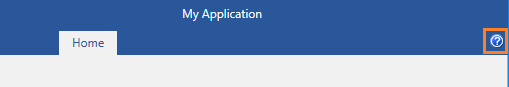

# Show Help Button and Change its Image

The purpose of this tutorial is to show you how to show the help button and to change its image. 

## Show the Help Button

In order to manage the visibility of the help button, the developer should use the __RadRibbonView__'s __HelpButtonVisibility__ property. The next code-snippet shows you how to enable (show) the help button.

#### __XAML__

{{region radribbonview-howto-show-and-change-help-button_0}}
	<telerik:RadRibbonView x:Name="xRibbonView" HelpButtonVisibility="Visible"/>
	{{endregion}}

#### __C#__

{{region radribbonview-howto-show-and-change-help-button_1}}
	xRibbonView.HelpButtonVisibility = Visibility.Visible;
	{{endregion}}

#### __VB__

{{region radribbonview-howto-show-and-change-help-button_2}}
	xRibbonView.HelpButtonVisibility = Visibility.Visible;
	{{endregion}}

>The default value of the __HelpButtonVisibility__ property is __Visibility.Collapsed__.
		  

The help button is shown in the right part of the ribbon view.
		

## Change the Help Button Image

To set a different icon from the default one, you should use the __HelpButtonImageSource__ property.

#### __XAML__

{{region radribbonview-howto-show-and-change-help-button_3}}
	<telerik:RadRibbonView x:Name="xRibbonView" HelpButtonImageSource="myHelpButton.png"/>
	{{endregion}}

# See Also
