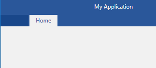
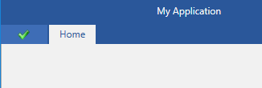
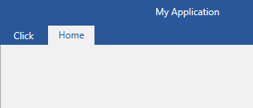

# Customize the Application Menu Button

The default look of the [application menu]() button is an empty rectangle as shown in __Figure 1__.

#### __Figure 1: RadRibbonView Application Button in the Office2016 theme__


## Set the ApplicationButtonImageSource

In order to add an image as the application button's content, you can use the __ApplicationButtonImageSource__ property. 

__Example 1: Setting the ApplicationButtonImageSource__

```XAML
	<telerik:RadRibbonView ApplicationButtonImageSource="Images/test.png">
		<telerik:RadRibbonView.Items>
            <telerik:RadRibbonTab Header="Home" />
        </telerik:RadRibbonView.Items>
	</telerik:RadRibbonView>
```

#### __Figure 2: RadRibbonView Application Button with an image in the Office2016 theme__


## Add custom Content to the Application Button

You can add custom Content to the Application Button via the __ApplicationButtonContent__ property.

__Example 2: Setting the ApplicationButtonContent__
```XAML
	<Grid>
        <Grid.Resources>
            <TextBlock x:Key="clickTextBlock" Text="Click" />
        </Grid.Resources>
        <telerik:RadRibbonView ApplicationButtonContent="{StaticResource clickTextBlock}">
            <telerik:RadRibbonView.Items>
                <telerik:RadRibbonTab Header="Home" />
            </telerik:RadRibbonView.Items>
        </telerik:RadRibbonView>
    </Grid>
```

#### __Figure 3: RadRibbonView Application Button with custom content__


## Disabling the ApplicationButton

In order to disable the application button, you can set the __IsApplicationButtonEnabled__ property to False. 

__Example 3: Disabling the Application Button__
```XAML
	<telerik:RadRibbonView IsApplicationButtonEnabled="False" />
```

## Hide the Application Button

In order to hide the application button, you can set the __ApplicationButtonVisibility__ property to __Collapsed__.

__Example 4: Setting the ApplicationButtonVisibility__
```XAML
	<telerik:RadRibbonView ApplicationButtonVisibility="Collapsed" />
```