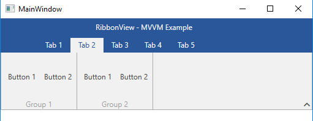
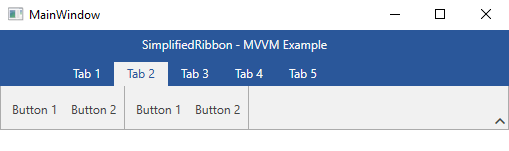

# Use MVVM in RadRibbonView

This example shows how to use a __RadRibbonView__ control with the Model-View-ViewModel (MVVM) pattern.

### 1. __Set up the ViewModels__

In order to demonstrate how the RadRibbonView can be used in an MVVM scenario, we will setup up a small example. First, we will define a MainViewModel containing a collection of TabViewModels. Each TabViewModel will hold a collection of GroupViewModels, which will hold a collection of ButtonViewModels.

__Example 1: Defining the ViewModels__
```C#
    public class MainViewModel : ViewModelBase
    {
        public ObservableCollection<TabViewModel> Tabs
        {
            get
            {
                var tabs = new ObservableCollection<TabViewModel>();
                for (int i = 1; i <= 5; i++)
                {
                    tabs.Add(new TabViewModel() { Text = "Tab " + i });
                }

                return tabs;
            }
        }

    }

    public class TabViewModel
    {
        public string Text { get; set; }

        public ObservableCollection<GroupViewModel> Groups
        {
            get
            {
                var groups = new ObservableCollection<GroupViewModel>();
                for (int i = 1; i <= 2; i++)
                {
                    groups.Add(new GroupViewModel() { Text = "Group " + i });
                }

                return groups;
            }
        }
    }


    public class GroupViewModel
    {
        public string Text { get; set; }

        public ObservableCollection<ButtonViewModel> Buttons
        {
            get
            {
                var buttons = new ObservableCollection<ButtonViewModel>();
                for (int i = 1; i <= 2; i++)
                {
                    buttons.Add(new ButtonViewModel() { Text = "Button " + i });
                }

                return buttons;
            }
        }
    }

    public class ButtonViewModel
    {
        public string Text { get; set; }
    }
```
```VB.NET
    Public Class MainViewModel
        Inherits ViewModelBase

            Public ReadOnly Property Tabs() As ObservableCollection(Of TabViewModel)
                Get
                    Dim tabs_ = New ObservableCollection(Of TabViewModel)()
                    For i As Integer = 1 To 5
                        tabs_.Add(New TabViewModel() With {.Text = "Tab " & i})
                    Next i

                    Return tabs_
                End Get
            End Property
    End Class

	Public Class TabViewModel
		Public Property Text() As String

		Public ReadOnly Property Groups() As ObservableCollection(Of GroupViewModel)
			Get
				Dim groups_ = New ObservableCollection(Of GroupViewModel)()
				For i As Integer = 1 To 2
					groups_.Add(New GroupViewModel() With {.Text = "Group " & i})
				Next i

				Return groups_
			End Get
		End Property
	End Class


	Public Class GroupViewModel
		Public Property Text() As String

		Public ReadOnly Property Buttons() As ObservableCollection(Of ButtonViewModel)
			Get
				Dim buttons_ = New ObservableCollection(Of ButtonViewModel)()
				For i As Integer = 1 To 2
					buttons_.Add(New ButtonViewModel() With {.Text = "Button " & i})
				Next i

				Return buttons_
			End Get
		End Property
	End Class

	Public Class ButtonViewModel
		Public Property Text() As String
	End Class
```

### 2. __Define the RadRibbonView__

Next we will define a RadRibbonView and set the DataContext to an instance of our MainViewModel. Then we can bind its __ItemsSource__ property to the __Tabs__ collection and wire up the hierarchy using [HierarchicalDataTemplates](https://docs.microsoft.com/en-us/dotnet/api/system.windows.hierarchicaldatatemplate?view=netframework-4.7.2) and a [DataTemplate](https://docs.microsoft.com/en-us/dotnet/api/system.windows.datatemplate?view=netframework-4.7.2).

__Example 3: Defining the RadRibbonView__
```XAML
    <Grid>
        <Grid.Resources>
            <DataTemplate x:Key="ButtonTemplate">
                <telerik:RadRibbonButton Text="{Binding Text}" VerticalAlignment="Center" />
            </DataTemplate>
            
            <HierarchicalDataTemplate x:Key="GroupHeaderTemplate" ItemsSource="{Binding Buttons}"
					ItemTemplate="{StaticResource ButtonTemplate}">
                <TextBlock Text="{Binding Text}" />
            </HierarchicalDataTemplate>

            <HierarchicalDataTemplate x:Key="TabTemplate" ItemsSource="{Binding Groups}"
					ItemTemplate="{StaticResource GroupHeaderTemplate}">
                <TextBlock Text="{Binding Text}" />
            </HierarchicalDataTemplate>
        </Grid.Resources>
        
        <Grid.DataContext>
            <local:MainViewModel />
        </Grid.DataContext>
        
        <telerik:RadRibbonView ApplicationName="MVVM Example" Title="RibbonView" ItemsSource="{Binding Tabs}" ItemTemplate="{StaticResource TabTemplate}" />
    </Grid>
```


#### __Figure 1: MVVM RadRibbonView in the Office2016 theme__


> For an extended implementation, check out the __Paint with MVVM__ example from our [WPF Demos Application](https://demos.telerik.com/wpf/)[online demos](https://demos.telerik.com/silverlight/#GridView/Exporting).



## SimplifiedRibbon MVVM

Using MVVM in a [SimplifiedRibbon]() scenario is as simple as setting the __SimplifiedItemTemplate__ property (along with the __ItemTemplate__) to the corresponding DataTemplate and setting the __LayoutMode__ property to __Simplified__. 

__Example 4: SimplifiedRibbon MVVM__
```XAML
      <telerik:RadRibbonView ApplicationName="MVVM Example"  Title="SimplifiedRibbon" ItemsSource="{Binding Tabs}" ItemTemplate="{StaticResource TabTemplate}" SimplifiedItemTemplate="{StaticResource TabTemplate}" LayoutMode="Simplified"/>
```

#### __Figure 2: SimplifiedRibbon MVVM in the Office2016 theme__


> Note, that __Example 4__ uses exactly the same setup as __Example 3__.

## See Also
* [SimplifiedRibbon]()
