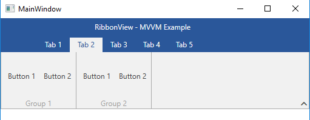
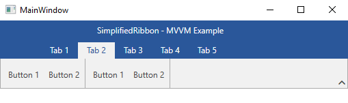

# Use MVVM in RadRibbonView

This example shows how to use a __RadRibbonView__ control with the Model-View-ViewModel (MVVM) pattern.

### 1. __Set up the ViewModels__

In order to demonstrate how the RadRibbonView can be used in an MVVM scenario, we will setup up a small example. First, we will define a MainViewModel containing a collection of TabViewModels. Each TabViewModel will hold a collection of GroupViewModels, which will hold a collection of ButtonViewModels.

__Example 1: Defining the ViewModels__
<snippet id='radribbonview-how-to-howto-use-mvvm-in-radribbonview-block_1-cs' />
<snippet id='radribbonview-how-to-howto-use-mvvm-in-radribbonview-block_2-vb' />

### 2. __Define the RadRibbonView__

Next we will define a RadRibbonView and set the DataContext to an instance of our MainViewModel. Then we can bind its __ItemsSource__ property to the __Tabs__ collection and wire up the hierarchy using [HierarchicalDataTemplates](https://docs.microsoft.com/en-us/dotnet/api/system.windows.hierarchicaldatatemplate?view=netframework-4.7.2) and a [DataTemplate](https://docs.microsoft.com/en-us/dotnet/api/system.windows.datatemplate?view=netframework-4.7.2).

__Example 3: Defining the RadRibbonView__
<snippet id='radribbonview-how-to-howto-use-mvvm-in-radribbonview-block_3-xaml' />

#### __Figure 1: MVVM RadRibbonView in the Office2016 theme__

> For an extended implementation, check out the __Paint with MVVM__ example from our [WPF Demos Application](https://demos.telerik.com/wpf/)[online demos](https://demos.telerik.com/silverlight/#GridView/Exporting).



## SimplifiedRibbon MVVM

Using MVVM in a [SimplifiedRibbon]() scenario is as simple as setting the __SimplifiedItemTemplate__ property (along with the __ItemTemplate__) to the corresponding DataTemplate and setting the __LayoutMode__ property to __Simplified__. 

__Example 4: SimplifiedRibbon MVVM__
<snippet id='radribbonview-how-to-howto-use-mvvm-in-radribbonview-block_4-xaml' />

#### __Figure 2: SimplifiedRibbon MVVM in the Office2016 theme__

> Note, that __Example 4__ uses exactly the same setup as __Example 3__.

## See Also
* [SimplifiedRibbon]()
