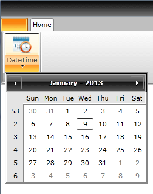
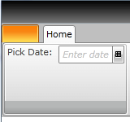
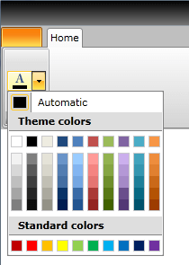
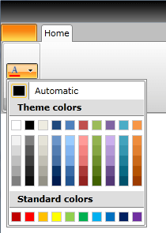

# Use RadRibbonView with Other controls

## Use RadRibbonView with RadCalendar	  

The purpose of this tutorial is to show you how to integrate a __RadCalendar__ with a __RadRibbonView__. The solution is to set the __RadCalendar__ as a drop down content of a __RadRibbonSplitButton__. The next example demonstrates how to do that.		


```XAML
	<telerik:RadRibbonView Name="xRibbonView">
		<telerik:RadRibbonTab Header="Home">
			<telerik:RadRibbonGroup>
				<telerik:RadRibbonSplitButton LargeImage="Images/CalendarIcon.png"
						                        Size="Large"
						                        Text="DateTime">
					<telerik:RadRibbonSplitButton.DropDownContent>
						<telerik:RadCalendar />
					</telerik:RadRibbonSplitButton.DropDownContent>
				</telerik:RadRibbonSplitButton>
			</telerik:RadRibbonGroup>
		</telerik:RadRibbonTab>
	</telerik:RadRibbonView>
```

Here is the result:


## Use RadRibbonView with DataPicker	  

Except the controls associated with the __RadRibbonView__, like RadRibbonButton, RadRibbonGallery, RadRibbonComboBox, you can place other controls in the __RadRibbonGroups__. Here is an example of adding a __RadDatePicker__ control inside a __RadRibbonGroup__.		


```XAML
	<telerik:RadRibbonView Name="xRibbonView">
		<telerik:RadRibbonTab Header="Home">
			<telerik:RadRibbonGroup>
				<TextBlock Text="Pick Date: " />
				<telerik:RadDatePicker HorizontalAlignment="Right" VerticalAlignment="Top" />
			</telerik:RadRibbonGroup>
		</telerik:RadRibbonTab>
	</telerik:RadRibbonView>
```

The result is the following:


## Integrate a RadColorPicker Directly Into a Ribbon Group	  

The next example demonstrates how to integrate a __RadColorPicker__ directly into a __Ribbon Group__.		


```XAML
	<telerik:RadRibbonView Name="xRibbonView">
		<telerik:RadRibbonTab Header="Home">
			<telerik:RadRibbonGroup>
				<telerik:RadColorPicker Name="xColorPicker" />
			</telerik:RadRibbonGroup>
		</telerik:RadRibbonTab>
	</telerik:RadRibbonView>
```

And the result is:


## Integrate a RadColorSelector as a Part of a RadRibbonDropDownButton	  

Integrating a __RadColorSelector__ with a __RadRibbonDropDownButton__ is a simple task. See the next code-snippet.		


```XAML
	<telerik:RadRibbonView Name="xRibbonView">
		<telerik:RadRibbonTab Header="Home">
			<telerik:RadRibbonGroup>
				<telerik:RadRibbonDropDownButton SmallImage="Images/ColorPickerIcon.png" Height="20" Width="40">
					<telerik:RadRibbonDropDownButton.DropDownContent>
						<telerik:RadColorSelector />
					</telerik:RadRibbonDropDownButton.DropDownContent>
				</telerik:RadRibbonDropDownButton>
			</telerik:RadRibbonGroup>
		</telerik:RadRibbonTab>
	</telerik:RadRibbonView>
```

The __RadColorSelector__ is set as a __DropDownContent__ of the __RadRibbonDropDownButton__.
