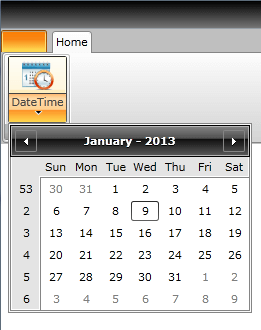
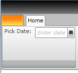
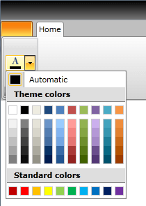
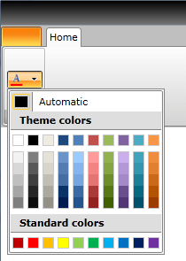

# Use RadRibbonView with Other controls

## Use RadRibbonView with RadCalendar	  

The purpose of this tutorial is to show you how to integrate a __RadCalendar__ with a __RadRibbonView__. The solution is to set the __RadCalendar__ as a drop down content of a __RadRibbonSplitButton__. The next example demonstrates how to do that.		

<snippet id='radribbonview-how-to-howto-use-ribbonview-other-controls-block_1-xaml' />

Here is the result:

## Use RadRibbonView with DataPicker	  

Except the controls associated with the __RadRibbonView__, like RadRibbonButton, RadRibbonGallery, RadRibbonComboBox, you can place other controls in the __RadRibbonGroups__. Here is an example of adding a __RadDatePicker__ control inside a __RadRibbonGroup__.		

<snippet id='radribbonview-how-to-howto-use-ribbonview-other-controls-block_2-xaml' />

The result is the following:

## Integrate a RadColorPicker Directly Into a Ribbon Group	  

The next example demonstrates how to integrate a __RadColorPicker__ directly into a __Ribbon Group__.		

<snippet id='radribbonview-how-to-howto-use-ribbonview-other-controls-block_3-xaml' />

And the result is:

## Integrate a RadColorSelector as a Part of a RadRibbonDropDownButton	  

Integrating a __RadColorSelector__ with a __RadRibbonDropDownButton__ is a simple task. See the next code-snippet.		

<snippet id='radribbonview-how-to-howto-use-ribbonview-other-controls-block_4-xaml' />

The __RadColorSelector__ is set as a __DropDownContent__ of the __RadRibbonDropDownButton__.
