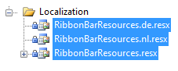
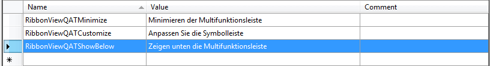

# Localization

## Localization Using ResourceManager

You can base your localization on the standard resource files provided by the .NET framework. For that purpose you will have to create a separate __.ResX file__ for each one of the languages that your application will support.				

Imagine that you want to translate your ribbon bar into English, German and Dutch. For that purpose you will have to add three new resource files to your project:

* __RibbonResources.resx__ - this resource file will store the __English(default)__ resources for the ribbon bar control. Set the __AccessModifier__ property to __Public__.					

* __RibbonResources.de.resx__ - this resource file will store the __German__ resources for the ribbon bar control. Set the __AccessModifier__ property to __No code generation__.					

* __RibbonResources.nl.resx__ - this resource file will store the __Dutch__ resources for the ribbon bar control. Set the __AccessModifier__ property to __No code generation__.



Now, having the needed files, it's time to illustrate the idea and localize for example the 'Minimize the Ribbon', 'Customize Quick Access Tool bar' and 'Show below the Ribbon' strings. For that purpose you need to create three resource strings in each one of the three resource files and translate them to the appropriate language.

>Note that the name of the resource string should be the same as the resource key for the string you are localizing i.e. the resource key for 'Minimize the Ribbon' is __RibbonBarQATMinimize__, for 'Customize Quick Access Tool bar' is __RibbonBarQATCustomize__ and for 'Show below the Ribbon' is __RibbonBarQATShowBelow__.					

The snapshot below shows the content of the __RibbonViewResources.de.resx__ file. The resource name of the other two files should be the same. Only the Value column will contain the translation for the appropriate language.



The last step is to instantiate the __LocalizationManager__ class and set its __ResourceManager__ to the resources that have been just created.				


```C#
	LocalizationManager.Manager = new LocalizationManager()
	{
	ResourceManager = RibbonResources.ResourceManager
	};
```
```VB.NET
	LocalizationManager.Manager = New LocalizationManager()
	LocalizationManager.Manager.ResourceManager = RibbonResources.ResourceManager
```

>If you rely on culture settings to load the right resources automatically, you have to write some code inside your application's project file. For example, if you have to support English and Dutch languages, you can store the localized strings in __RibbonResources.resx__ and __RibbonResources.nl.resx__ files. For the __RibbonResources.resx__ file you can set __ResXFileCodeGenerator__ to __Internal__ or __Public__ and for others to __No code generation__. Then, open the project file in a text-mode and insert the code below into the __<PropertyGroup>__ section. In this way you notify the framework about the supported cultures.

	<SupportedCultures>en;nl</SupportedCultures>				

## Localization Using Custom Localization Manager

The other way to localize your __RadRibbonView__ control is to create a class that derives from the __LocalizationManager__ object and to override its method __GetStringOverride()__. The logic is pretty simple, you just have to create a switch statement and return the correct translation for each resource key, as it is shown below:				


```C#
	public class CustomLocalizationManager : LocalizationManager
	{
	    public override string GetStringOverride( string key )
	    {
	        switch( key )
	        {
	            case "RibbonViewQATMinimize":
	                return "Minimieren der Multifunktionsleiste";
	            case "RibbonViewQATCustomize":
	                return "Anpassen Sie die Symbolleiste";
	            case "RibbonViewQATShowBelow":
	                return "Zeigen unten die Multifunktionsleiste";
	        }
	        return base.GetStringOverride( key );
	    }
	}
```
```VB.NET
	Public Class CustomLocalizationManager
	    Inherits LocalizationManager
	    Public Overloads Overrides Function GetStringOverride(ByVal key As String) As String
	        Select Case key
					Case "RibbonViewQATMinimize"
						Return "Minimieren der Multifunktionsleiste"
					Case "RibbonViewQATCustomize"
						Return "Anpassen Sie die Symbolleiste"
					Case "RibbonViewQATShowBelow"
						Return "Zeigen unten die Multifunktionsleiste"
				End Select
	
	        Return MyBase.GetStringOverride(key)
	    End Function
	End Class
```

Of course, if you don't want to hard-code your translation inside the source code, you can always use resource files:


```C#
	public override string GetStringOverride( string key )
	{
	    switch( key )
	    {
	        case "RibbonViewQATMinimize":
	            return RibbonBarResources.RibbonBarQATMinimize;
	    }
	    return base.GetStringOverride( key );
	}
```
```VB.NET
	Public Overloads Overrides Function GetStringOverride(ByVal key As String) As String
	    Select Case key
				Case "RibbonViewQATMinimize"
					Return RibbonBarResources.RibbonBarQATMinimize
			End Select
	    Return MyBase.GetStringOverride(key)
	End Function
```

## RadRibbonView Resource Keys

Here is a list of all of the __Resources Keys__ available and their default values:

Key	|	Value
---	|	---	
RibbonViewGalleryButtonMore | More
RibbonViewGalleryButtonUpDown | Row
RibbonViewGalleryOfPart | of
RibbonViewQATCustomize | Customize Quick Access ToolBar
RibbonViewQATMinimize | Minimize the Ribbon
RibbonViewQATShowAbove | Show above the Ribbon
RibbonViewQATShowBelow | Show below the Ribbon
RibbonViewQATRestore | Restore the Ribbon
RibbonViewWindowTitleDivider | - 
RibbonWindowClose | Close
RibbonWindowMaximize | Maximize
RibbonWindowMinimize | Minimize
RibbonWindowRestoreDown | Restore Down
RibbonViewExpandRibbon | Expand the Ribbon
RibbonViewHelp | Help
RibbonViewLayoutModeButtonContent | Simplified Ribbon

## See Also

* [Localization]()
* [Simplified Ribbon]()