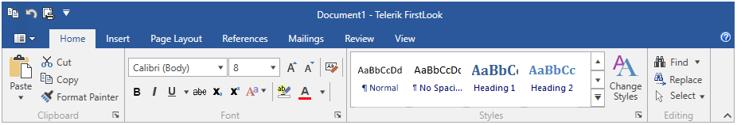

# Overview



Thank you for choosing Telerik __RadRibbonView__!

__RadRibbonView__ is an easy-to-use implementation of the MS Office “ribbon” UI, which allows you to codelessly organize the navigation functionality of your application into a single compact toolbar control. Its popup engine, dynamic resizing and powerful customization capabilities make the RibbonView your shortcut to creating powerful navigation systems.

## Key Features	

* __MS Office Interface at your Fingertips__: The RibbonView control provides a UI very similar to the one provided by the MS Office ribbon.

* __Automatic Resizing and Minimization__: The ribbon provides built-in mechanisms that allows you to minimize and automatically resize the ribbon content. Read more about this in the [Minimization]() and [Resizing]() articles.

* __Rich Set of Ribbon Specific Controls__: The ribbon control works with special components (buttons, galleries, tabs, groups, etc.). Read more about this in the [Ribbon Controls]() section.

* __Application Menu, Recent Documents Menu__: The ribbon allows you to open a backstage menu where you can display information related to the content. Read more about this in the [Ribbon Backstage]() and [Application Menu]() articles.

* __Quick Access Toolbar__: The quick access toolbar is easily accessible toolbar displayed in the header of the ribbon where you can place buttons for quick actions as print, copy, etc. Read more about this in the [Quick Access Toolbar]() article.

* __Screen Tips__: The ribbon allows you to display a small window that appears when the mouse cursor is hovered over an icon or a ribbon element (command). The popup window will provide details that explain the command's function. Read more about this in the [Screen Tips]() article.

* __Commands Support__: RadRibbonView supports several commands that allow you to execute and override some of the ribbon actions. Read more about this in the [Commands Support]() article.

* __Keyboard Support__: The control supports two types of keyboard navigation - via key tips and via arrow keys. Read more about this in the [Keyboard Support]() article.

* __Localization Support__: Localization is the translation of application resources into localized versions for the specific cultures that the application supports. Read more about this in the [ribbon specific]() and [common]() Localization articles.

A complete list with all the key features can be found in the [Key Features]() article.

>tip Get started with the control with its [Getting Started]() help article that shows how to use it in a basic scenario.

<!-- -->
> Check out the control demos at [demos.telerik.com](http://demos.telerik.com/silverlight/#RibbonView/FirstLook)[demos.telerik.com](http://demos.telerik.com/wpf/)

## See Also  
* [Visual Structure]()
* [Functional Structure]()
* [Contextual Tabs]()