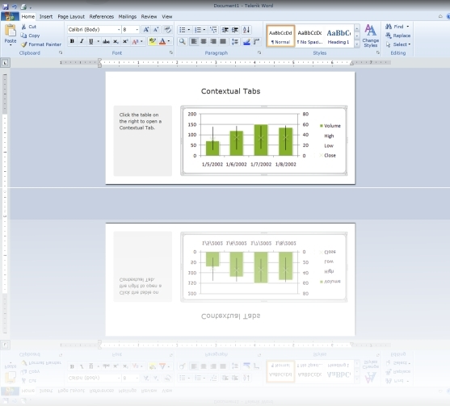

# Overview



## 

Thank you for choosing Telerik __RadRibbonView__!
				

Telerik Silverlight WPF __RibbonView__is an easy-to-use implementation of the Microsoft Office 2010 “ribbon” UI, which allows you to codelessly organize the navigation functionality of your application into a single compact toolbar control. Its popup engine, dynamic resizing and powerful customization capabilities make the  Silverlight WPF  RibbonView your shortcut to creating powerful navigation systems.
				

__RadRibbonView__ key features list:
				

* __MS Office 2010 Interface at your Fingertips__

* __Automatic Resizing and Minimization__

* __Galleries and Pop-ups__

* __Application Menu, Recent Documents Menu__

* __Quick Access Toolbar__

* __Nested Controls__

* __Screen Tips__

* __Styling and Appearance__

* __Commands Support__

* __Localization Support__

* __Enhanced Routed Events Framework__

* __All Telerik controls for__

* __WPF/Silverlight Code Compatibility__

* __Codeless Test Automation for Scheduler__

A complete list with all the key features can be found [here]().
				

Check out the online demo at: [http://demos.telerik.com/silverlight/#RibbonView/Word](http://demos.telerik.com/silverlight/#RibbonView/Word)
