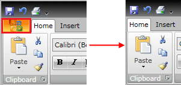
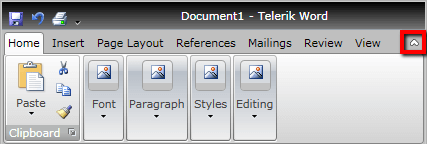
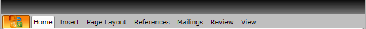
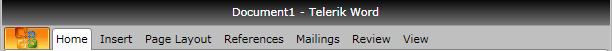
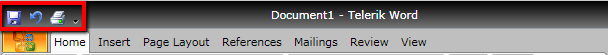
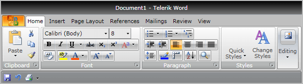
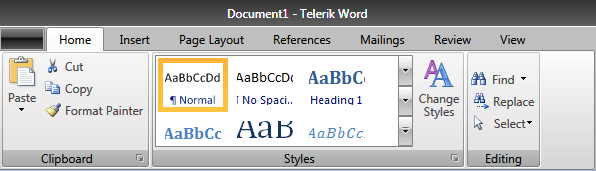
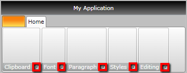
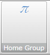
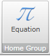

# Controlling Appearance

There are many ways to customize the look and feel of your __RadRibbonView__ control. This topic covers some of the most useful of these properties.
			

## RadRibbonView

* If you want to hide the __Application Button__, located at the top left part of the __RadRibbonView__ control just set the __ApplicationButtonVisibility__ property to __Visibility.Collapsed__. The __Application Button__ is visible by default.
	

* If you want to show the __Help Button__, located at the right part of the __RadRibbonView__'s title bar just set the __HelpButtonVisibility__ property to __Visibility.Visible__. The __Help Button__ is hidden (collapsed) by default. The next snapshot shows you a RibbonView with visible help button.
	

* If you want to minimize the __RadRibbonView__, set the __IsMinimized__ property to __True__. The __RadRibbonView__ is not minimized by default. The next snapshot shows you a minimized RibbonView:
	

* If you want to hide the __Title Bar__, set the __TitleBarVisibility__ property to __Visibility.Collapsed__. The __RadRibbonView__'s title bar is visible by default.
	

	>Note how the __Quick Access Toolbar__ and the __Application Title__ are collapsed.							

* If you want to hide the __Quick Access Toolbar__, set the __QuickAccessToolBarPosition__ property to __QuickAccessToolBarPosition.NotHosted__.
	

By default the __Quick Access Toolbar__ is always visible and its position is __QuickAccessToolBarPosition.AboveRibbon.__
	

If you want to change the default position of the __Quick Access Toolbar__, set the __QuickAccessToolBarPostion__ property to __QuickAccessToolBarPosition.BelowRibbon__. This will move the toolbar at the bottom part of the ribbon bar.
	

* If you want to change the default __Height__ of the __RadRibbonView__, you can set the __ContentHeight__ property.				  

	```XAML
		<telerik:RadRibbonView ContentHeight="120"
						   Title="Document1"
						   ApplicationName="Telerik Word">

		</telerik:RadRibbonView>					  
	```

	

## RadRibbonGroup

* If you want to show the dialog launcher button, you need to set the __RadRibbonGroup__'s __DialogLauncherVisibility__ property to __Visibility.Visible__. By default, the dialog launcher button is not visible (it is collapsed).
	

## RadRibbonButton

* If you want to change the initial size of the __RibbonButtons__, you need to set their __Size__ property. The possible values are predefined in the __ButtonSize__ enumeration, which exposes the following fields:				  

* __Small__
	

* __Medium__
	

* __Large__
	

## See Also
 * [RadRibbonView Template Structure]()
 * [Styling the RadRibbonView]()
 * [Styling the QuickAccessToolbar]()
 * [Styling the ApplicationButton]()
 * [Styling the RadRibbonView TitleBar]()
 * [Styling the RadRibbonTab]()
 * [Styling the RadRibbonGroup]()
 * [Styling the RadRibbonButton]()
 * [Styling the RadRibbonGallery]()
 * [Styling the RadRibbonComboBox]()