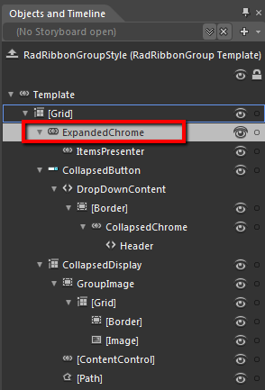
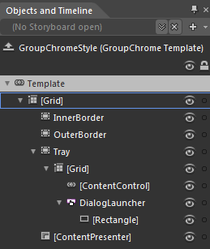
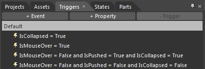
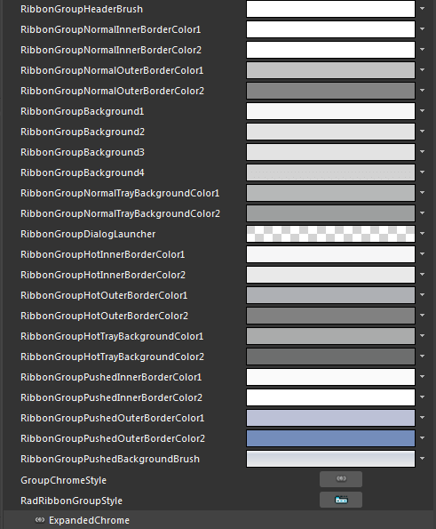
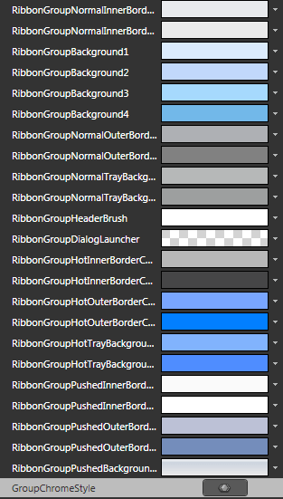
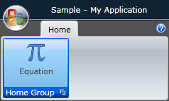

# Styling the Ribbon GroupChrome

>tip In order to style the __GroupChrome__ control, which represents the uncollapsed group, you have to generate the default style for the __RadRibbonGroup__
and modify its template. To see how to do it take a look at the [Styling the Ribbon Group]() topic.

From the resources generated for the __RadRibbonGroup's__ style modify the __RadRibbonGroupStyle__, by clicking on its icon.				

It will be loaded in the 'Objects and Timeline' pane. Right-click on it and choose *Edit Template -> Edit Current*. In the 'Objects and Timeline' the parts of the __RadRibbonGroup's__ template will get loaded. Select the part called __ExpandedChrome__.


After generating the __RadRibbonGroup__'s default template and loading it in the 'Objects and Timeline' pane, select the __ExpandedChrome__ control.



From the menu select *Object -> Edit Style -> Edit a Copy*. You will be prompted for the name of the style and where to be placed.


Right-click on it and choose *Edit Template -> Edit a Copy*. Expression Blend will wrap the template in a style and set it to the __GroupChrome__ control. You will be for the name of the style and where to be placed.


>tip If you choose to define the style in Application, it would be available for the entire application. This allows you to define a style only once and then reuse it where needed.

After clicking 'OK', Expression Blend will generate the default style of the __GroupChrome__ control in the __Resources__ section of your User Control.  The properties available for the style will be loaded in the 'Properties' pane and you will be able to modify their default values.If you want to change the __ControlTemplate__ elements of the __RadRibbonGroup__ select the style in the 'Objects and Timeline' pane, right-click on it and choose Edit Template -> Edit Current. In the same pane the element parts for the __RadRibbonGroup__'s template will get loaded.
 The template for the __GroupChrome__ control will be loaded in the 'Objects and Timeline' pane. 


Change the elements' properties until you get the desired look.

>tip You can also modify the triggers defined for the __GroupChrome__. They are located in the 'Triggers' pane.




If you go to the 'Resources' pane, you will see an editable list of resources generated together with the style and used by it. In this list you will find the brushes, styles and templates needed to change the visual appearance of the __GroupChrome__. Their names indicate to which part of the __GroupChrome's__ appearance they are assigned. 

* __RibbonGroupHeaderBrush__ - a brush that represents the __Foreground__ color of the __GroupChrome__ footer content				

* __RibbonGroupNormalInnerBorderColor1__, __RibbonGroupNormalInnerBorderColor2__ - brushes that represent the color of the inner border of the __GroupChrome__.					

* __RibbonGroupNormalOuterBorderColor1__, __RibbonGroupNormalOuterBorderColor2__ - brushes that represent the color of the outer border of the __GroupChrome__.					

* __RibbonGroupBackground1__, __RibbonGroupBackground2__, __RibbonGroupBackground3__, __RibbonGroupBackground4__ - brushes that represent the background color of the __GroupChrome__

* __RibbonGroupNormalTrayBackgroundColor1__, __RibbonGroupNormalTrayBackgroundColor2__ - brushes that represent the background color of the footer of the __GroupChrome__.					

* __RibbonGroupDialogLauncher__ - an image brush that represents the image for the __DialogLauncher__ button.					

* __RibbonGroupHotInnerBorderColor1__, __RibbonGroupHotInnerBorderColor2__ - brushes that represent the color of the inner border of the __GroupChrome__, when the mouse is over it.					

* __RibbonGroupHotOuterBorderColor1__, __RibbonGroupHotOuterBorderColor2__ - brushes that represent the color of the outer border of the __GroupChrome__, when the mouse is over it.					

* __RibbonGroupHotTrayBackgroundColor1__, __RibbonGroupHotTrayBackgroundColor2__ - brushes that represent the background color of the footer of the __GroupChrome__, when the mouse is over it.					

* __RibbonGroupPushedInnerBorderColor1__, __RibbonGroupPushedInnerBorderColor2__- brushes that represent the color of the inner border of the __GroupChrome,__when when it is collapsed and pressed.					

* __RibbonGroupPushedOuterBorderColor1__, __RibbonGroupPushedOuterBorderColor2__- brushes that represent the color of the outer border of the __GroupChrome__, when it is collapsed and pressed.					

* __RibbonGroupPushedBackgroundBrush__ - brushes that represent the color of the outer border of the __GroupChrome__, when it is collapsed and pressed.					

* __GroupChromeStyle__ - represents the style applied to the __GroupChrome__ control.					

>tip Changing the value of the resources can be done by clicking on the color indicator or the icon next to them.

Modify the resource to bring the desired appearance to the __RadRibbonGroup__. For more detailed information, please, view the [Example](#example) section below.

## Example
Here is an example of the above resource modified.

Here is a snapshot of the result when the mouse is over the group



## See Also
 * [Styling the RadRibbonView]()
 * [Styling the RadRibbonGroup]()
