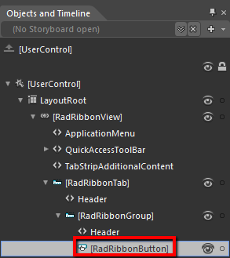
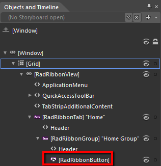
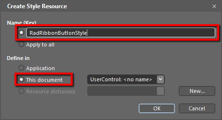
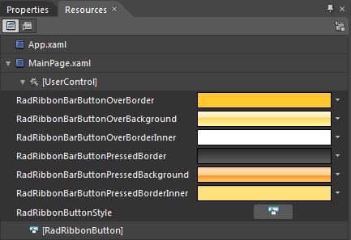
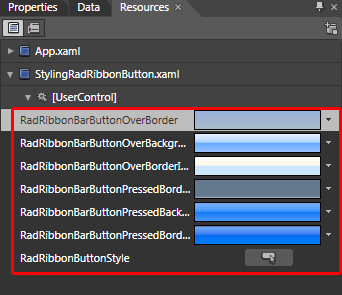
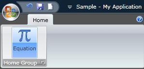
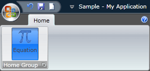
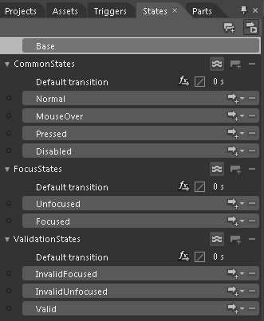

# Styling the RadRibbonButton

The __RadRibbonButton__ can be styled by creating an appropriate __Style__ and setting it to the __Style__ property of the control.			

You have two options:

* To create an empty style and set it up on your own.
* To copy the default style of the control and modify it.

This topic will show you how to perform the second one.

## Modifying the Default Style

To copy the default style, load your project in Expression Blend and open the User Control that holds the __RadRibbonView__. In the 'Objects and Timeline' pane select the __RadRibbonButton__ you want to style.







From the menu choose *Object -> Edit Style -> Edit a Copy*. You will be prompted for the name of the style and where to be placed.

>tip If you choose to define the style in Application, it would be available for the entire application. This allows you to define a style only once and then reuse it where needed.

After clicking 'OK', Expression Blend will generate the default style of the __RadRibbonButton__ control in the __Resources__ section of your User Control. The properties available for the style will be loaded in the 'Properties' pane and you will be able to modify their default values.

If you go to the 'Resources' pane, you will see an editable list of resources generated together with the style and used by it. In this list you will find the brushes, styles and templates needed to change the visual appearance of the __RadRibbonButton__. Their names indicate to which part of the __RadRibbonButton's__ appearance they are assigned.



* __RadRibbonBarButtonOverBorder__ - a brush that represents the color of the __RadRibbonButton's__ border, when the mouse is over it.          

* __RadRibbonBarButtonOverBackground__ - a brush that represents the background color of the __RadRibbonButton__, when the mouse is over it.          

* __RadRibbonBarButtonOverBorderInner__ - a brush that represents the color of the __RadRibbonButton's__ inner border, when the mouse is over it.          

* __RadRibbonBarButtonPressedBorder__ - a brush that represents the color of the __RadRibbonButton's__ border, when the button gets pressed.          

* __RadRibbonBarButtonPressedBackground__ - a brush that represents the background color of the __RadRibbonButton__, when the button gets pressed.          

* __RadRibbonBarButtonPressedBorderInner__ - a brush that represents the color of the __RadRibbonButton's__ inner border, when the button gets pressed.          

* __RadRibbonButtonStyle__ - represents the style created for the __RadRibbonButton__.          

>tip Changing the value of the resources can be done by clicking on the color indicator or the icon next to them.

Modify the resource to bring the desired appearance to the __RadRibbonButton__. For more detailed information, please, view the __Example__ section below.



>tip By default the __Background__ and the __BroderBrush__ properties of the __RadRibbonButton__ are transparent. To modify them, edit the __RadRibbonButtonStyle__ resource and change these properties in the 'Properties' pane. The __Foreground__ property of the button can also be set from there.



If you want to change the __ControlTemplate__ elements of the __RadRibbonButton__ select the style in the 'Objects and Timeline' pane, right-click on it and choose Edit Template -> Edit Current. In the same pane the element parts for the __RadRibbonButton__'s template will get loaded.

## Example

Here is an example of the above resources modified.

Here is a snapshot of the result when the mouse is over the button.

and when the button is pressed





You can modify these properties to achieve the desired appearance. However the most of the visual parts of the __RadRibbonButton__ have to be styled in the template of it. To modify it select the style in the 'Objects and Timeline' pane, right-click on it and choose *Edit Template -> Edit Current*. In the same pane the element parts for the __RadRibbonButton's__ template will get loaded.					

Change the elements' properties until you get the desired look.

>tip You can also modify the default __VisualStates__ defined for the __RadRibbonButton__. They are located in the 'States' pane.
>



## See Also
 * [Styling the RadRibbonView]()
 * [Styling the RadRibbonTab]()
 * [Styling the RadRibbonGroup]()
 * [Styling the RadRibbonToggleButton]()
 * [Styling the RadRibbonRadioButton]()
 * [Styling the RadRibbonSplitButton]()
 * [Styling the RadRibbonDropDownButton]()