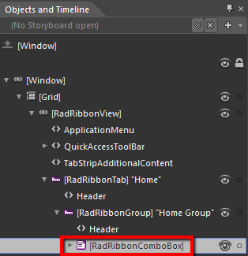
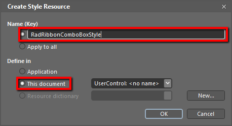
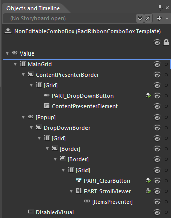
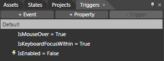
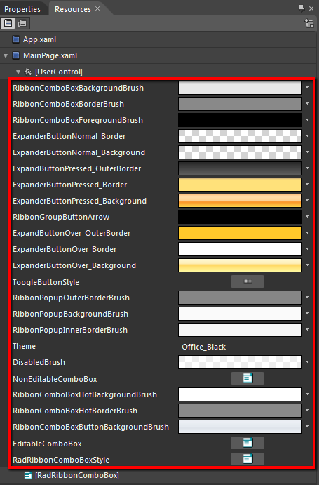

# Styling the RadRibbonComboBox

The __RadRibbonComboBox__ can be styled by creating an appropriate __Style__ and setting it to the __Style__ property of the control.
			

You have two options:

* To create an empty style and set it up on your own.

* To copy the default style of the control and modify it.

This topic will show you how to perform the second one.

## Modifying the Default Style

In order to copy the default style, load your project in Expression Blend and open the User Control that holds the __RadRibbonView__. In the 'Objects and Timeline' pane select the __RadRibbonComboBox__ you want to style.
				



From the menu choose *Object -> Edit Style -> Edit a Copy*. You will be prompted for the name of the style and where to be placed.
				

>tipIf you choose to define the style in Application, it would be available for the entire application. This allows you to define a style only once and then reuse it where needed.

After clicking 'OK', Expression Blend will generate the default style of the __RadRibbonComboBox__ control in the __Resources__ section of your User Control. The properties available for the style will be loaded in the 'Properties' pane and you will be able to modify their default values.
				

If you want to change the ControlTemplate elements of the __RadRibbonComboBox__ select the style in the 'Objects and Timeline' pane, right-click on it and choose Edit Template -> Edit Current. In the same pane the element parts for the __RadRibbonComboBox's__ template will get loaded.
					

You can modify these properties to achieve the desired appearance. However the most of the visual parts of the __RadRibbonComboBox__ have to be styled in the template of it. To modify it select the style in the 'Objects and Timeline' pane, right-click on it and choose *Edit Template -> Edit Current*. In the same pane the element parts for the __RadRibbonComboBox's__ template will get loaded.
					

>tip
					The __RadRibbonComboBox__ has two templates - __Editable__ and __NonEditable__. As default the __NonEditable__ is used. To modify the __Editable__ template you have to right-click on the style and select *Edit Additional Templates -> Edit EditalbeTemplate -> Edit Current*.
				

Change the elements' properties untill you get the desired look.

>tipYou can also modify the triggers defined for the __RadRibbonComboBox__. They are located in the 'Triggers' pane.
						

If you go to the 'Resources' pane, you will see an editable list of resources generated together with the style and used by it. In this list you will find the brushes, styles and templates needed to change the visual appearance of the __RadRibbonComboBox__.____Their names indicate to which part of the __RadRibbonComboBox's__ appearance they are assigned.
					

* __RibbonComboBoxBackgroundBrush__ - a brush that represents the background color of the __RadRibbonComboBox__.
						

* __RibbonComboBoxBorderBrush__ - a brush that represents the color of the __RadRibbonComboBox's__ border.
						

* __RibbonComboBoxForegroundBrush__ - a brush that represents the foreground color of the __RadRibbonComboBox's__ content.
						

* __ExpanderButtonNormal_Border__- a brush that represents the color of the expander button's border.
						

* __ExpanderButtonNormal_Background__ - a brush that represents the background color of the expander button.
						

* __ExpanderButtonPressed_OuterBorder__- a brush that represents the color of the expander button's outer border, when it gets pressed.
						

* __ExpanderButtonPressed_Background__ - a brush that represents the background color of the expander button, when it gets pressed.
						

* __ExpanderButtonPressed_Border__- a brush that represents the color of the expander button's border, when it gets pressed.
						

* __RibbonGroupButtonArrow__ - a brush that represents the color of the expander button's arrow.
						

* __ExpanderButtonOver_OuterBorder__- a brush that represents the color of the expander button's outer border, when the mouse is over it.
						

* __ExpanderButtonOver_Border__- a brush that represents the color of the expander button's border, when the mouse is over it.
						

* __ExpanderButtonOver_Background__ - a brush that represents the background color of the expander button, when the mouse is over it.
						

* __ToggleButtonStyle__ - represents the style applied to the expander button.
						

>tip
						When the __RadRibbonComboBox__ is not editable, the whole control represents the expander button. When it is editable, the button is placed on its right.
					

* __RibbonPopupBackgroundBrush__ - a brush that represents the background color of the popup area.
						

* __RibbonPopupOuterBorderBrush__ - a brush that represents the color of the popup area's outer border.
						

* __RibbonPopupInnerBorderBrush__ - a brush that represents the color of the popup area's inner border.
						

* __DisabledBrush__ - a brush that represents the background color of the __RibbonComboBox__ when it is disabled
						

* __NonEditableComboBox__ - represents the __ControlTemplate__ that is applied to the __RadRibbonComboBox__, when it is not editable.
						

* __RibbonComboBoxHotBackgroundBrush__ - a brush that represents the background color of the editable area of the __RadRibbonComboBox__.
						

* __RibbonComboBoxHotBorderBrush__ - a brush that represents the border color of the editable area of the __RadRibbonComboBox__.
						

* __EditableComboBox__ - represents the __ControlTemplate__ that is applied to the __RadRibbonComboBox__, when it is editable.
						

* __RadRibbonComboBoxStyle__ - represents the style applied to the __RadRibbonComboBox__.
						

>tipChanging the value of the resources can be done by clicking on the color indicator or the icon next to them.

Modify the resource to bring the desired appearance to the __RadRibbonComboBox__ . For more detailed information, please, view the __Example__ section below.
						

# See Also

 * [Styling the RadRibbonView]()

 * [Styling the RadRibbonTab]()

 * [Styling the RadRibbonButton]()

 * [Styling the RadRibbonDropDownButton]()
