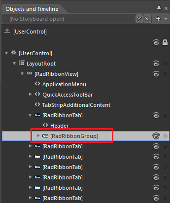
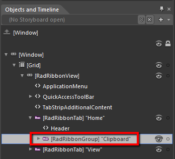
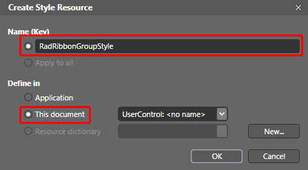
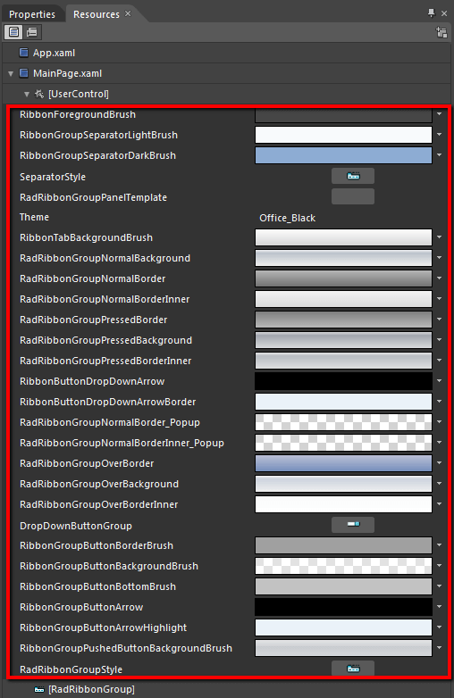
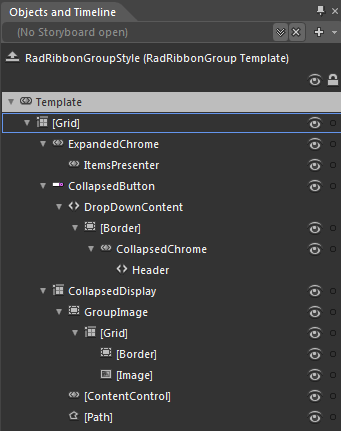
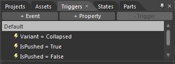

# Styling the RadRibbonGroup

The __RadRibbonGroup__ can be styled by creating an appropriate __Style__ and setting it to the __Style__ property of the control.
			

You have two options:

* To create an empty style and set it up on your own.

* To copy the default style of the control and modify it.

This topic will show you how to perform the second one.

## Modifying the Default Style

In order to copy the default style, load your project in Expression Blend and open the User Control that holds the __RadRibbonView__. In the 'Objects and Timeline' pane select the __RadRibbonGroup__ you want to style.
				



From the menu choose *Object -> Edit Style -> Edit a Copy*. You will be prompted for the name of the style and where to be placed.
				

>If you choose to define the style in Application, it would be available for the entire application. This allows you to define a style only once and then reuse it where needed.

After clicking 'OK', Expression Blend will generate the default style of the __RadRibbonGroup__ control in the __Resources__ section of your User Control. The properties available for the style will be loaded in the 'Properties' pane and you will be able to modify their default values.
				

If you go to the 'Resources' pane, you will see an editable list of resources generated together with the style and used by it. In this list you will find the brushes, styles and templates needed to change the visual appearance of the __RadRibbonGroup____.__Their names indicate to which part of the __RadRibbonGroup's__ appearance they are assigned.
					

* __RibbonForegroundBrush__- a brush that represents the foreground color of the __RadRibbonGroup__.
				

* __RibbonGroupSeparatorLightBrush__ - a brush that represents the background of the separators in the __RadRibbonGroup__.
				

* __RibbonGroupSeparatorDarkBrush__ - a brush that represents the color of the separators' border.
				

* __SeparatorStyle__ - represents the style applied to the __Separator__.
				

* __RadRibbonGroupPanelTemplate__ -  represents the __RadRibbonGroup.ItemsPanel__

* __RibbonTabBackgroundBrush__ - a brush that represents the background color of the collapsed __RadRibbonGroup's__ drop down content.
				

* __RadRibbonGroupNormalBackground__ - a brush that represents the background color of the __RadRibbonGroup__, when it is collapsed.
				

* __RadRibbonGroupNormalBorder__ - a brush that represents the color of the __RadRibbonGroup's__border, when it is collapsed.
				

* __RadRibbonGroupNormalBorderInner__ - a brush that represents the color of the __RadRibbonGroup's__inner____border, when it is collapsed.
				

* __RadRibbonGroupPressedBackground__ - a brush that represents the background color of the __RadRibbonGroup__, when it is collapsed and is pressed.
				

* __RadRibbonGroupPressedBorder__ - a brush that represents the color of the __RadRibbonGroup's__border, when it is collapsed and is pressed.
				

* __RadRibbonGroupPressedBorderInner__ - a brush that represents the color of the __RadRibbonGroup's__inner____border, when it is collapsed and is pressed.
				

* __RibbonButtonDropDownArrow__ - a brush that represents the background color of the __DropDownIndicator__ of the __RibbonGroup__ when it is in collapsed state
				

* __RibbonButtonDropDownArrowBorder__ - a brush that represents the color of the __RibbonGroup.____DropDownIndicator's__border, when the __RibbonGroup__ is in collapsed state
				

* __RadRibbonGroupNormalBorder_Popup -__a brush that represents the color of the __RibbonGroup.DropDownContent's__outer border, when the __RibbonGroup__ is in collapsed state
				

* __RadRibbonGroupNormalBorderInner_Popup -__a brush that represents the color of the __RibbonGroup.DropDownContent's__inner border, when the __RibbonGroup__ is in collapsed state
				

* __RadRibbonGroupOverBackground__ - a brush that represents the background color of the __RadRibbonGroup__, when it is collapsed and the mouse is over it.
				

* __RadRibbonGroupOverBorder__ - a brush that represents the color of the __RadRibbonGroup's__border, when it is collapsed and the mouse is over it.
				

* __RadRibbonGroupOverBorderInner__ - a brush that represents the color of the __RadRibbonGroup's__inner____border, when it is collapsed and the mouse is over it.
				

* __DropDownButtonGroup__- represents the style that is applied to the button that represents the collapsed __RadRibbonGroup__.
				

* __RibbonGroupButtonBackgroundBrush__ - a brush that represents the background color of the button inside the collapsed __RadRibbonGroup__.
				

* __RibbonGroupButtonBorderBrush__ - a brush that represents the color of the button's border.
				

* __RibbonGroupButtonBottomBrush__ - a brush that represents the color of the bottom part of the button inside the collapsed __RadRibbonGroup__.
				

* __RibbonGroupButtonArow__ - a brush that represents the color of the drop down arrow of the collapsed __RadRibbonGroup__.
				

* __RibbonGroupButtonArrowHighlight__ - a brush that represents the color of the drop down arrow's border.
				

* __RibbonGroupPushedButtonBackgroundBrush__ - a brush that represents the background color of the button inside the collapsed __RadRibbonGroup__, when the drop down is expanded.
				

* __RadRibbonGroupStyle__ - represents the style applied to the __RadRibbonGroup__.
				

>Changing the value of the resources can be done by clicking on the color indicator or the icon next to them.

Modify the resource to bring the desired appearance to the __RadRibbonGroup__.
					

If you want to change the __ControlTemplate__ elements of the __RadRibbonGroup__ select the style in the 'Objects and Timeline' pane, right-click on it and choose Edit Template -> Edit Current. In the same pane the element parts for the __RadRibbonGroup__'s template will get loaded.
					

You can modify these properties to achieve the desired appearance. However the most of the visual parts of the __RadRibbonGroup__ have to be styled in the template of it. To modify it select the style in the 'Objects and Timeline' pane, right-click on it and choose *Edit Template -> Edit Current*. In the same pane the element parts for the __RadRibbonGroup's__ template will get loaded.
					

Change the elements' properties untill you get the desired look.

>tipYou can also modify the triggers defined for the __RadRibbonGroup__. They are located in the 'Triggers' pane.
						

# See Also

 * [Styling the RadRibbonView]()

 * [Styling the Ribbon GroupChrome]()

 * [Styling the RadRibbonButton]()

 * [Styling the RadRibbonGallery]()

 * [Styling the RadRibbonComboBox]()
