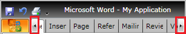
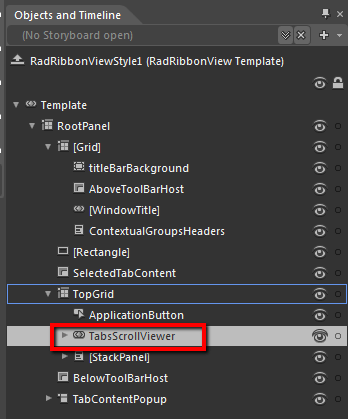
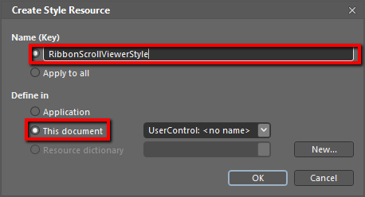
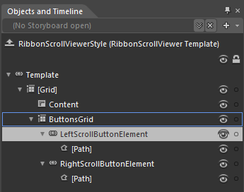
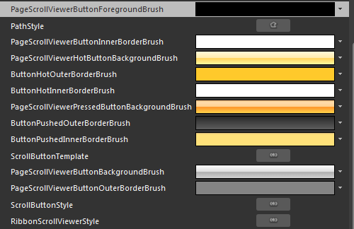

# Styling the RibbonScrollViewer

The __RibbonScrollViewer__ control is used both in the template structure of the __RadRibbonView__ to host the __RibbonTabs__ and in the template structure of the __RadRibbonTab__ control to host its content. If you want to edit its default style, you need to first edit the __[RadRibbonView]()__ or __[RadRibbonTab ]()__ __ControlTemplate__. This article will demonstrate how to edit the default style of the __RibbonScrollViewer__ control hosting the __RibbonTabs__ inside the __RadRibbonView__.

Once you open the __ControlTemplate__ of the __RadRibbonView__ in the 'Objects and Timeline' pane, you need to locate the __TabsScrollViewer__ element.

From the menu choose *Object -> Edit Template -> Edit a Copy*. You will be prompted for the name of the style and where to be placed.

After clicking 'OK', Expression Blend will generate the default style of the __RibbonScrollViewer__ control in the __Resources__ section of your User Control. The properties available for the style will be loaded in the 'Properties' pane and you will be able to modify their default values.

>tip You can further customize the appearance of the __RibbonScrollViewer__ by editing the default style of the __Left/RightScrollButtonElements__ and their __[Path]__ elements.

 

If you go to the 'Resources' pane, you will see an editable list of resources generated together with the style and used by it. In this list you will find the brushes, styles and templates needed to change the visual appearance of the __RibbonScrollViewer__. Their names indicate to which part of the __RibbonScrollViewer's__ appearance they are assigned.

* __PageScrollViewerButtonInnerBorderBrush__ - a brush, that represents the inner border brush of the __RibbonScrollViewer__ __Left/RightScrollButtonElements__

* __PageScrollViewerPressedButtonBackgroundBrush__ - a brush, that represents the background color of the __RibbonScrollViewer__ __Left/RightScrollButtonElements__, when they are pressed						

* __ButtonPushedOuterBorderBrush__ - a brush that represents the border brush of the __RibbonScrollViewer__ __Left/RightScrollButtonElements__, when they are pressed						

* __ButtonPushedInnerBorderBrush__ - a brush that represents the inner border brush of the __RibbonScrollViewer__ __Left/RightScrollButtonElements__, when they are pressed						

* __ButtonHotInnerBorderBrush__ - a brush that represents the inner border brush of the __RibbonScrollViewer__ __Left/RightScrollButtonElements__, when the mouse is over them						

* __ButtonHotOuterBorderBrush__ - a brush that represents the border brush of the __RibbonScrollViewer__ __Left/RightScrollButtonElements__, when the mouse is over them						

* __PageScrollViewerHotButtonBackgroundBrush__ - a brush that represents the background color of the __RibbonScrollViewer__ __Left/RightScrollButtonElements__, when the mouse is over them						

*  __PageScrollViewerButtonForegroundBrush__ - a brush that represents the fill of the path displayed in the __RibbonScrollViewer__  __Left/RightScrollButtonElements__ 



# See Also
 * [Styling the RadRibbonView]()
 * [RadRibbonView Template Structure]()
 * [Styling the RadRibbonTab]()