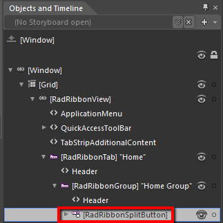
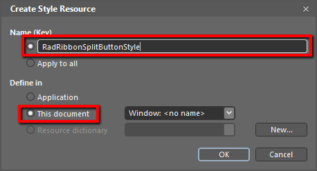
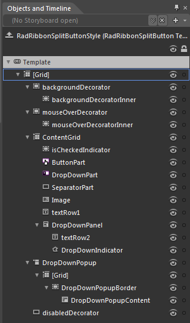
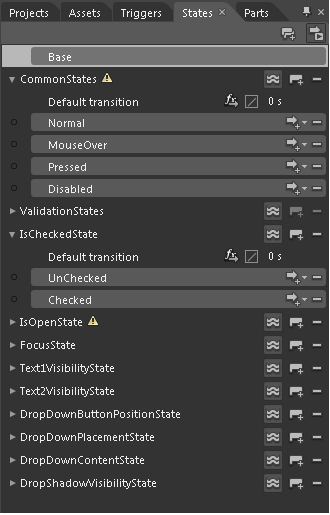
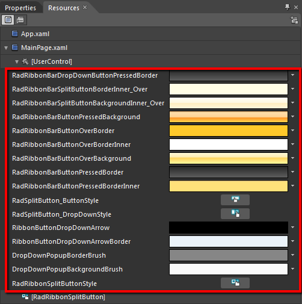

# Styling the RadRibbonSplitButton

The __RadRibbonSplitButton__ can be styled by creating an appropriate __Style__ and setting it to the __Style__ property of the control.
			

You have two options:

* To create an empty style and set it up on your own.

* To copy the default style of the control and modify it.

This topic will show you how to perform the second one.

## Modifying the Default Style

To copy the default style, load your project in Expression Blend and open the User Control that holds the __RadRibbonView__. In the 'Objects and Timeline' pane select the __RadRibbonSplitButton__ you want to style.
				



From the menu choose *Object -> Edit Style -> Edit a Copy*. You will be prompted for the name of the style and where to be placed.
				

>tipIf you choose to define the style in Application, it would be available for the entire application. This allows you to define a style only once and then reuse it where needed.

After clicking 'OK', Expression Blend will generate the default style of the __RadRibbonSplitButton__ control in the __Resources__ section of your User Control. The properties available for the style will be loaded in the 'Properties' pane and you will be able to modify their default values.
				

If you want to change the ControlTemplate elements of the __RadRibbonSplitButton__ select the style in the 'Objects and Timeline' pane, right-click on it and choose Edit Template -> Edit Current. In the same pane the element parts for the __RadRibbonSplitButton__'s template will get loaded.
					

You can modify these properties to achieve the desired appearance. However the most of the visual parts of the __RadRibbonSplitButton__ have to be styled in the template of it. To modify it select the style in the 'Objects and Timeline' pane, right-click on it and choose *Edit Template -> Edit Current*. In the same pane the element parts for the __RadRibbonSplitButton's__ template will get loaded.
					

Change the elements' properties untill you get the desired look.

>tipYou can also modify the default __VisualStates__ defined for the __RadRibbonSplitButton__. They are located in the 'States' pane.
						

If you go to the 'Resources' pane, you will see an editable list of resources generated together with the style and used by it. In this list you will find the brushes, styles and templates needed to change the visual appearance of the __RadRibbonSplit____Button____.__Their names indicate to which part of the __RadRibbonSplitButton's__ appearance they are assigned.
					

* __RadRibbonBarDropDownButtonPressedBorder -__ a brush that represents the color of the drop down button's border, when the button gets pressed.
              

* __RadRibbonBarSplitButtonBackgroundInner_Over__ - a brush that represents the background of __RadRibbonSplitButton__, when the mouse is over it.
              

* __RadRibbonBarSplitButtonBorderInner_Over__ - a brush that represents the color of the basic button's border, when the mouse is over it.
              

* __RadRibbonBarButtonPressedBackground -__ a brush that represents the background color of the __RadRibbonSplitButton__, when the button gets pressed.
              

* __RadRibbonBarButtonOverBorder__ - a brush that represents the color of the button part's border, when the mouse is over it.
              

* __RadRibbonBarButtonOverBorderInner__ - a brush that represents the color of the button part's____inner border, when the mouse is over it.
              

* __RadRibbonBarButtonOverBackground__ - a brush that represents the background color of the __RadRibbonSplitButton's__button part, when the mouse is over it.
              

* __RadRibbonBarButtonPressedBorder__ - a brush that represents the color of the __RadRibbonSplitButton's__ border, when it gets pressed.
              

* __RadRibbonBarButtonPressedBorderInner__ - a brush that represents the color of the __RadRibbonSplitButton's__inner border, when it gets pressed.
              

* __RadSplitButton_ButtonStyle__ - the __ControlTemplate__ applied to the basic button part of the __RadRibbonSplitButton__.
              

* __RadSplitButton_DropDownStyle__ - the __ControlTemplate__ applied to the drop down button part of the __RadRibbonSplitButton__.
              

* __RibbonButtonDropDownArrow__ - a brush that represents the fill color of the drop down arrow.
              

* __RibbonButtonDropDownArrowBorder__ - a brush that represents the color of the drop down arrow's border.
              

* __DropDownPopupBackgroundBrush__ - a brush that represents the background of the popup area.
              

* __DropDownPopupBorderBrush__ - a brush that represents the color of the popup area's border.
              

* __RadRibbonSplitButtonStyle__ - represents the style created for the __RadRibbonSplitButton__.
              

>tipChanging the value of the resources can be done by clicking on the color indicator or the icon next to them.
            

Modify the resource to bring the desired appearance to the __RadRibbonSplitButton__. For more detailed information, please, view the __Example__ section below.
					

>tipBy default the __Background__ and the __BroderBrush__ properties of the __RadRibbonSplitButton__ are transparent. To modify them, edit the __RadRibbonSplitButtonStyle__ resource and change these properties in the 'Properties' pane. The __Foreground__property of the button can also be set from there.
          

# See Also

 * [Styling the RadRibbonView]()

 * [Styling the RadRibbonTab]()

 * [Styling the RadRibbonGroup]()

 * [Styling the RadRibbonButton]()

 * [Styling the RadRibbonToggleButton]()

 * [Styling the RadRibbonRadioButton]()

 * [Styling the RadRibbonDropDownButton]()
