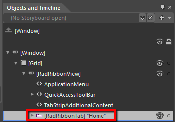
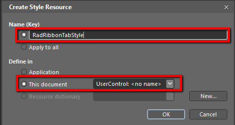
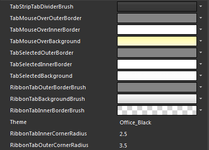
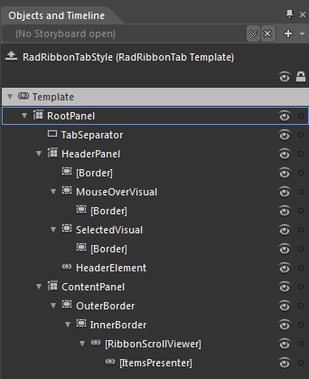

# Styling the RadRibbonTab

The __RadRibbonTab__ can be styled by creating an appropriate __Style__ and setting it to the __Style__ property of the control.
			

You have two options:

* To create an empty style and set it up on your own.

* To copy the default style of the control and modify it.

This topic will show you how to perform the second one.

## Modifying the Default Style

To copy the default style, load your project in Expression Blend and open the User Control that holds the __RadRibbonView__. In the 'Objects and Timeline' pane select the __RadRibbonTab__ you want to style.
				



From the menu choose *Object -> Edit Style -> Edit a Copy*. You will be prompted for the name of the style and where to be placed.
				

>tipIf you choose to define the style in Application, it would be available for the entire application. This allows you to define a style only once and then reuse it where needed.

After clicking 'OK', Expression Blend will generate the default style of the __RadRibbonTab__ control in the __Resources__ section of your User Control. The properties available for the style will be loaded in the 'Properties' pane and you will be able to modify their default values.
				

If you go to the 'Resources' pane, you will see an editable list of resources generated together with the style and used by it. In this list you will find the brushes, styles and templates needed to change the visual appearance of the __RadRibbonTab.__ Their names indicate to which part of the __RadRibbonTab's__ appearance they are assigned.
					__TabStripTabDividerBrush__ - a brush that represents the color of the separators used to divide the tab headers.
					__TabMouseOverOuterBorder__ - a brush that represents the color of the __RadRibbonTab.Header's__outer border, when the mouse is over it
					__TabMouseOverInnerBorder__ - a brush that represents the color of the __RadRibbonTab.Header's__inner border, when the mouse is over it
					__TabMouseOverBackground__ - a brush that represents the background color of the __RadRibbonTab.Header__, when the mouse is over it
					__TabSelectedOuterBorder__ - a brush that represents the color of the __RadRibbonTab.Header's__outer border, when it is selected
					__TabSelectedInnerBorder__ - a brush that represents the color of the __RadRibbonTab.Header's__inner border, when it is selected
					__TabSelectedBackground__ - a brush that represents the background color of the __RadRibbonTab.Header__, when it is selected
					__RibbonTabOuterBorderBrush__ - a brush that represents the color of the __RadRibbonTab.Content's__outer border
					__RibbonTabBackgroundBrush__ - a brush that represents the background color of the __RadRibbonTab.Content____RibbonTabInnerBorderBrush__ - a brush that represents the color of the __RadRibbonTab.Content's__ inner border
					__RibbonTabInnerCornerRadius__ - the __CornerRadius__ of the __RadRibbonTab.Content's__inner border
					__RibbonTabOuterCornerRadius__ - the __CornerRadius__ of the __RadRibbonTab.Content's__outer border
					

>tipChanging the value of the resources can be done by clicking on the color indicator or the icon next to them.

Modify the resources to bring the desired appearance to the __RadRibbonTab__. For more detailed information, please, view the
						[Example](#example) section below.
					

If you want to change the __ControlTemplate__ elements of the __RadRibbonTab__ select the style in the 'Objects and Timeline' pane, right-click on it and choose Edit Template -> Edit Current. In the same pane the element parts for the __RadRibbonTab__'s template will get loaded.
					

You can modify these properties to achieve the desired appearance. However most of the visual parts of the __RadRibbonTab__ have to be styled in its template. To modify it select the style in the 'Objects and Timeline' pane, right-click on it and choose *Edit Template -> Edit Current*. In the same pane the element parts for the __RadRibbonTab's__ template will get loaded.
					

* __RootPanel__ - a __Grid__control that represents the main layout control in the __RadRibbonTab's__ template.
						

* __TabSeparator__ - a __Rectangle__ control that represents the separators used to divide the tab headers.
							

* __HeaderPanel__ - a __Grid__ control that hosts the __RadRibbonTab.Header__ elements
								

* __[Border]__ - a __Border__ control that represents the background color of the __RadRibbonTab.Header__

* __MouseOverVisual__ - a __Border__ control that represents the outer border of the __RadRibbonTab.Header__,____when the mouse is over it
										

* __[Border]__ - a __Border__ control that represents the background and the inner border of the __RadRibbonTab.Header__, when the mouse is over it
											

* __SelectedVisual__ - a __Border__ control that represents the outer border of the __RadRibbonTab.Header__,____when it is selected
										

* __[Border]__ - a __Border__ control that represents the background and the inner border of the __RadRibbonTab.Header__, when it is selected
											

* __HeaderElement__ - a __TabItemContentPresenter__ control the represents the content of the __RadRibbonTab.Header__

* __ContentPanel__ - a __Grid__ control that hosts the __RadRibbonTab.Content__ elements
								

* __OuterBorder__ - a __Border__ control that represents the background and the outer border of the __RadRibbonTab.Content__

* __InnerBorder__ - a __Border__ control that represents the inner border of the __RadRibbonTab.Content__

* __[RibbonScrollViewer]__ - a __RibbonScrollViewer__ control that hosts the __RadRibbonTab.Content__

* __[ItemsPresenter]__ - an __ItemsPresenter__ control used to display the __RadRibbonTab.Content__

>If you want to modify the default style of the __RibbonScrollViewer__ control, you can follow the approach described in [this article]().
					

# See Also

 * [Styling the RadRibbonView]()

 * [RadRibbonView Template Structure]()

 * [Styling the RadRibbonGroup]()
