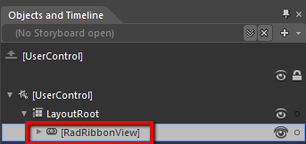
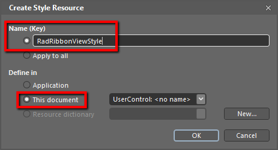
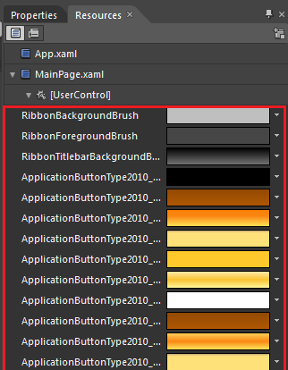
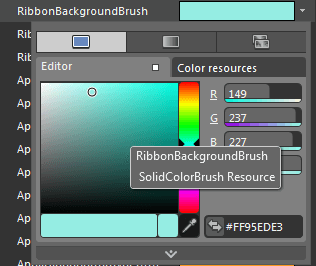
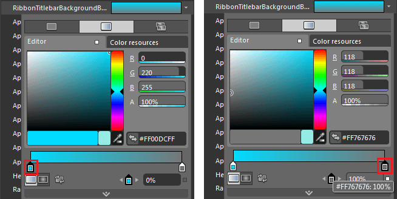
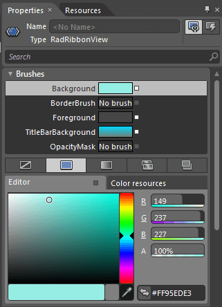
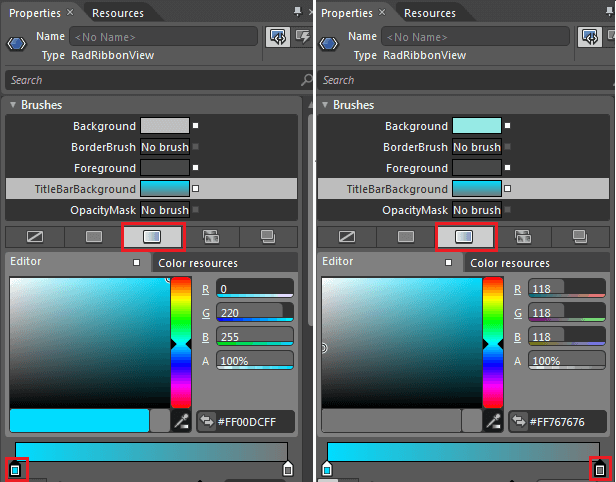

# Styling the RadRibbonView

The __RadRibbonView__ can be styled by creating an appropriate __Style__ and setting it to the __Style__ property of the control.
			

You have two options:

* To create an empty style and set it up on your own.

* To copy the default style of the control and modify it.

This topic will show you how to perform the second one.

## Modifying the Default Style

To copy the default style, load your project in Expression Blend and open the User Control that holds the __RadRibbonView__. In the 'Objects and Timeline' pane select the __RadRibbonView__ you want to style.
				

From the menu choose *Object -> Edit Style -> Edit a Copy*. You will be prompted for the name of the style and where to be placed.
				

>tipIf you choose to define the style in Application, it would be available for the entire application. This allows you to define a style only once and then reuse it where needed.

After clicking 'OK', Expression Blend will generate the default style of the __RadRibbonView__ control in the __Resources__ section of your User Control. The properties available for the style will be loaded in the 'Properties' pane and you will be able to modify their default values.
				

If you go to the 'Resources' pane, you will see an editable list of resources generated together with the style and used by it. In this list you will find the brushes, styles and templates needed to change the visual appearance of the __RadRibbonView.__ Their names indicate to which part of the __RadRibbonView's__ appearance they are assigned.
					

* __RibbonBackgroundBrush__ - a brush, that represents the background color of the __RadRibbonView__ control.
					

* __RibbonForegroundBrush__ - a brush that represents the foreground color for the __RadRibbonView__.
					

* __RibbonTitleBarBackgroundBrush__ - a brush, that represents the background color behind the __RadRibbonView__ title bar
					

* __RibbonTitlebarBorderBrush__- a brush, that represents the border color of the title bar in the __RadRibbonView__.
					

>

An explanation of the other resources can be found in the following topics:

* [Styling the ApplicationButton]()

* [Styling the RadRibbonTab]()

* [Styling the RibbonScrollViewer]()

* [Styling the RadRibbonView TitleBar]()

>tipChanging the value of the resources can be done by clicking on the color indicator or the icon next to them.

						Modify the resources to bring the desired appearance to the __RadRibbonView__. For more detailed information, please, view the
							[Example](#example) section below.
					

						If you want to change the __ControlTemplate__ elements of the __RadRibbonView__ select the style in the 'Objects and Timeline' pane, right-click on it and choose Edit Template -> Edit Current. In the same pane the element parts for the __RadRibbonView__'s template will get loaded.
					

						You can modify these properties to achieve the desired appearance. However most of the visual parts of the __RadRibbonView__ have to be styled in its template. To modify it select the style in the 'Objects and Timeline' pane, right-click on it and choose *Edit Template -> Edit Current*. In the same pane the element parts for the __RadRibbonView's__ template will get loaded.
					

>tip

						To learn more about the template of the __RadRibbonView__ read the [TemplateStructure]() topic.
					

To learn how to style the different visual elements you can read the following topics:

* [Styling the ApplicationButton]()

* [Styling the RadRibbonTab]()

* [Styling the RibbonScrollViewer]()

* [Styling the RadRibbonView TitleBar]()

## Example

						For example, select the __RibbonBackgroundBrush__ brush resource and modify it in order to change the background of the __RadRibbonView's__ background.
					

						Modify the __RibbonTitleBarBackgroundBrush__ too, in order to make the background consistent.
					

						For example, select the __Background__ brush resource and modify it in order to change the background of the __RadRibbonView's__ background.
					

						Modify the __TitleBarBackground__ too, in order to make the background consistent.
					

Here is a snapshot of the result.

# See Also

 * [RadRibbonView Template Structure]()

 * [Styling the QuickAccessToolbar]()

 * [Styling the ApplicationButton]()

 * [Styling the RibbonScrollViewer]()

 * [Styling the RadRibbonView TitleBar]()

 * [Styling the RadRibbonTab]()
