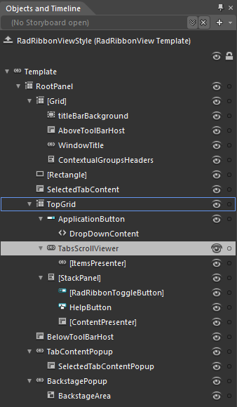

# RadRibbonView Template Structure

This topic will explain you the structure of the __RadRibbonView__ template and will describe the elements in it.

* __RootPanel__ - a __Grid__ control that represents the main layout control in the __RadRibbonView's__ template						

	* __[Grid]__ - a __Grid__ control that hosts the __RadRibbonView__ __TitleBar__ elements
		* __titleBarBackground__ - a __Border__ control that represents the background color of the __RadRbbonView__ __TitleBar__
		* __AboveToolBarHost__ - a __ContentPresenter__ that hosts the __Quick Access Toolbar__, when it is positioned above the __RadRbbonView__
		* __WindowTitle__ - a __WinowTitle__ control that displays the __RadRbbonView__ title and application name
		* __ContextualGroupsHeaders__ - a __StackPanel__ control hosting the headers of the __RadRbbonView__ __RadRibbonContextualGroups__
		
	* __[Rectangle]__ - a __Rectangle__ control representing the __RadRibbonView__ background color								

	* __SelectedTabContent__ - a __ContentPresenter__ control that displays the content of the selected __RadRibbonTab__.							

	* __TopGrid__ - a __Grid__ control hosting the __ApplicationButton__, the __HelpButton__ and the __MinimizeButton__ as well as the __RadRibbonTabs__ __Headers__
	
		* __ApplicationButton__ - a __RadRibbonDropDownButton__ that represents the __ApplicationButton__
		* __TabsScrollViewer__ - a __RibbonScrollViewer__ control that hosts the __RadRibbonTab__ __Headers__		
			* __[ItemsPresenter]__ - an __ItemsPresenter__ control used to display the __RadRibbonTabs Headers__
		* __[StackPanel]__ - a __StackPanel__ control hosting the __HelpButton__ and the __MinimizeButton__		
			* __[RadRibbonToggleButton]__ - a __RadRibbonToggleButton__ control representing the __MinimizeButton__
			* __HelpButton__ - a __RadRibbonButton__ control representing the __MinimizeButton__
			* __[ContentPresenter]__ - a __ContentPresenter__ control that hosts the __TabStripAdditionalContent__
	* __BelowToolBarHost__ - a __ContentPresenter__ that hosts the __Quick Access Toolbar__, when it is positioned below the __RadRbbonView__
	* __TabContentPopup__ - a __Popup__ control that is used to display the selected __RadRibbonTab__ content, when the __RadRbbonView__ is minimized								
		* __SelectedTabContentPopup__ - a __ContentPresenter__ control that displays the content of the selected __RadRibbonTab__, when the __RadRbbonView__ is minimized
	* __BackstagePopup__ - a __Popup__ control that is used to display the __RadRibbonBackstage__ menu
		* __BackstageArea__ - a __Canvas__ control that hosts the __RadRibbonBackstage__ menu									

## See Also
 * [Styling the RadRibbonView]()
 * [Styling the ApplicationButton]()
 * [Styling the RadRibbonView TitleBar]()
 * [Styling the QuickAccessToolbar]()
 * [Styling the RadRibbonTab]()
 * [Styling the RibbonScrollViewer]()