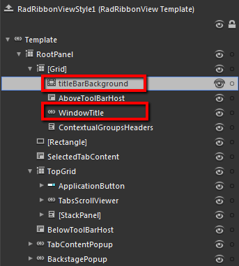
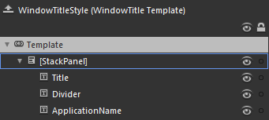
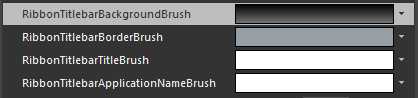

# Styling the RadRibbonView TitleBar

In order to style the __TitleBar__ of the __RadRibbonView__ you have to create the style for the __RadRibbonView__ itself and modify its template. To see how to do this take a look at this [topic]().



The controls responsible for the __TitleBar__ are the __titleBarBackground__ __Border__ control and the __WindowTitle__ control.

The __titleBarBackground__ __Border__ control is responsible for the background and the border of the __TitleBar__. The __WindowTitle__ control displays the title and the application name. To modify their appearance you have to modify the template of the control. Select it, right-click on it and choose *Edit Template -> Edit Current*. The 'Objects and Timeline' pane will be populated with its template parts.

Change the elements' properties untill you get the desired look.





Modifying some of the resources generated for the __RadRibbonView's__ style will allow you to change the appearance of the __TitleBar__. Here is the list of resources that are used for it.

* __RibbonTitlebarBackgroundBrush__ - a brush that represents the background color of the __TitleBar__.				

* __RibbonTitlebarBorderBrush__ - a brush that represents the color of the __TitleBar's__ border.				

* __RibbonTitlebarTitleBrush__ - a brush that represents the foreground color of the __RadRibbonView's__ title.				

* __RibbonTitlebarApplicationNameBrush__ - a brush that represents the foreground color of the application label of the __TitleBar__.				

>Changing the value of the resources can be done by clicking on the color indicator or the icon next to them.

Modify the resource to bring the desired appearance to the __TitleBar__. For more detailed information, please, view the [Example](#example) section below.



## See Also
 * [RadRibbonView Template Structure]()
 * [Styling the RadRibbonView]()