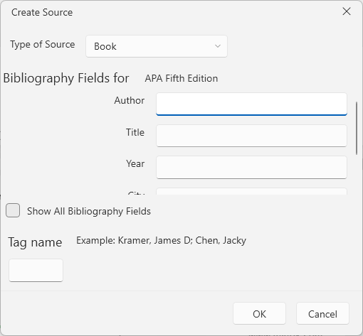

# Manage Bibliographic References Dialog

This dialog allows you to insert and edit [bibliographic references]() in the document.

The insert bibliographic dialog can be opened from the __Add New Source__ option of the __Insert Citation__ drop down button in the __References__ tab of the [RadRichTextBoxRibbonUI]() or via the in the same option in the right-click menu (context menu) of `RadRichTextBox`.

The manage bibliographic references can be opened with the __Manage Sources__ button.

## Showing the Dialog Manually

The dialogs can be shown by executing the `ShowManageBibliographicSourcesDialogCommand` and `ShowAddNewBibliographicReferenceDialogCommand`. See how to bind the commands to external buttons in the [Commands]() article.

#### __[C#] Executing the show dialog command__
{{region richtextbox-dialogs-bibliographic-sources-0}}
	this.richTextBox.Commands.ShowManageBibliographicSourcesDialogCommand.Execute(null);
{{endregion}}

Alternatively, you can call the `ShowAddNewBibliographicSourceDialog` and `ShowManageBibliographicSourcesDialog` methods of `RadRichTextBox`.

#### __[C#] Using the show dialog method__
{{region richtextbox-dialogs-bibliographic-sources-1}}
	this.richTextBox.ShowAddNewBibliographicSourceDialog();
{{endregion}}