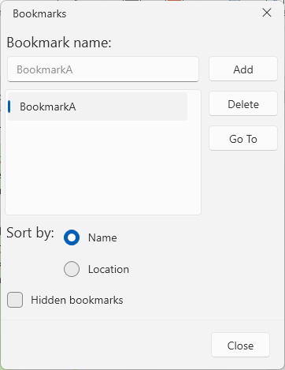
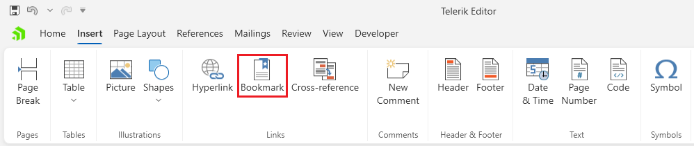

# Bookmarks Dialog

This allows you to insert and edit [bookmarks]() in the document.



The dialog can be opened from the __Bookmark__ button in the __Insert__ tab of the [RadRichTextBoxRibbonUI]().



## Showing the Dialog Manually

The dialog can be shown by executing the `ShowManageBookmarksDialogCommand`. See how to bind the command to an external button in the [Commands]() article.

__Executing the show dialog command__
```C#
	this.richTextBox.Commands.ShowManageBookmarksDialogCommand.Execute(null);
```

Alternatively, call the `ShowManageBookmarksDialog` method of `RadRichTextBox`.

__Using the show dialog method__
```C#
	this.richTextBox.ShowManageBookmarksDialog();
```
