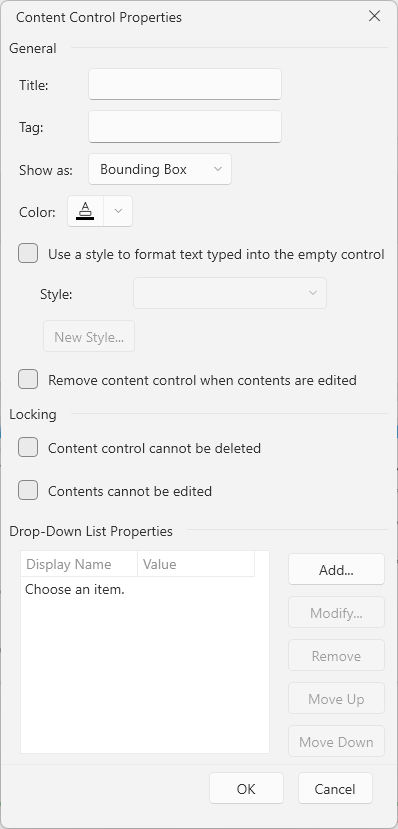
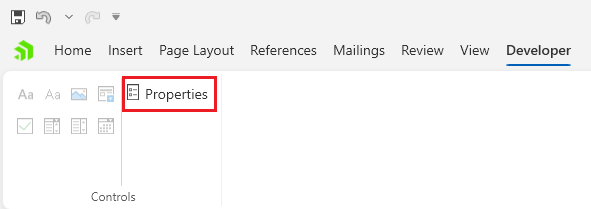

# Content Control Properties Dialog

This dialog allows you to edit the properties of the [content controls]() in the document.

The dialog can be opened from the __Properties__ button in the __Developer__ tab of the [RadRichTextBoxRibbonUI]() or via the in the same option in the right-click menu (context menu) of `RadRichTextBox`.

## Showing the Dialog Manually

The dialog can be shown by executing the `ShowContentControlPropertiesDialogCommand`. See how to bind the command to an external button in the [Commands]() article.

#### __[C#] Executing the show dialog command__
{{region radrichtextbox-dialogs-content-controls-0}}
	this.richTextBox.Commands.ShowContentControlPropertiesDialogCommand.Execute(null);
{{endregion}}