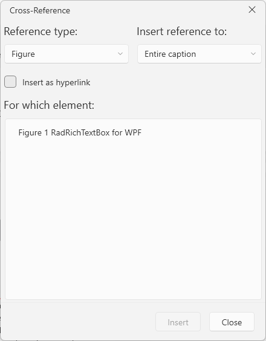
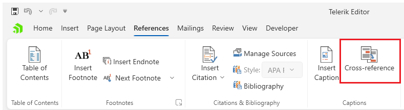

# Cross-Reference Dialog

This dialog allows you to insert [cross-reference fields]() that point to a caption, heading or a bookmark in the document.

The dialog can be opened from the __Cross-reference__ button in the __References__ tab of the [RadRichTextBoxRibbonUI]().

## Showing the Dialog Manually

The dialog can be shown by executing the `ShowInsertCrossReferenceWindowCommand`. See how to bind the command to an external button in the [Commands]() article.

#### __[C#] Executing the show dialog command__
{{region richtextbox-dialogs-cross-reference-0}}
	this.richTextBox.Commands.ShowInsertCrossReferenceWindowCommand.Execute(null);
{{endregion}}

Alternatively, call the `ShowInsertCrossReferenceWindow` method of `RadRichTextBox`.

#### __[C#] Using the show dialog method__
{{region richtextbox-dialogs-cross-reference-1}}
	this.richTextBox.ShowInsertCrossReferenceWindow();
{{endregion}}