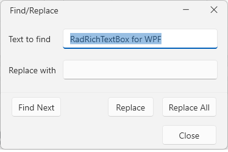
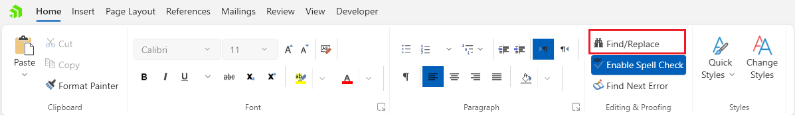

# Find and Replace Dialog

The find and replace dialog allows you find text and replace it if needed.



The dialog can be opened from the __Find/Replace__ button in the __Home__ tab of the [RadRichTextBoxRibbonUI]().



## Showing the Dialog Manually

The dialog can be shown by executing the `ShowFindReplaceDialogCommand`. See how to bind the command to an external button in the [Commands]() article.

__Executing the show dialog command__
```C#
	this.richTextBox.Commands.ShowFindReplaceDialogCommand.Execute(null);
```

Alternatively, call the `ShowFindReplaceDialog` method of `RadRichTextBox`.

__Using the show dialog method__
```C#
	this.richTextBox.ShowFindReplaceDialog();
```

## See Also  
* [Search in Document]()
