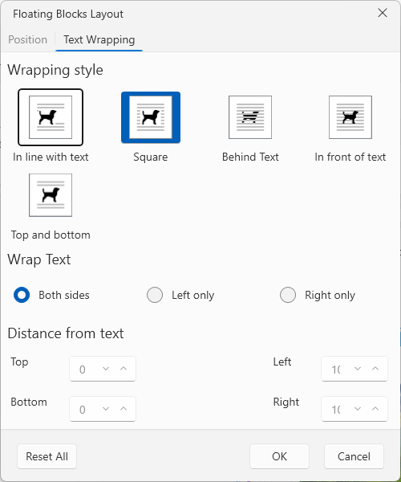
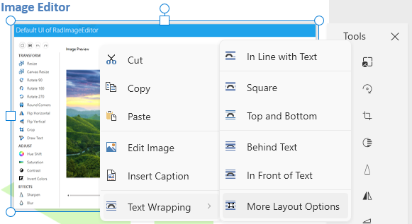

# Floating Blocks Layout Properties Dialog

This dialog allows you to update the properties of floating blocks, like [floating images]().



The dialog can be opened from the __More Layout Options__ button in the right-click menu (context menu) of `RadRichTextBox`.



## Showing the Dialog Manually

The dialog can be shown by executing the `ShowFloatingBlockPropertiesDialogCommand`. See how to bind the command to an external button in the [Commands]() article.

__Executing the show dialog command__
```C#
	this.richTextBox.Commands.ShowFloatingBlockPropertiesDialogCommand.Execute(null);
```

Alternatively, call the `ShowFloatingBlockPropertiesDialog` method of `RadRichTextBox`.

__Using the show dialog method__
```C#
	this.richTextBox.ShowFloatingBlockPropertiesDialog();
```