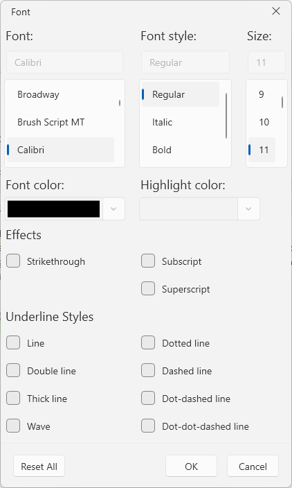
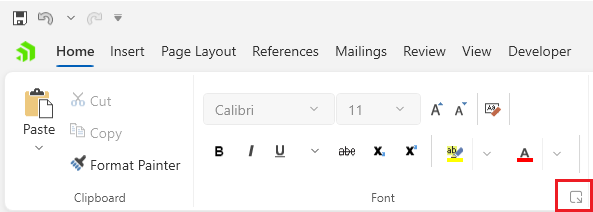
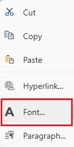

# Font Properties Dialog

This dialog allows you to edit the selected [font]() for the current selection in the document.

The dialog can be opened from the dialog launcher button at the bottom right corner of the __Font__ group in the __Home__ tab of the [RadRichTextBoxRibbonUI]() or via the in the same option in the right-click menu (context menu) of `RadRichTextBox`.

## Showing the Dialog Manually

The dialog can be shown by executing the `ShowFontPropertiesDialogCommand`. See how to bind the command to an external button in the [Commands]() article.

#### __[C#] Executing the show dialog command__
{{region richtextbox-dialogs-font-properties-0}}
	this.richTextBox.Commands.ShowFontPropertiesDialogCommand.Execute(null);
{{endregion}}

Alternatively, call the `ShowFontPropertiesDialog` method of `RadRichTextBox`.

#### __[C#] Using the show dialog method__
{{region richtextbox-dialogs-font-properties-1}}
	this.richTextBox.ShowFontPropertiesDialog();
{{endregion}}