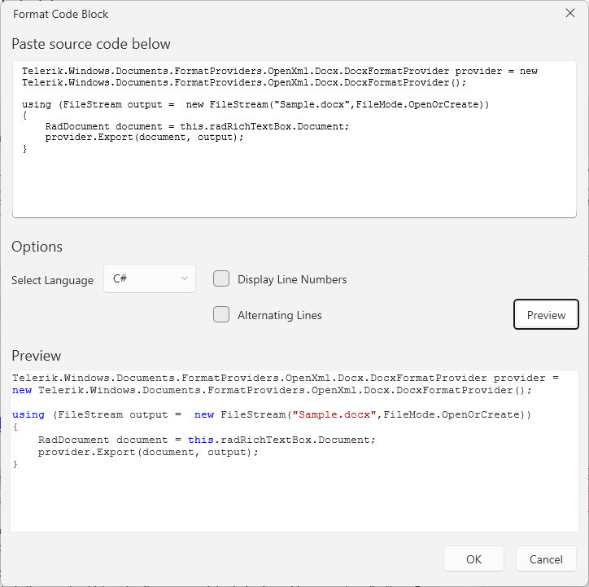
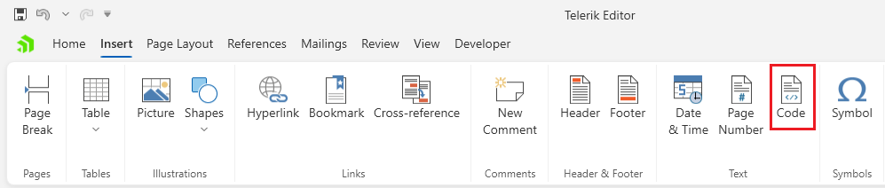
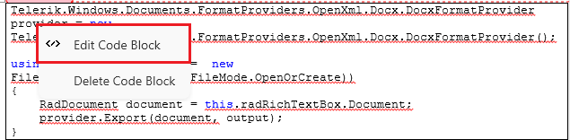

# Format Code Block Dialog

This dialog allows you to insert and edit [code blocks]() in the document.



The dialog can be opened from the __Code__ button in the __Insert__ tab of the [RadRichTextBoxRibbonUI]() or via the in the same option in the right-click menu (context menu) of `RadRichTextBox`.





## Showing the Dialog Manually

The dialog can be shown by executing the `ShowCodeFormattingDialogCommand`. See how to bind the command to an external button in the [Commands]() article.

__Executing the show dialog command__
```C#
	this.richTextBox.Commands.ShowCodeFormattingDialogCommand.Execute(null);
```

Alternatively, call the `ShowCodeFormattingDialog` method of `RadRichTextBox`.

__Using the show dialog method__
```C#
	this.richTextBox.ShowCodeFormattingDialog();
```