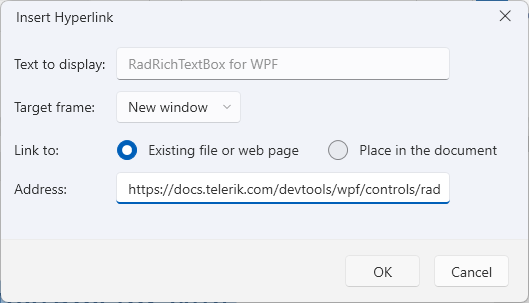
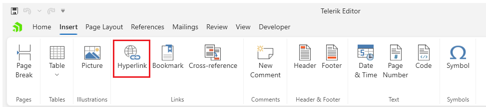
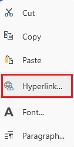

# Hyperlink Dialog

This dialog allows you to insert and edit [hyperlinks]() pointing to web addresses or bookmarks in the document.

The dialog can be opened from the __Hyperlink__ button in the __Insert__ tab of the [RadRichTextBoxRibbonUI]() or via the in the same option in the right-click menu (context menu) of `RadRichTextBox`.

## Showing the Dialog Manually

The dialog can be shown by executing the `ShowInsertHyperlinkDialogCommand`. See how to bind the command to an external button in the [Commands]() article.

#### __[C#] Executing the show dialog command__
{{region radrichtextbox-dialogs-hyperlink-0}}
	this.richTextBox.Commands.ShowInsertHyperlinkDialogCommand.Execute(null);
{{endregion}}

Alternatively, call the `ShowInsertHyperlinkDialog` method of `RadRichTextBox`.

#### __[C#] Using the show dialog method__
{{region radrichtextbox-dialogs-hyperlink-1}}
	this.richTextBox.ShowInsertHyperlinkDialog();
{{endregion}}
